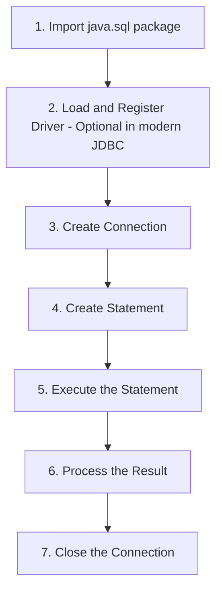
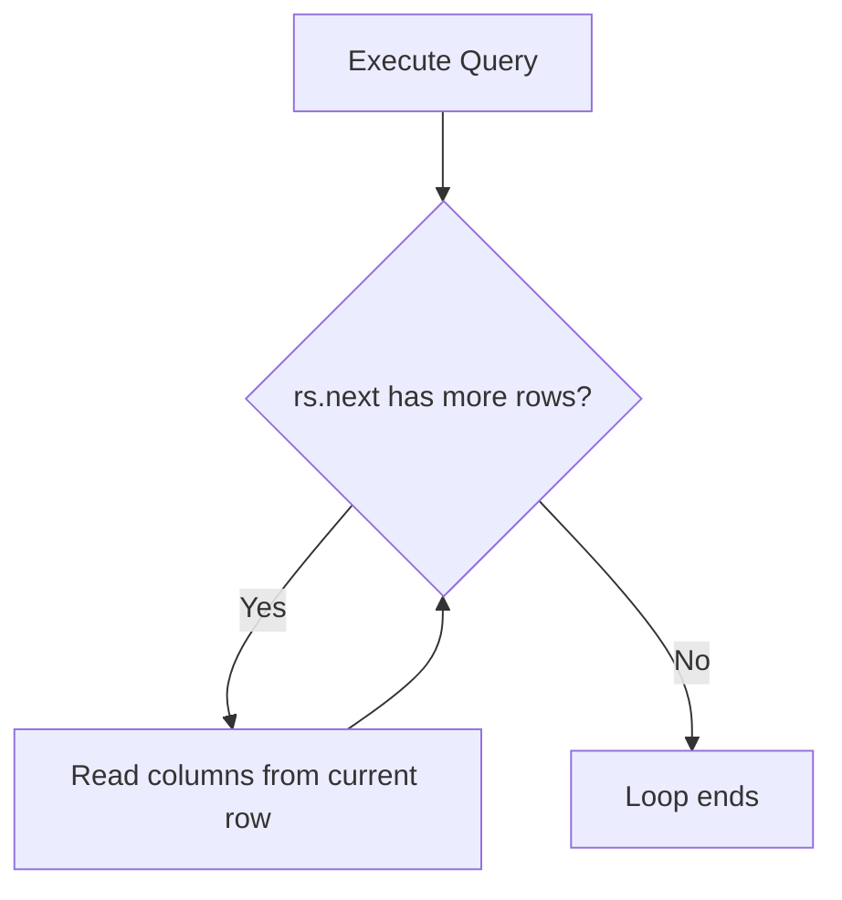

# JDBC (Java Database Connectivity) — Complete Tutorial

## 1. What is JDBC and Why Do We Need It?

Every software application works with **data**. We store data, read data, update data, and delete data.

Until now, when you wrote a Java program, you stored data in **variables** (`int`, `double`, `String`, etc). But variables have one big problem: the moment your program stops running, the data is gone. It does not stay saved.

To keep data permanently, we need a **permanent storage**. There are two common options:

1. **Text files** — Easy to create, but very hard to search and hard to connect related pieces of data. Example: if you store 10 people's names and ages in a text file, finding one person's age is difficult.
2. **Relational Database Management System (RDBMS)** — Stores data in table format (rows and columns), and makes searching, filtering, and connecting data very easy.

### The Problem with Databases

To use a database directly, you must know **SQL** (Structured Query Language). But normal users (or clients using your app) should not need to learn SQL. So we build an **application** that sits between the user and the database.

```
User  <-->  Application (built in Java)  <-->  Database
```

The user interacts with the application (for example, through the command line). But how does the **application** talk to the **database**? That connection is provided by **JDBC**.

### What Exactly is JDBC?

- JDBC stands for **Java Database Connectivity**.
- It is an **API** (a set of interfaces and classes) that comes as part of the Java Development Kit.
- JDBC lets a Java application connect to a database.

### The Multi-Database Problem

There are many databases in the world — Oracle, PostgreSQL, MySQL, H2, DB2, and more. If JDBC code was written differently for each database, switching databases would mean rewriting a lot of code.

Java's solution:
- JDBC gives you **common interfaces and classes** to write your code against.
- Each database vendor (Postgres, MySQL, etc.) provides its own **implementation** of these interfaces, packaged as a **JAR file** (called a **driver**).

So your Java code mostly stays the same — only the driver (JAR file) and a few configuration details change when you switch databases.

> **Note:** In this tutorial, we use **PostgreSQL** as the database. The same steps apply to any other database with only small changes (driver JAR and connection details).

---

## 2. Setting Up PostgreSQL

Before writing any JDBC code, you need a working database. Here is a short summary of the setup:

1. Go to the official website **postgresql.org** and download PostgreSQL for your operating system (Windows/Mac/Linux).
2. Run the installer and click through the setup steps. You will be asked to set a **password** for the database — remember it, you will need it in your Java code.
3. The installer also offers to install **pgAdmin**, a graphical tool to manage your Postgres databases. Make sure this option is selected.
4. Open **pgAdmin**, enter your password, and you will see the **Object Explorer** on the left side, showing your Postgres server.

### Creating a Database and Table (using pgAdmin)

1. Right-click on **Databases** → **Create** → **Database**. Give it a name (example: `demo`).
2. Expand your new database → **Schemas** → **public** → **Tables**.
3. Right-click **Tables** → **Create Table**. Give it a name (example: `student`) and add columns:

| Column Name | Data Type | Notes |
|---|---|---|
| `sid` | integer | Primary Key, Not Null |
| `sname` | text | Student name |
| `marks` | integer | Student marks |

4. Save the table. You can insert data either through the GUI, or by writing SQL directly using the **Query Tool**:

```sql
INSERT INTO student VALUES (1, 'Navin', 15);
```

> **Tip:** A **Primary Key** is a column that uniquely identifies each row in a table. No two rows can have the same primary key value.

---

## 3. The 7 Steps of JDBC

Different books describe JDBC in 5, 6, or 7 steps. The number does not matter much — what matters is understanding **what** each step does. Here we will use **7 steps**, and mark which ones are optional.

### An Easy Analogy: Making a Phone Call

Think of connecting to a database like calling a friend on the phone:

| JDBC Step | Phone Call Analogy |
|---|---|
| 1. Import package | You need a phone in your hand |
| 2. Load & register driver | Your SIM card must be active and have network |
| 3. Create connection | You are able to make a call |
| 4. Create statement | You think about what you want to say |
| 5. Execute statement | You dial and speak your question |
| 6. Process the result | You listen to your friend's answer |
| 7. Close the connection | You hang up the call |

### The 7 Steps in Detail



1. **Import the package** — Bring in `java.sql.*` so you can use JDBC classes and interfaces.
2. **Load and register the driver** — Tells Java which database driver to use. *(Optional since JDBC 4.0 / Java 6 — it happens automatically once the driver JAR is added to the project.)*
3. **Create a connection** — Open a real connection between your Java app and the database.
4. **Create a statement** — Prepare the SQL command you want to send.
5. **Execute the statement** — Actually send the SQL command to the database.
6. **Process the result** — Read and use the data that comes back.
7. **Close the connection** — Always close the connection when done, to avoid wasting memory and database resources.

> ⚠️ **Anti-Pattern:** Forgetting to close the connection (Step 7) causes **connection leaks**. Over time, this can exhaust the database's available connections and crash your application. Always close connections, ideally using `try-with-resources`.

---

## 4. Adding the PostgreSQL JDBC Driver

To connect Java with Postgres, you need the Postgres **JDBC driver JAR file**.

### Steps:

1. Create a new Java project in your IDE (IntelliJ IDEA is used in this tutorial, but any Java IDE works).
2. Download the PostgreSQL JDBC driver:
   - Search **"Postgres JDBC driver"** and go to `jdbc.postgresql.org`, **or**
   - Search on **Maven Repository (mvnrepository.com)** for `postgresql jdbc` and download the JAR from there.
3. Add the JAR to your project:
   - In IntelliJ: **File → Project Structure → Libraries → + → Java** → select the downloaded JAR → **Apply → OK**.
4. Once added, the driver's classes will appear under **External Libraries** in your project, ready to use.

> **Note:** JDK version 8 or above works fine for JDBC development.

---

## 5. Connecting Java to the Database

Now let's write actual Java code. Create a new file, for example `DemoJdbc.java`.

### Step 1 & 2: Import and Load Driver

```java
import java.sql.*;

public class DemoJdbc {
    public static void main(String[] args) throws Exception {
        // Step 2: Load and register the driver (optional in modern JDBC)
        Class.forName("org.postgresql.Driver");
    }
}
```

- `Class.forName(...)` loads the driver class into memory. This step is **optional** in modern JDBC (4.0+), but it is still shown here for clarity.

### Step 3: Create the Connection

```java
String url = "jdbc:postgresql://localhost:5432/demo";
String uname = "postgres";
String pass = "0000";

Connection con = DriverManager.getConnection(url, uname, pass);
System.out.println("Connection established");
```

**Understanding the Connection URL:**

```
jdbc : postgresql : //localhost : 5432 / demo
 |         |             |          |      |
 |         |             |          |      +--> database name
 |         |             |          +--> port number (5432 for Postgres, 3306 for MySQL)
 |         |             +--> host address (localhost if on the same machine)
 |         +--> database type (postgresql, mysql, oracle, etc.)
 +--> always starts with "jdbc"
```

- `Connection` is an **interface**, not a class — so we cannot create it directly with `new`.
- `DriverManager` is a utility class with a `getConnection()` method that gives us the actual implementation of `Connection`, provided by the driver JAR.
- `getConnection()` needs 3 things: the **URL**, **username**, and **password**.

> ⚠️ **Anti-Pattern:** Hardcoding database credentials (username/password) directly in your source code, like above, is fine for learning, but **not safe for real projects**. In production, use environment variables or a configuration/secrets manager instead.

### Step 7: Close the Connection

```java
con.close();
System.out.println("Connection closed");
```

Closing a connection is simple — just call `.close()` on the `Connection` object.

---

## 6. Creating a Statement, Executing It, and Processing Results

Now that we can connect, let's actually fetch data from the `student` table.

### Creating a Statement

```java
Statement st = con.createStatement();
```

- `Statement` is also an **interface**.
- The `Connection` object's `createStatement()` method gives us a working implementation.

### Writing and Executing a Query

```java
String sql = "select sname from student where sid = 1";
ResultSet rs = st.executeQuery(sql);
```

- Use `executeQuery()` when your SQL is a **SELECT** query (it only fetches data, does not change anything).
- The result is stored in a `ResultSet` object — this holds the rows returned by the database.

### Reading the Result

```java
if (rs.next()) {
    String name = rs.getString("sname");
    System.out.println("Name of student is " + name);
}
```

- `rs.next()` moves the "cursor" (pointer) to the next row, and returns `true` if a row exists, or `false` if there are no more rows.
- **Important:** Before reading any data, you must call `rs.next()` at least once. By default, the cursor starts **before** the first row.
- `rs.getString("sname")` fetches the value of column `sname` as a `String` for the current row.
- You can fetch by **column name** (`getString("sname")`) or **column number** (`getString(2)`). Using column names is safer and easier to understand, though column numbers can be slightly faster.

| Method | Used For |
|---|---|
| `getString(columnName)` | Text / VARCHAR columns |
| `getInt(columnName)` | Integer columns |
| `getDouble(columnName)` | Decimal columns |

> ⚠️ **Anti-Pattern:** Calling `rs.getString(...)` before calling `rs.next()` will throw an error like `"ResultSet not positioned properly"`, because the cursor has not moved to any row yet.

---

## 7. Fetching All Records (Looping Through Results)

If a table has multiple rows, you don't want to fetch them one by one manually. Use a `while` loop with `rs.next()`:

```java
String sql = "select * from student";
ResultSet rs = st.executeQuery(sql);

while (rs.next()) {
    int sid = rs.getInt(1);
    String sname = rs.getString(2);
    int marks = rs.getInt(3);
    System.out.println(sid + " - " + sname + " - " + marks);
}
```

**How this works:**

- `rs.next()` does two things every time it's called:
  1. Checks if there is a next row.
  2. If yes, moves the cursor to that row and returns `true`. If no more rows exist, it returns `false`.
- The `while` loop keeps running as long as there are rows left to read.
- Since we selected all 3 columns (`select *`), we read all 3 using their column positions (1, 2, 3) in order.



---

## 8. CRUD Operations (Create, Read, Update, Delete)

We have already done **Read** (fetching data). Now let's cover **Create**, **Update**, and **Delete**. The connection and statement setup stays the same — only the SQL query and execution method change.

### Insert (Create)

```java
String sql = "insert into student values (5, 'John', 48)";
boolean status = st.execute(sql);
```

### Update

```java
String sql = "update student set sname = 'Max' where sid = 5";
st.execute(sql);
```

### Delete

```java
String sql = "delete from student where sid = 5";
st.execute(sql);
```

### `executeQuery()` vs `execute()`

| Method | Use When | Returns |
|---|---|---|
| `executeQuery()` | Running a **SELECT** query | `ResultSet` (the data) |
| `execute()` | Running **INSERT / UPDATE / DELETE** (or when result type is unknown) | `boolean` — `true` only if the result is a `ResultSet`. For insert/update/delete, it returns `false`, even though the operation succeeded. |

> **Note:** `execute()` returning `false` for an insert/update/delete does **not** mean the query failed. It simply means the result was not a `ResultSet`. If you need to know how many rows were affected, use `executeUpdate()` instead, which returns an `int` count of affected rows.

---

## 9. The Problem with `Statement` (Why We Need `PreparedStatement`)

Imagine data (like `sid`, `sname`, `marks`) comes from a **user** — for example, from a form or console input — instead of being fixed values. You would need to build the SQL query using **string concatenation**:

```java
int sid = 101;
String sname = "Max";
int marks = 48;

String sql = "insert into student values (" + sid + ", '" + sname + "', " + marks + ")";
```

This approach has **three major problems**:

1. **Hard to write and error-prone.** Managing all the quotes (`"`) and string concatenation (`+`) correctly is tedious and easy to get wrong (missing a `+` or a quote breaks the whole query).
2. **SQL Injection risk.** If user input is inserted directly into a query string, a malicious user could type SQL code instead of normal data, and change what the query actually does — potentially leaking or corrupting data. This is a common way websites get hacked.
3. **No performance benefit.** Every time this query runs, the database treats it as a brand-new query and compiles it again — even if the same query structure is used repeatedly.

> ⚠️ **Anti-Pattern:** Never build SQL queries by directly concatenating raw user input into the query string. This is the #1 cause of SQL Injection vulnerabilities.

---

## 10. `PreparedStatement` — The Better Way

`PreparedStatement` solves all three problems above.

### Creating a PreparedStatement

```java
String sql = "insert into student values (?, ?, ?)";
PreparedStatement st = con.prepareStatement(sql);
```

- Instead of concatenating values into the query, use **`?` (placeholders)** for each value.
- `con.prepareStatement(sql)` pre-compiles the query — the database can reuse this compiled version, improving performance for repeated queries.

### Setting Values for the Placeholders

```java
st.setInt(1, 102);        // column 1 -> sid
st.setString(2, "Jasmine"); // column 2 -> sname
st.setInt(3, 52);          // column 3 -> marks

st.execute();
```

- Each `set...()` method takes the **placeholder position** (starting at 1) and the **value** to insert.
- Use `setInt()` for integer columns, `setString()` for text columns, `setDouble()` for decimal columns, and so on.
- If you forget to set a value for any `?`, JDBC will throw an error when you try to execute.

### `Statement` vs `PreparedStatement`

| Feature | `Statement` | `PreparedStatement` |
|---|---|---|
| How values are added | Manual string concatenation | `?` placeholders + `set...()` methods |
| SQL Injection safety | ❌ Unsafe with user input | ✅ Safe — values are handled separately from the query |
| Readability | Poor with many values | Clean and easy to read |
| Performance (repeated queries) | Recompiled every time | Can be pre-compiled and cached |
| Best used for | Simple, fixed queries; DDL (create/alter table) | Queries with dynamic/user-supplied values, especially with `WHERE` clauses |
| Interface relationship | Base interface | Extends `Statement` (has all its features, plus more) |

> ✅ **Best Practice:** Always prefer `PreparedStatement` over `Statement` when your query includes any value that comes from outside your code (user input, variables, etc.) — especially for `SELECT` queries with a `WHERE` clause, and for all `INSERT`/`UPDATE`/`DELETE` operations.

`PreparedStatement` works the same way for `SELECT`, `UPDATE`, and `DELETE` — just change the SQL text and the `?` placeholders as needed.

---

## Quick Reference Summary

| Concept | Key Point |
|---|---|
| JDBC | Java's API for connecting to databases; actual implementation comes from the database vendor's driver JAR |
| Connection URL format | `jdbc:<dbtype>://<host>:<port>/<databaseName>` |
| `DriverManager.getConnection()` | Creates the `Connection` object using URL, username, password |
| `Statement` | Basic way to run SQL; vulnerable to SQL injection with raw concatenation |
| `PreparedStatement` | Safer, faster, cleaner way to run SQL with `?` placeholders |
| `executeQuery()` | For `SELECT` — returns `ResultSet` |
| `execute()` | For `INSERT`/`UPDATE`/`DELETE` — returns `boolean` |
| `executeUpdate()` | For `INSERT`/`UPDATE`/`DELETE` — returns count of affected rows |
| `ResultSet.next()` | Moves cursor to next row; returns `false` when no rows are left |
| Always close connections | Prevents memory/connection leaks |

---

## Practice Questions

**Q1: What is the main purpose of JDBC?**
A: JDBC is a Java API that allows a Java application to connect to and interact with a database (execute SQL queries, read/write data), without needing to write database-specific connection code for each database vendor.

**Q2: Why does the actual implementation of JDBC interfaces come from the database vendor, not from Java itself?**
A: Because different databases (Postgres, MySQL, Oracle, etc.) work differently internally. Java only defines the common interfaces (like `Connection`, `Statement`); each vendor provides a driver JAR with the real implementation for their specific database.

**Q3: Is loading and registering the driver (`Class.forName(...)`) required in modern JDBC?**
A: No. Since JDBC 4.0 (Java 6 onward), this step happens automatically as soon as the driver JAR is added to the project's classpath.

**Q4: What is the difference between `executeQuery()` and `execute()`?**
A: `executeQuery()` is used for SELECT queries and returns a `ResultSet`. `execute()` is used when the result type may vary (e.g., INSERT/UPDATE/DELETE) and returns a `boolean` indicating whether the result is a `ResultSet` — not whether the operation succeeded.

**Q5: Why should `rs.next()` be called before reading data from a `ResultSet`?**
A: Because the cursor starts positioned **before** the first row by default. Calling `rs.next()` moves it to the first row (or next row) and confirms that a row exists there.

**Q6: What problem does `PreparedStatement` solve that plain `Statement` does not?**
A: It removes the need for manual string concatenation (making code cleaner), protects against SQL injection attacks, and allows the database to cache/reuse the compiled query for better performance.

**Q7: In the JDBC connection URL `jdbc:postgresql://localhost:5432/demo`, what does each part represent?**
A: `jdbc` — the protocol; `postgresql` — the database type; `localhost` — the host machine; `5432` — the port number; `demo` — the database name.

**Q8: Why is it dangerous to build a SQL query by directly concatenating user input into the query string?**
A: A malicious user could insert extra SQL code as part of their "input," changing the query's actual behavior — potentially reading, modifying, or deleting data they should not have access to. This is called SQL Injection.