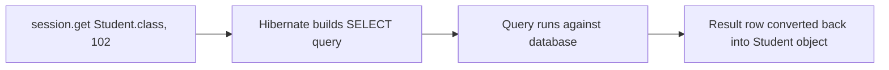
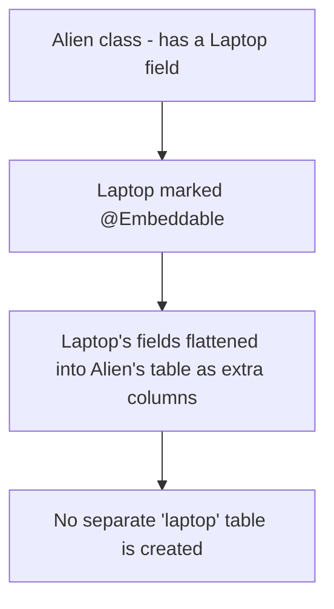

# Hibernate (ORM) — Complete Tutorial

## 1. Why Do We Need Hibernate?

We already know how to build applications using **Java and JDBC**. JDBC is enough to connect an application to a database, but it has one big pain point: **you have to manually write SQL queries and manually convert data between Java objects and database rows.**

This is where **Hibernate** comes in — its goal is to increase developer **productivity** by removing the need to manually write most of that SQL.

> **Note on versions:** This tutorial is based on Hibernate 6, but Hibernate 7 exists too. The core concepts stay the same — only a few method names changed (some old methods are **deprecated** but still work; a couple were removed). Wherever a method is deprecated in this tutorial, the replacement is also shown.

---

## 2. What is Hibernate? (Understanding ORM)

**Hibernate is an ORM framework.**

**ORM = Object Relational Mapping.**

### Why Do We Need ORM?

- Java is an **object-oriented** language. Everything you build starts as an **object** — an object has **data** (fields) and **methods**.
- To keep this data permanently, we store it in a **relational database** — which stores data in **tables** (rows and columns), not objects.
- This creates a mismatch: **Java thinks in objects, but the database thinks in tables.**
- With plain JDBC, you must manually convert your object's data into a SQL query, and manually convert query results back into objects. This is repetitive and error-prone.

**ORM solves this mismatch.** You simply tell the ORM tool: *"Save this object"* — and the tool automatically converts it into the right table row (and vice versa when reading data back).

### How Does Hibernate Know What Table and Columns to Use?

Hibernate looks at your Java class (the **blueprint** of the object) and maps it to a table automatically:

```
Java Class                     Database Table
------------------             ------------------
class Student                  table: student
  int rollNumber        <-->     column: roll_number
  String sName          <-->     column: s_name
  int sAge              <-->     column: s_age

One object                     One row
```

- **Class name** → becomes the **table name**
- **Field names** → become **column names** (Java uses camelCase, database usually uses snake_case)
- **Field types** → get matched to compatible database column types
- **Each object** → becomes **one row** of data

### Benefits of Hibernate

| Benefit | Explanation |
|---|---|
| **Productivity** | No need to manually write most SQL queries |
| **Maintainability** | Code is cleaner since SQL is abstracted away |
| **Portability** | Easier to switch from one database (e.g., MySQL) to another (e.g., Postgres) |
| **Performance** | Built-in caching and query optimization |

---

## 3. Setting Up a Hibernate Project

1. Create a new **Maven** project in your IDE (IntelliJ IDEA Community Edition works fine). Use JDK 21 or above.
2. Open the `pom.xml` file and add two dependencies inside a `<dependencies>` tag:
   - **The database driver** (example: PostgreSQL driver)
   - **Hibernate Core** (the ORM library itself)

```xml
<dependencies>
    <!-- PostgreSQL JDBC Driver -->
    <dependency>
        <groupId>org.postgresql</groupId>
        <artifactId>postgresql</artifactId>
        <version>42.7.3</version>
    </dependency>

    <!-- Hibernate ORM Core -->
    <dependency>
        <groupId>org.hibernate.orm</groupId>
        <artifactId>hibernate-core</artifactId>
        <version>6.6.3.Final</version>
    </dependency>
</dependencies>
```

> **Tip:** When picking a library version from Maven Repository, it's often safer to pick a version that is not the very latest release (to avoid last-minute bugs), unless you have a specific reason to need the newest one.

3. Reload/sync your Maven project. You should now see Hibernate and the database driver under **External Libraries**, along with a related library called **`jakarta.persistence`** (this is **JPA** — explained in section 5).

---

## 4. Creating an Entity Class (POJO)

Before saving anything, create a simple Java class to represent your data. This is called a **POJO** (Plain Old Java Object).

```java
public class Student {
    private int rollNumber;
    private String sName;
    private int sAge;

    // Getters, Setters, and toString() go here
}
```

- Generate **getters, setters,** and a **`toString()`** method for all fields (most IDEs can auto-generate these).
- At this point, this is just a normal Java class — Hibernate does not know about it yet.

---

## 5. Trying to Save Data (First Attempt — and Why It Fails)

Let's try saving a `Student` object step by step, learning from the errors along the way.

### Step 1: Create and Fill the Object

```java
Student s1 = new Student();
s1.setName("Naveen");
s1.setRollNumber(101);
s1.setAge(30);
```

### Step 2: Understanding `Session` and `SessionFactory`

To save data with Hibernate, you need a **`Session`** object. But `Session` is an **interface** — you cannot create it directly with `new`.

- A `Session` is created by a **`SessionFactory`**.
- `SessionFactory` is also an interface — it is built using a **`Configuration`** object.

```
Configuration  --builds-->  SessionFactory  --opens-->  Session  --used to-->  save/get/update/delete data
```

```java
Configuration cfg = new Configuration();
SessionFactory sf = cfg.buildSessionFactory();
Session session = sf.openSession();

session.save(s1); // old method name — see Section 8 for the modern replacement
```

> **Important distinction:**
> - **`SessionFactory`** is a **heavyweight object** — expensive to create. Create it **only once per database** in your application.
> - **`Session`** is lightweight — you can open a new one for each unit of work (each task).

### Step 3: The Errors You Will Hit (and What They Mean)

Running the code above at this stage produces errors, in this order:

1. **`NullPointerException`** — because `session` was never properly initialized before `SessionFactory` was built correctly.
2. **`"The application must supply JDBC connections"`** — Hibernate does not yet know *which* database to connect to, or the username/password. This means **configuration is missing.**

> ⚠️ **Anti-Pattern:** Don't assume Hibernate "just knows" your database details. Just like JDBC, Hibernate still needs connection information (URL, username, password, driver) — it just needs to be provided through **configuration**, not manual JDBC code.

---

## 6. Configuring Hibernate (XML Configuration)

Hibernate needs a configuration file to know your database connection details. By default, it looks for a file named **`hibernate.cfg.xml`** inside the `resources` folder.

### Creating `hibernate.cfg.xml`

```xml
<?xml version="1.0" encoding="UTF-8"?>
<!DOCTYPE hibernate-configuration PUBLIC
        "-//Hibernate/Hibernate Configuration DTD 3.0//EN"
        "http://www.hibernate.org/dtd/hibernate-configuration-3.0.dtd">

<hibernate-configuration>
    <session-factory>
        <property name="hibernate.connection.driver_class">org.postgresql.Driver</property>
        <property name="hibernate.connection.url">jdbc:postgresql://localhost:5432/telusko</property>
        <property name="hibernate.connection.username">postgres</property>
        <property name="hibernate.connection.password">0000</property>
    </session-factory>
</hibernate-configuration>
```

To actually load this file, call `.configure()` on the `Configuration` object:

```java
Configuration cfg = new Configuration();
cfg.configure(); // loads hibernate.cfg.xml
```

### Telling Hibernate About Your Entity Class

Even with the XML configured, Hibernate still doesn't know that `Student` should be mapped to a table. There are two ways to fix this:

**Option A — Register the class in code:**
```java
cfg.addClass(Student.class);
```

**Option B — Mark the class with annotations (recommended):**

```java
import jakarta.persistence.Entity;
import jakarta.persistence.Id;

@Entity
public class Student {

    @Id
    private int rollNumber;

    private String sName;
    private int sAge;
    // getters, setters, toString...
}
```

- **`@Entity`** tells Hibernate: *"This class should be mapped to a database table."*
- **`@Id`** tells Hibernate: *"This field is the table's primary key."* Every entity **must** have at least one `@Id` field, or Hibernate will throw an error.

> **What is `jakarta.persistence`?**
> This is **JPA** (Java Persistence API — originally called "Java Persistence API," renamed to "Jakarta Persistence API"). Since many ORM tools exist (Hibernate, EclipseLink, etc.), JPA defines a **common standard set of annotations** so that all ORM tools work in a similar way. Hibernate implements the JPA standard.

---

## 7. Successfully Saving Data (and Understanding Transactions)

Even after fixing the class mapping, saving data still won't appear in the database — because of one missing step: **transactions**.

### Why Transactions Are Needed

Any operation that changes data (save, update, delete) is a **transaction**. A transaction must be explicitly **committed**, or the changes will not be saved to the database.

```java
Transaction transaction = session.beginTransaction();

session.save(s1); // deprecated — see Section 8

transaction.commit();
```

### The Missing Table Problem

Even with a transaction, if the table (`student`) doesn't exist yet in the database, Hibernate will throw an error like `"relation student does not exist"`.

You can let Hibernate **automatically create/manage the table** using this configuration property:

```xml
<property name="hibernate.hbm2ddl.auto">update</property>
```

### `hibernate.hbm2ddl.auto` Options

| Value | What It Does | When to Use |
|---|---|---|
| `none` | Does nothing to the schema | When you manage tables manually |
| `create` | Creates a new table every time the app starts (drops nothing first, but tries to create fresh) | Testing/experimenting only |
| `create-drop` | Creates the table, then drops it when the session factory closes | Short-lived tests |
| `update` | Creates the table if missing; adds new columns if the class changes; does **not** remove old columns | Development |

> ⚠️ **Anti-Pattern:** Never use `create`, `create-drop`, or even `update` in a **production** environment. These can unintentionally alter or wipe real data. In production, manage your database schema with proper migration tools instead.

Once `hibernate.hbm2ddl.auto` is set and the transaction is committed, running the code will:
1. Automatically create the `student` table (if it doesn't exist).
2. Insert the row for the `Student` object.

You can verify this by checking the table in your database tool (e.g., pgAdmin).

---

## 8. Updated (Non-Deprecated) Hibernate Methods

As Hibernate evolved to align with the JPA standard, several old method names were **deprecated**. Always prefer the modern JPA-aligned names:

| Old (Deprecated) Method | Modern Replacement | Purpose |
|---|---|---|
| `session.save(obj)` | `session.persist(obj)` | Insert a new object into the database |
| `session.update(obj)` / `session.saveOrUpdate(obj)` | `session.merge(obj)` | Update an existing object (or insert if it doesn't exist) |
| `session.delete(obj)` | `session.remove(obj)` | Delete an object |
| `session.load(...)` | `session.get(...)` (with caution — see Section 10) | Fetch an object by primary key |

---

## 9. Viewing the Generated SQL

By default, Hibernate hides the SQL it generates behind the scenes. You can turn this on for learning/debugging purposes with configuration properties:

```xml
<property name="hibernate.show_sql">true</property>
<property name="hibernate.format_sql">true</property>
<property name="hibernate.dialect">org.hibernate.dialect.PostgreSQLDialect</property>
```

| Property | What It Does |
|---|---|
| `hibernate.show_sql` | Prints the actual SQL query Hibernate generates and executes |
| `hibernate.format_sql` | Prints that SQL in a nicely indented, readable format (instead of one long line) |
| `hibernate.dialect` | Tells Hibernate exactly which "flavor" of SQL to generate, since SQL syntax differs slightly between databases (Postgres, MySQL, Oracle, etc.). Not always required, but useful if you hit unexplained errors. |

> **Note:** If you try to save an object with a primary key value that already exists in the table, you will get a **`"duplicate key value violates unique constraint"`** error — because the primary key must be unique for every row.

---

## 10. Fetching Data with `get()`

To read a single row by its primary key:

```java
Student s2 = session.get(Student.class, 102);
System.out.println(s2);
```

- `get()` needs **two parameters**: the **entity type** (`Student.class`) and the **primary key value** (`102`).
- Behind the scenes, Hibernate fires a `SELECT` query and automatically converts the result row back into a `Student` object — you never write the SQL yourself.



> ⚠️ **Anti-Pattern:** If no row exists for the given primary key, `get()` returns **`null`** — not an exception. Calling a method (like `.getName()`) on that `null` result will throw a `NullPointerException`. **Always check for `null` before using the fetched object.**

```java
Student s2 = session.get(Student.class, 999);
if (s2 != null) {
    System.out.println(s2);
} else {
    System.out.println("No student found with that ID");
}
```

> **Note:** There is also a `load()` method, but it is **deprecated** and can throw errors like `"could not initialize the proxy"` if used outside an active session. Prefer `get()`.

---

## 11. Updating and Deleting Data

### Update — Using `merge()`

```java
Student s1 = new Student();
s1.setRollNumber(103);
s1.setName("Harsh");
s1.setAge(23); // updated value

Transaction transaction = session.beginTransaction();
session.merge(s1);
transaction.commit();
```

- `merge()` first **checks if a row with that primary key already exists**:
  - If it **exists** → Hibernate updates that row.
  - If it **does not exist** → Hibernate inserts it as a new row (similar to the old deprecated `saveOrUpdate()` behavior).
- **A transaction is required** for `merge()` to actually take effect. Without `beginTransaction()` and `commit()`, Hibernate will only run a `SELECT` internally and will not save any changes.

### Delete — Using `remove()`

```java
Student toDelete = session.get(Student.class, 109);

Transaction transaction = session.beginTransaction();
session.remove(toDelete);
transaction.commit();
```

- `remove()` needs the actual **object**, not just the primary key.
- The common pattern is: **first `get()` the object, then `remove()` it.**

### CRUD Method Summary

| Operation | Modern Method | Needs Transaction? |
|---|---|---|
| Create | `session.persist(obj)` | ✅ Yes |
| Read | `session.get(EntityClass, id)` | ❌ No |
| Update | `session.merge(obj)` | ✅ Yes |
| Delete | `session.remove(obj)` | ✅ Yes |

---

## 12. Cleaning Up the Code (Refactoring)

Two common warnings you'll see in your IDE, and how to fix them:

### 1. Deprecated `save()`

Replace `session.save(obj)` with `session.persist(obj)` (see Section 8).

### 2. `SessionFactory` Not Closed

`SessionFactory` is a heavyweight resource — it should always be closed when you're done with it, just like you'd turn off a light you're not using.

**Option A — Manual close:**
```java
session.close();
sessionFactory.close();
```

**Option B — `try-with-resources` (recommended):**
Automatically closes the resource once the block finishes.

### Combining Setup Into One Line

Instead of:
```java
Configuration cfg = new Configuration();
cfg.addAnnotatedClass(Student.class);
cfg.configure();
SessionFactory sf = cfg.buildSessionFactory();
```

You can chain it into a single, cleaner statement:
```java
SessionFactory sf = new Configuration()
        .addAnnotatedClass(Student.class)
        .configure()
        .buildSessionFactory();
```

---

## 13. Customizing Table and Column Names

By default, Hibernate derives names like this:

```
Class Name  -->  Entity Name  -->  Table Name
```

If you don't customize anything, the **class name becomes the entity name, and the entity name becomes the table name**. Fields become column names the same way.

You can override each of these individually with annotations:

```java
import jakarta.persistence.*;

@Entity(name = "alien_entity")     // changes the Entity name
@Table(name = "alien_table")       // changes just the Table name (independent of Entity name)
public class Alien {

    @Id
    private int aid;

    @Column(name = "alien_name")   // changes just this column's name
    private String aname;

    private String technology;

    // getters, setters, toString...
}
```

| Annotation | Effect |
|---|---|
| `@Entity(name = "...")` | Changes the Entity name (used internally by Hibernate, e.g., in HQL/JPQL queries) |
| `@Table(name = "...")` | Changes only the actual database **table** name |
| `@Column(name = "...")` | Changes only that specific **column's** name |

### Excluding a Field from the Database — `@Transient`

Sometimes you want a field to exist on the Java object (for temporary processing), but you **don't** want it saved to the database:

```java
@Transient
private String technology;
```

Fields marked `@Transient` are completely ignored by Hibernate when creating the table and saving data.

---

## 14. Embedding Complex Types — `@Embeddable`

So far, all our fields were simple types (`int`, `String`). But what if an entity needs a more complex nested object — for example, an `Alien` that has a `Laptop`?

### The Problem

If you just add a field of a custom class type (like `Laptop laptop;`) without any annotation, Hibernate throws an error:

```
Could not determine the recommended JDBC type
```

This happens because Hibernate doesn't know how to map an arbitrary custom class to database column(s).

### The Solution: `@Embeddable`

Mark the nested class as `@Embeddable`. This tells Hibernate: *"Don't give this its own table — instead, flatten its fields as extra columns inside whichever entity uses it."*

```java
import jakarta.persistence.Embeddable;

@Embeddable
public class Laptop {
    private String brand;
    private String model;
    private int ram;
    // getters, setters, toString...
    // No @Id here — this is not its own table
}
```

```java
@Entity
public class Alien {

    @Id
    private int aid;
    private String aname;
    private String technology;

    private Laptop laptop; // embedded object
    // getters, setters, toString...
}
```

### Result

Instead of creating a separate `laptop` table, Hibernate adds the `Laptop` class's fields **directly as extra columns** inside the `alien` table:

```
Table: alien
-----------------------------------------------
| aid | aname | technology | brand | model | ram |
-----------------------------------------------
```

**When to use `@Embeddable`:** Whenever a value logically "belongs to" the parent object and doesn't need its own identity or table — for example, an `Address` (street, city, pin code) embedded inside a `Student`, or a `Laptop` embedded inside an `Alien`.



---

## Quick Reference Summary

| Concept | Key Point |
|---|---|
| Hibernate | An ORM (Object Relational Mapping) framework that removes the need to manually write most SQL |
| `SessionFactory` | Heavyweight; create **once** per database |
| `Session` | Lightweight; create a new one per unit of work |
| `Configuration` | Loads settings from `hibernate.cfg.xml` and registers entity classes |
| `@Entity` | Marks a class to be mapped to a database table |
| `@Id` | Marks the primary key field (required on every entity) |
| `hibernate.hbm2ddl.auto` | Controls automatic schema creation/updating (`update` for dev, avoid in production) |
| `session.persist(obj)` | Insert (replaces deprecated `save()`) |
| `session.get(Class, id)` | Fetch by primary key — returns `null` if not found |
| `session.merge(obj)` | Update or insert if not existing (replaces deprecated `update()`/`saveOrUpdate()`) |
| `session.remove(obj)` | Delete (replaces deprecated `delete()`) |
| Transactions | Required for persist/merge/remove; not required for get |
| `@Table` / `@Column` | Customize table/column names |
| `@Transient` | Exclude a field from being saved to the database |
| `@Embeddable` | Flatten a nested object's fields into the parent entity's table |

---

## Practice Questions

**Q1: What problem does Hibernate (ORM) solve that plain JDBC does not?**
A: Hibernate automatically converts Java objects to database rows and back, so developers don't need to manually write and manage SQL queries for every operation. This saves time and reduces repetitive, error-prone code.

**Q2: What is the difference between `SessionFactory` and `Session`?**
A: `SessionFactory` is a heavyweight object that should be created only once per database in an application. `Session` is lightweight and represents a single unit of work — a new one can be opened whenever needed.

**Q3: Why must every `@Entity` class have an `@Id` field?**
A: Because every database table needs a primary key to uniquely identify each row, and Hibernate requires this mapping to know which field represents that key.

**Q4: Why did saving data not appear in the database even after fixing the entity mapping?**
A: Because the save operation was not wrapped in a transaction. Any operation that changes data (insert/update/delete) must be committed via `Transaction.commit()`, or the changes are not persisted.

**Q5: What is the risk of using `hibernate.hbm2ddl.auto=update` (or `create`) in production?**
A: These settings let Hibernate automatically modify or recreate your database schema, which can unintentionally alter or delete real production data. Production schemas should be managed through controlled migration tools instead.

**Q6: What does `session.get()` return if no row matches the given primary key, and what should you do about it?**
A: It returns `null` (not an exception). You should always check for `null` before calling any method on the result, to avoid a `NullPointerException`.

**Q7: What is the difference between `session.persist()` and `session.merge()`?**
A: `persist()` inserts a brand-new object. `merge()` checks if a row with the given primary key already exists — if yes, it updates it; if no, it inserts it as new.

**Q8: When should you use `@Embeddable` instead of making a nested class its own `@Entity`?**
A: Use `@Embeddable` when the nested object's data logically belongs to the parent and doesn't need its own identity or separate table — its fields should simply become extra columns in the parent's table (e.g., a `Laptop` inside an `Alien`, or an `Address` inside a `Student`).