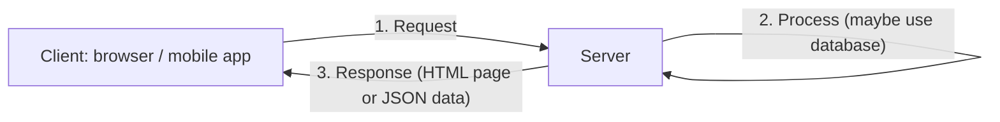
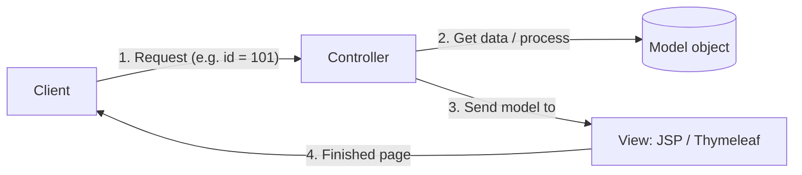
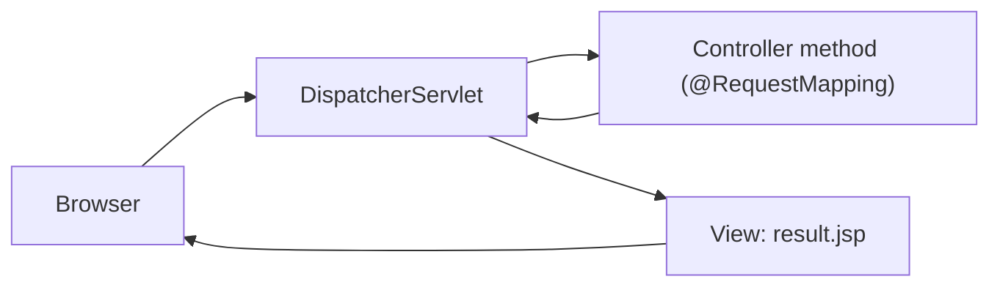
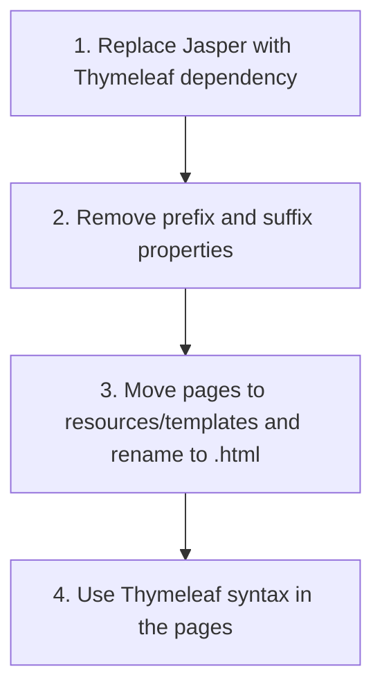

# Web Applications in Java: Servlets, Spring MVC (JSP) and Thymeleaf

This tutorial explains how a Java web application works, starting from **Servlets** (what runs behind the scenes) and moving to **Spring Boot MVC** with **JSP** and then **Thymeleaf**.

> **Important note:** In real projects today, we do not build new applications with raw servlets or JSP. We build the backend with **Spring** and the frontend with **React** or **Angular**. But Spring Web uses servlets internally, so knowing them helps you understand what Spring does for you. It is fine if you only read the servlet part and do not practice it.

---

## Table of Contents

1. [Web Application Basics](#1-web-application-basics)
2. [Servlet Container and Tomcat](#2-servlet-container-and-tomcat)
3. [Creating a Servlet Project](#3-creating-a-servlet-project)
4. [Creating and Running Your First Servlet](#4-creating-and-running-your-first-servlet)
5. [Servlet Mapping](#5-servlet-mapping)
6. [Responding to the Client](#6-responding-to-the-client)
7. [Introduction to MVC](#7-introduction-to-mvc)
8. [Creating a Spring Boot Web Project](#8-creating-a-spring-boot-web-project)
9. [Creating a JSP Page](#9-creating-a-jsp-page)
10. [Creating a Controller](#10-creating-a-controller)
11. [RequestMapping and Tomcat Jasper](#11-requestmapping-and-tomcat-jasper)
12. [Sending Data to the Controller](#12-sending-data-to-the-controller)
13. [Accepting Data the Servlet Way](#13-accepting-data-the-servlet-way)
14. [Displaying Data on the Result Page](#14-displaying-data-on-the-result-page)
15. [RequestParam](#15-requestparam)
16. [Model Object](#16-model-object)
17. [View Resolver: Prefix and Suffix](#17-view-resolver-prefix-and-suffix)
18. [ModelAndView](#18-modelandview)
19. [Why We Need ModelAttribute](#19-why-we-need-modelattribute)
20. [Using ModelAttribute](#20-using-modelattribute)
21. [Spring Boot with Thymeleaf](#21-spring-boot-with-thymeleaf)
22. [Quick Reference](#22-quick-reference)
23. [Practice Questions](#23-practice-questions)

---

## 1. Web Application Basics

### Why do we need web applications?

Almost everything today runs on the web. Even 99% of mobile apps talk to a web server. So the **same backend** often serves:

- A browser (desktop)
- A mobile app
- Another server

### Static vs dynamic content

| Type | Built with | Example |
|---|---|---|
| **Static** | HTML and CSS | Same page for every user |
| **Dynamic** | Backend code (like Java) | Different data for every user |

Showing a page is easy. **Getting the right data** for each user is the hard part. That is the job of the backend.

### What does the server do?



The server must:

1. **Accept** the request
2. **Process** the request
3. **Send back** a response

Today, the response is often only **JSON data**. The client (React, Angular, mobile app) decides how to show it. The client can also send JSON to the server.

### Two ways to build web apps with Spring

| Option | Use |
|---|---|
| **Spring Web** (with Spring Boot) | Normal web apps and REST APIs |
| **Spring MVC** (without Spring Boot) | Same idea, but more manual configuration |
| Reactive (Spring WebFlux) | Reactive programming (not covered here) |

In Java, the technology that can accept a request and send a response is the **Servlet**. Spring MVC and Spring Web use servlets behind the scenes.

---

## 2. Servlet Container and Tomcat

### What is a servlet?

The word has two parts: **serv** + **let**. A servlet is a small **server-side component** that:

- Accepts a request
- Processes it
- Sends a response

### Why can't we run it like a normal Java program?

A normal program runs on the **JVM**. A servlet needs extra features, like receiving requests from the internet. So it needs a special environment called a **servlet container** (also called a **web container**).

**Tomcat** is the most popular lightweight servlet container.

### WAR vs JAR

| Package | Meaning | Used for |
|---|---|---|
| `.jar` | Java Archive | Console apps (and, today, Spring Boot apps) |
| `.war` | Web Archive | Web apps deployed on a Tomcat server |

### External Tomcat vs Embedded Tomcat

| | External Tomcat | Embedded Tomcat |
|---|---|---|
| How it works | Download Tomcat, put your `.war` file in its `webapps` folder, start with `startup.sh` (stop with `shutdown.sh`) | Tomcat is a **library inside your project**. Run the project and Tomcat starts |
| Configuration | More features and control | Very little configuration |
| Good for | Real servlet projects | Learning and Spring Boot |

We use **embedded Tomcat**, because our goal is to learn Spring, not servlets.

---

## 3. Creating a Servlet Project

### Step 1: Create a Maven project

- Create a new Maven project using the **quickstart** archetype.
- Name: `ServletEx`
- Group ID: `com.telusko`
- Java version: 17

### Step 2: Add two dependencies

A servlet is **not part of the JDK**. You need:

1. **Servlet API** (so we can write servlets)
2. **Embedded Tomcat** (so we can run them)

In the lesson, we used an older pair of versions that work together: Servlet API **4.0.4** and Tomcat Embed Core **8.5.96**. Search for them on the Maven repository and copy them into `pom.xml`:

```xml
<dependency>
    <groupId>jakarta.servlet</groupId>
    <artifactId>jakarta.servlet-api</artifactId>
    <version>4.0.4</version>
</dependency>

<dependency>
    <groupId>org.apache.tomcat.embed</groupId>
    <artifactId>tomcat-embed-core</artifactId>
    <version>8.5.96</version>
</dependency>
```

Reload Maven. You should see both libraries under **External Libraries**.

> **Note:** After 2018 the servlet packages moved from `javax.servlet` to `jakarta.servlet`. Older versions (like 4.0.4) still use the `javax.servlet` package names. Any old version is fine for learning. Just make sure the **Servlet API and Tomcat versions match**.

---

## 4. Creating and Running Your First Servlet

### Step 1: Create the servlet class

To make a class a servlet, **extend `HttpServlet`**. This gives it the ability to handle requests and responses.

```java
import javax.servlet.http.HttpServlet;
import javax.servlet.http.HttpServletRequest;
import javax.servlet.http.HttpServletResponse;

public class HelloServlet extends HttpServlet {

    public void service(HttpServletRequest req, HttpServletResponse res) {
        System.out.println("In Service");
    }
}
```

**Explanation:**

- The name ends with `Servlet` so other developers know what it is.
- `service()` runs **every time a request comes in**.
- `HttpServletRequest` holds all data **coming from** the client.
- `HttpServletResponse` is used to put data **going to** the client.
- Both are **interfaces**. The container gives us the real objects.

### Step 2: Why doesn't it run?

If you only run `main()` and open `http://localhost:8080` in the browser, you get **"cannot reach"**. Nothing is running. A servlet only runs when Tomcat is running and a request arrives.

### Step 3: Start Tomcat in `main`

```java
public static void main(String[] args) throws LifecycleException {
    Tomcat tomcat = new Tomcat();
    tomcat.start();
    tomcat.getServer().await();
}
```

**Explanation:**

- `new Tomcat()` creates the embedded server.
- `start()` starts it (it can throw `LifecycleException`).
- **Why `await()`?** Without it, the program ends right after starting Tomcat, and the server stops. `getServer().await()` keeps the server **waiting for requests**.

Now the browser shows a **404** instead of "cannot reach". Good: Tomcat is running, but it does not know **which servlet** to call. That is what mapping solves.

---

## 5. Servlet Mapping

**Mapping** connects a URL (like `/hello`) to a servlet.

### Old way: XML

With an external Tomcat, you can map in `web.xml`:

```xml
<servlet>
    <servlet-name>HelloServlet</servlet-name>
    <servlet-class>HelloServlet</servlet-class>
</servlet>
<servlet-mapping>
    <servlet-name>HelloServlet</servlet-name>
    <url-pattern>/hello</url-pattern>
</servlet-mapping>
```

### Annotation way

With an external Tomcat, put `@WebServlet("/hello")` on top of the servlet class.

### Embedded Tomcat: do it in code

With embedded Tomcat, we do the mapping ourselves:

```java
public static void main(String[] args) throws LifecycleException {
    Tomcat tomcat = new Tomcat();
    tomcat.setPort(8081);                                   // optional

    Context context = tomcat.addContext("", null);          // 1
    Tomcat.addServlet(context, "HelloServlet", new HelloServlet());   // 2
    context.addServletMappingDecoded("/hello", "HelloServlet");       // 3

    tomcat.start();
    tomcat.getServer().await();
}
```

**Explanation:**

| Line | What it does |
|---|---|
| `addContext("", null)` | Creates the application context. `""` means the default (root) path. `null` means we do not create a new folder structure |
| `Tomcat.addServlet(context, "HelloServlet", new HelloServlet())` | Registers the servlet. Parameters: context, **a name** you choose, and the servlet **object** |
| `addServletMappingDecoded("/hello", "HelloServlet")` | Maps the URL `/hello` to the servlet **name** |
| `setPort(8081)` | Changes the port. The default is **8080**. Use it if another service already uses 8080 |

> **Name vs class:** The string `"HelloServlet"` is just a **name** (you could use `"h1"`). The name in `addServlet` and in `addServletMapping` must be **exactly the same**.

> **Tip:** If Tomcat starts but nothing answers on the port, add `tomcat.getConnector();` before `start()`. Newer Tomcat versions need it to create the connector.

Run it and open `http://localhost:8081/hello`. The page is blank, but the console prints **In Service**. The mapping works.

> **Good news:** Spring Boot does all of this mapping for us. We do the hard way once to understand what happens behind the scenes.

---

## 6. Responding to the Client

The `HttpServletResponse` object is like an **empty paper** that goes back to the client. We write on it using a **writer** (like taking a pen).

```java
public void service(HttpServletRequest req, HttpServletResponse res) throws IOException {
    res.setContentType("text/html");
    PrintWriter out = res.getWriter();
    out.println("<h2>Hello World</h2>");
}
```

**Explanation:**

- `res.getWriter()` returns a `PrintWriter`.
- `out.println(...)` looks like `System.out.println`, but it writes into the **response** (sent to the browser), not the console.
- `setContentType("text/html")` tells the browser: "this is HTML, please render it". Without it, the browser shows the tags as plain text (like `<h2>`).
- `throws IOException` is needed because writing can fail.

### HTTP methods and doGet / doPost

| HTTP method | Purpose |
|---|---|
| **GET** | Get data from the server |
| **POST** | Send data to the server |
| **PUT** | Update data |
| **DELETE** | Delete data |

A browser address bar sends a **GET** request. The `service()` method handles **all** types. To handle a specific type, use special methods:

```java
@Override
protected void doGet(HttpServletRequest req, HttpServletResponse res) throws IOException {
    res.setContentType("text/html");
    res.getWriter().println("<h2>Hello World</h2>");
}
```

- `doGet()` → handles GET requests
- `doPost()` → handles POST requests (for example, form submission)

### The problem with this approach

In a servlet we do three jobs in one class: **accept the request, process data, and build the HTML page**. Writing thousands of HTML tags inside Java code is hard to read and hard to debug. The solution is the **MVC pattern**.

---

## 7. Introduction to MVC

### The problem

A servlet can get data from a database and send it back. But users do not want raw data. They want a nice page. Writing HTML inside Java is messy. So we keep the page in a separate technology.

### View technologies

| Technology | Idea |
|---|---|
| **JSP** (Java Server Pages) | An HTML page where you can write Java code in between |
| **Thymeleaf**, **Velocity**, **FreeMarker** | Other template engines for the same job |

They are called **view** technologies, because they create what the client **sees**.

### What is MVC?

**MVC = Model, View, Controller.** It is a pattern used in all web applications (not only Java).

| Part | Job | In Java |
|---|---|---|
| **Model** | Holds the data (as an object) | A simple class (**POJO** = Plain Old Java Object) |
| **View** | Creates the page shown to the client | JSP, Thymeleaf, etc. |
| **Controller** | Accepts the request, does the work, chooses the view | Servlet (in Spring: a controller class) |

### Flow



> The real order would be "CMV", but "MVC" sounds better. The name order does not show the flow.

Example: The client asks for the student with id **101**. The controller gets the student data, puts it in a `Student` object (the model), and sends that object to the view. The view fills the page and returns it.

### JSP runs on Tomcat, but Tomcat only runs servlets. How?

Behind the scenes, **every JSP page is converted into a servlet**. You write simple HTML + Java, and the container does the conversion.

---

## 8. Creating a Spring Boot Web Project

We will build MVC using Spring Boot. (Plain Spring MVC needs much more configuration. Spring Boot saves it.)

### Project settings at start.spring.io

| Setting | Value |
|---|---|
| Project | Maven |
| Language | Java |
| Spring Boot | 3.2 |
| Group | `com.telusko` |
| Artifact | `SpringBootWeb1` |
| Packaging | Jar |
| Java | 21 |
| Dependency | **Spring Web** (only one) |

> **Spring Web vs Spring Reactive Web:** Use **Spring Web** for normal web apps and REST APIs. Reactive Web (WebFlux) is for reactive programming.

> **Why "Jar" packaging for a web app?** The Initializr page says Spring Web uses **Apache Tomcat as the default embedded container**. Since Tomcat is inside the project, we can run a Jar without an external server.

### Check the `pom.xml`

```xml
<dependency>
    <groupId>org.springframework.boot</groupId>
    <artifactId>spring-boot-starter-web</artifactId>
</dependency>
```

Under **External Libraries** you will see the embedded Tomcat libraries.

### Run it

Run the main class. In the console you see that **Tomcat started on port 8080**. Open `http://localhost:8080`:

- Before running: browser says "cannot connect" (no server).
- After running: you get **404**. The server works, but there is no homepage yet.

---

## 9. Creating a JSP Page

Spring Boot looks for JSP pages in a folder called `webapp`.

### Step 1: Create the folder and page

```
src/main/webapp/index.jsp
```

(`webapp` goes inside `src/main`, next to `java` and `resources`.)

### Step 2: Write the page

```jsp
<%@ page language="java" %>
<html>
<body>
    <h2>Hello World</h2>
</body>
</html>
```

**Explanation:**

- `<%@ page language="java" %>` tells the container: this is a JSP page and it may contain Java code.
- The rest is normal HTML.

### Step 3: Run it

It still shows **404**. Why? In MVC, the client never calls the JSP directly. The **controller** calls the view. We have no controller yet.

---

## 10. Creating a Controller

### Step 1: A simple class with `@Controller`

```java
@Controller
public class HomeController {

    public String home() {
        System.out.println("home method called");
        return "index.jsp";
    }
}
```

**Explanation:**

- We do **not** write a servlet. We write a plain class and add **`@Controller`**. Spring converts it into servlet handling behind the scenes.
- `@Controller` is a **stereotype annotation**, like `@Component`. It tells Spring: "manage this class, it handles web requests".
- You can have **many controllers** (for example `HomeController`, `StudentController`).
- The actual work is done by **methods**. The method returns a `String`: the **name of the view** to show.

### Step 2: Test

The page still gives an error, and the console does **not** print "home method called". So our method is **never called**. Spring does not know **which URL** should call this method. We need **mapping**.

---

## 11. RequestMapping and Tomcat Jasper

### Mapping a URL to a method

In Spring we use an **annotation** (no XML):

```java
@Controller
public class HomeController {

    @RequestMapping("/")
    public String home() {
        System.out.println("home method called");
        return "index.jsp";
    }
}
```

- `@RequestMapping("/")` means: when someone requests the homepage (`/`), call this method.
- `@RequestMapping("/student")` would map the URL `/student`.
- There are also `@GetMapping`, `@PostMapping`, etc. You will use them later.

### New problem: the browser downloads a file

Now the method is called, but the browser asks to **download** a file. That file contains the JSP source.

**Reason:** Spring Boot **does not support JSP by default**. Nobody converts the JSP into a servlet.

### Fix: add Tomcat Jasper

**Jasper** is the engine that converts JSP to servlet. Add this dependency and reload Maven:

```xml
<dependency>
    <groupId>org.apache.tomcat.embed</groupId>
    <artifactId>tomcat-embed-jasper</artifactId>
</dependency>
```

> **Tip:** The version must match your Tomcat version (in the lesson it was 10.1.16). Spring Boot already manages the version for you, so you can leave out the `<version>` tag. That way it always matches.

Now `http://localhost:8080` shows **Hello World**.

---

## 12. Sending Data to the Controller

Now we want the client to send data and the server to process it. Our simple example: **add two numbers**. (The logic is simple so that we can focus on Spring.)

### Step 1: A form in `index.jsp`

```jsp
<html>
<body>
    <h2>Calculator</h2>
    <form action="add">
        Enter first number: <input type="text" name="num1"><br>
        Enter second number: <input type="text" name="num2"><br>
        <input type="submit">
    </form>
</body>
</html>
```

**Explanation:**

- `action="add"` → the form sends a request to the URL `/add`.
- Each input has a **`name`**. The server reads the data using this name (`num1`, `num2`).
- A form uses **GET** by default, so the data goes in the URL:
  `http://localhost:8080/add?num1=6&num2=7`

(Styling with a CSS file is optional and not part of Spring, so we skip it here.)

### Step 2: What happens on submit?

You get a **404**. The request goes to `/add`, but no method is mapped to it. We need another method in the controller.

---

## 13. Accepting Data the Servlet Way

### Multiple methods in one controller

One controller can handle **many URLs**. Usually you group related requests, for example:

| Controller | Handles |
|---|---|
| `UserController` | add, delete, update user |
| `ProductController` | add, remove, update product |
| `OrderController` | place, delete, change order |

Here we add a second method to `HomeController`.

### Step 1: Add the method and mapping

```java
@RequestMapping("/add")
public String add() {
    System.out.println("in add");
    return "result.jsp";
}
```

Submit the form. The console prints **in add**, so the mapping works. But we get an error because `result.jsp` does not exist.

### Step 2: Create `result.jsp`

```jsp
<html>
<body>
    <h2>Result is </h2>
</body>
</html>
```

### Who connects everything?

In servlets, we mapped every servlet by hand. In Spring, a special servlet called **DispatcherServlet** does it. It receives **every request**, checks the mapping, calls the right controller method, and finds the view that the method returns.



### Step 3: Read the values (servlet way)

We ask Spring for the request object by adding it as a **method parameter**. Spring gives us the object.

```java
@RequestMapping("/add")
public String add(HttpServletRequest req) {

    int num1 = Integer.parseInt(req.getParameter("num1"));
    int num2 = Integer.parseInt(req.getParameter("num2"));

    int result = num1 + num2;
    System.out.println(result);

    return "result.jsp";
}
```

**Explanation:**

- `req.getParameter("num1")` reads the value sent by the client. The name must match the form field name.
- `getParameter` always returns a **String**, so we convert it with `Integer.parseInt()`.
- Submitting 6 and 7 prints **13** in the console.

The result goes to the **console**, not the page. We need to send it to `result.jsp`.

---

## 14. Displaying Data on the Result Page

The two pages (`add` method and `result.jsp`) are separate, so we must pass the data between them. We can use the **session**.

### Step 1: Put the result in the session

```java
@RequestMapping("/add")
public String add(HttpServletRequest req, HttpSession session) {

    int num1 = Integer.parseInt(req.getParameter("num1"));
    int num2 = Integer.parseInt(req.getParameter("num2"));
    int result = num1 + num2;

    session.setAttribute("result", result);

    return "result.jsp";
}
```

**Explanation:**

- `HttpSession` is an interface. Spring gives us the object when we ask for it as a parameter.
- A **session** keeps data between several pages for one user.
- `setAttribute(name, value)` stores data under a name. The name here is `"result"`.

### Step 2: Show it in the JSP (two ways)

**Way 1: Java code in JSP (scriptlet expression)**

```jsp
<h2>Result is <%= session.getAttribute("result") %></h2>
```

- `<% ... %>` is used to write Java code in a JSP.
- `<%= ... %>` **prints** the value. (The `=` is important. Without it, nothing is printed and you may get an error.)
- JSP gives you ready-made objects like **`session`** and **`request`**. You do not create them.

**Way 2: JSTL / Expression Language (EL)**

```jsp
<h2>Result is ${result}</h2>
```

- `${result}` looks for the name `result` in the request, session, etc., and prints it.
- It is shorter and cleaner.

Both work. This code works, but it is long. Spring can make it simpler. The next sections do that step by step.

---

## 15. RequestParam

We can remove `HttpServletRequest` and read the values directly as method parameters.

### Same name as the form field

```java
@RequestMapping("/add")
public String add(int num1, int num2, HttpSession session) {
    int result = num1 + num2;
    session.setAttribute("result", result);
    return "result.jsp";
}
```

- Spring matches the **parameter name** (`num1`) with the **request parameter name** (`num1`) and also converts the text to `int` for us. No `getParameter` and no `parseInt`.

### Different names: use `@RequestParam`

If the variable name is **different** from the field name, matching fails. You get a **500 error** (Spring cannot fill the variable). Use `@RequestParam` and give the real request name:

```java
@RequestMapping("/add")
public String add(@RequestParam("num1") int i, @RequestParam("num2") int j, HttpSession session) {
    int result = i + j;
    session.setAttribute("result", result);
    return "result.jsp";
}
```

- `@RequestParam("num1")` means: "take the request value named `num1` and put it into `i`".
- If the names are the same, `@RequestParam` is optional, and you can even write it without the name: `@RequestParam int num1`.

| Situation | What to do |
|---|---|
| Variable name = request name | No annotation needed |
| Variable name ≠ request name | `@RequestParam("requestName")` |

---

## 16. Model Object

Now we remove `HttpSession`. In MVC, we use a **Model** to carry data from the controller to the view.

```java
@RequestMapping("/add")
public String add(@RequestParam("num1") int i, @RequestParam("num2") int j, Model model) {
    int result = i + j;
    model.addAttribute("result", result);
    return "result.jsp";
}
```

**Explanation:**

- `Model` is a Spring interface (`org.springframework.ui.Model`). Spring gives us the object.
- `addAttribute(name, value)` adds data. We can add **many** attributes.
- The view reads it the same way: `${result}`.

So now there is no `HttpServletRequest` and no `HttpSession` in our code.

### Remove the file extension and folder from the controller

Returning `"result.jsp"` has two problems:

1. If we change from JSP to Thymeleaf someday, we must edit **every controller**.
2. We may want to keep view files in another folder, for example `views`.

So we want to return only `"result"` and `"index"`. If you just do this (and move the files to a `views` folder) the pages are **not found**, because Spring does not know the folder or the extension. The next section fixes this.

---

## 17. View Resolver: Prefix and Suffix

### What is a view resolver?

When a controller returns `"result"`, someone must turn that name into a real file. This component is the **View Resolver**. We tell it:

- **Prefix**: the folder where the views are
- **Suffix**: the file extension

### Set it in `application.properties`

```properties
spring.mvc.view.prefix=/views/
spring.mvc.view.suffix=.jsp
```

Spring Boot reads `src/main/resources/application.properties` for configuration. You do not need to remember every property name. Search "Spring Boot common application properties" (or use Stack Overflow / an AI tool) when needed.

### How the name is built

```
prefix + returned name + suffix
/views/ + result + .jsp  →  /views/result.jsp
```

### Project structure

```
src/main/webapp/views/index.jsp
src/main/webapp/views/result.jsp
```

### Controller now returns names only

```java
@RequestMapping("/")
public String home() {
    return "index";
}

@RequestMapping("/add")
public String add(@RequestParam("num1") int i, @RequestParam("num2") int j, Model model) {
    model.addAttribute("result", i + j);
    return "result";
}
```

### Where to put CSS and images

Static files (CSS, images) are **not views**. Do not put them in the `views` folder. Put them in:

- `src/main/resources/static/`, or
- `src/main/webapp/`

`static` is the usual choice. It keeps your structure clean: views in `views`, static content in `static`.

---

## 18. ModelAndView

`Model` carries only **data**, and we return the **view name** separately. `ModelAndView` holds **both** in **one object**.

```java
@RequestMapping("/add")
public ModelAndView add(@RequestParam("num1") int i, @RequestParam("num2") int j) {

    ModelAndView mv = new ModelAndView();
    mv.addObject("result", i + j);
    mv.setViewName("result");

    return mv;
}
```

**Explanation:**

- `new ModelAndView()` creates the object (you create it yourself here).
- `addObject(name, value)` adds data. You can add many objects.
- `setViewName("result")` sets the view name. **Do not forget it**, or you get a 404.
- The method now returns the `ModelAndView`, and the view resolver reads both the data and the view from it.

### Model vs ModelAndView

| | `Model` | `ModelAndView` |
|---|---|---|
| Holds | Only data | Data **and** view name |
| Return type of method | `String` (view name) | `ModelAndView` |
| Who creates it | Spring gives it to you | You create it |

Both are fine. Choose whichever you like.

---

## 19. Why We Need ModelAttribute

So far we sent **numbers**. In real projects, we send data about an **entity** (a student, a laptop, a product). In Java, this data should be an **object**.

### Example: an `Alien` class

(Here "alien" means "programmer" in the instructor's jokes. It is just a class with an `id` and a `name`.)

```java
public class Alien {
    private int aid;
    private String aname;

    public int getAid() { return aid; }
    public void setAid(int aid) { this.aid = aid; }

    public String getAname() { return aname; }
    public void setAname(String aname) { this.aname = aname; }

    @Override
    public String toString() {
        return "Alien [aid=" + aid + ", aname=" + aname + "]";
    }
}
```

This is a simple **POJO** with getters, setters and `toString()`.

### Form

```jsp
<form action="addAlien">
    Enter ID: <input type="text" name="aid"><br>
    Enter name: <input type="text" name="aname"><br>
    <input type="submit">
</form>
```

### Controller: the long way

```java
@RequestMapping("addAlien")
public String addAlien(@RequestParam("aid") int aid,
                       @RequestParam("aname") String aname,
                       Model model) {
    Alien alien = new Alien();
    alien.setAid(aid);
    alien.setAname(aname);

    model.addAttribute("alien", alien);
    return "result";
}
```

### Result page

```jsp
<h2>Welcome to Telusko</h2>
<p>${alien}</p>
```

`${alien}` prints the object using its `toString()` method.

### The problem

This works, but if the class has **10 fields**, you need **10 `@RequestParam`** parameters and 10 setter calls. That is a lot of repeated code. We want Spring to **create the object and fill it** for us.

---

## 20. Using ModelAttribute

### Let Spring create and fill the object

Just ask for the `Alien` object as a parameter:

```java
@RequestMapping("addAlien")
public String addAlien(Alien alien) {
    return "result";
}
```

**Explanation:**

- Spring creates an `Alien` object.
- It matches the request names (`aid`, `aname`) with the **setter names** and fills the object.
- It also **adds the object to the model** automatically, so the view can use `${alien}`.

### What is `@ModelAttribute` doing?

The annotation `@ModelAttribute` is what does this behind the scenes. That is why it is **optional** in this simple case:

```java
public String addAlien(@ModelAttribute Alien alien) { ... }   // same as without it
```

### When do you need it? When the name is different

By default, the name in the model is the **class name in lower case** (`alien`). If your view uses a different name, say `alien1`, you must give that name:

```java
@RequestMapping("addAlien")
public String addAlien(@ModelAttribute("alien1") Alien alien) {
    return "result";
}
```

```jsp
<p>${alien1}</p>
```

Without `("alien1")`, the page shows nothing, because the data was stored under the name `alien`.

### `@ModelAttribute` on a method (common data for every page)

You can also put `@ModelAttribute` **on a method**. The method runs **before every request handler in that controller**, and its returned value is added to the model.

Suppose every result page should say "Welcome to the ___ world", and the course name changes:

```java
@ModelAttribute("course")
public String courseName() {
    return "Java";        // could come from a database in real projects
}
```

Result page:

```jsp
<p>Welcome to the ${course} world</p>
```

- Without this method, the page prints "Welcome to the world" (the value is empty).
- With it, the value `"Java"` is available in the model of **every request** in this controller.
- In a real project, this method could read the student's course from a database.

### Summary

| Use of `@ModelAttribute` | Meaning |
|---|---|
| On a **parameter** | Fill an object from the request data (optional if the name is default) |
| On a parameter **with a name** | Use a different name in the view |
| On a **method** | Add common data to the model for every request of the controller |

---

## 21. Spring Boot with Thymeleaf

JSP is old. It is not directly supported by Spring Boot, and needs extra setup (Jasper, `webapp` folder, prefix/suffix). Old applications still use it. A more modern choice is **Thymeleaf**, a **server-side Java template engine**. It is well supported by Spring.

### Why Thymeleaf?

- Pages are normal **`.html`** files (not `.jsp`).
- Dynamic data is written using **placeholders** inside HTML tags.
- Spring Boot supports it without special configuration.

### Steps to convert the JSP project



**Step 1: Change `pom.xml`.** Remove `tomcat-embed-jasper` (it was only for JSP) and add:

```xml
<dependency>
    <groupId>org.springframework.boot</groupId>
    <artifactId>spring-boot-starter-thymeleaf</artifactId>
</dependency>
```

Reload Maven.

**Step 2: Remove these lines** from `application.properties`:

```properties
spring.mvc.view.prefix=/views/
spring.mvc.view.suffix=.jsp
```

Thymeleaf has its own default settings.

**Step 3: Move and rename the pages.**

```
src/main/resources/templates/index.html
src/main/resources/templates/result.html
```

Spring Boot looks for Thymeleaf pages in the **`templates`** folder, with the extension **`.html`**. Our controller still returns `"index"` and `"result"`. **No change in the controller.** Remove `<%@ page language="java" %>` from the pages (it is JSP only).

**Step 4: Use Thymeleaf syntax.** If you keep `${alien}` as plain text, the page shows `${alien}` itself, because the JSP syntax does not work.

First, tell the page that we use Thymeleaf, by adding a namespace to the `<html>` tag:

```html
<html xmlns:th="http://www.thymeleaf.org">
```

Then use `th:text` in the tag where you want the data:

```html
<html xmlns:th="http://www.thymeleaf.org">
<body>
    <h2>Welcome to Telusko</h2>
    <p th:text="${alien}">greeting</p>
    <p th:text="'Welcome to ' + ${course} + ' World'">default text</p>
</body>
</html>
```

**Explanation:**

- `th:text="${alien}"` replaces the text inside the `<p>` tag with the value of `alien` from the model.
- The text inside the tag (`greeting`) is only a **fallback**. It is shown when you open the HTML file directly without the server. This is why Thymeleaf pages are called **natural templates**.
- For joining text and data, use a single-quoted string and `+`: `'Welcome to ' + ${course} + ' World'`.
- The `${...}` placeholders read from the same model we used before, so the controller does not change.

### JSP vs Thymeleaf

| | JSP | Thymeleaf |
|---|---|---|
| File type | `.jsp` | `.html` |
| Folder | `webapp/views` | `resources/templates` |
| Extra dependency | `tomcat-embed-jasper` | `spring-boot-starter-thymeleaf` |
| Prefix/suffix properties | Needed | Not needed |
| Show data | `${name}` | `th:text="${name}"` |
| Java code in page | Possible (scriptlets) | Not needed |

Submit the form again with id `12` and name `Naveen`. The result page shows the alien data and "Welcome to Java World".

---

## 22. Quick Reference

### Servlet concepts

| Term | Meaning |
|---|---|
| Servlet | Server component that handles requests and responses |
| Servlet container | Environment that runs servlets (Tomcat) |
| `HttpServlet` | Class to extend to create a servlet |
| `service()`, `doGet()`, `doPost()` | Methods called for requests |
| `HttpServletRequest` / `HttpServletResponse` | Request data in / response data out |
| `getWriter()` | Writes content to the response |
| `setContentType("text/html")` | Tells the browser the response is HTML |

### Spring MVC annotations and classes

| Item | Use |
|---|---|
| `@Controller` | Class handles web requests and returns view names |
| `@RequestMapping("/url")` | Map a URL to a method |
| `@RequestParam` | Read a request value (needed when names differ) |
| `Model` | Pass data from controller to view |
| `ModelAndView` | Pass data **and** view name together |
| `@ModelAttribute` (parameter) | Fill an object from request data |
| `@ModelAttribute` (method) | Add common data to every request's model |
| DispatcherServlet | Receives every request and calls the right controller |
| View Resolver | Turns the returned name into a real view file |

### Configuration

```properties
# JSP only
spring.mvc.view.prefix=/views/
spring.mvc.view.suffix=.jsp
```

| Setup | Dependency | Page location |
|---|---|---|
| JSP | `tomcat-embed-jasper` | `src/main/webapp/views/` |
| Thymeleaf | `spring-boot-starter-thymeleaf` | `src/main/resources/templates/` |

### Common mistakes

| Mistake | Result | Fix |
|---|---|---|
| Not keeping Tomcat running (`await()`) | Server stops at once | `tomcat.getServer().await()` |
| Servlet not mapped | 404 | Map the URL to the servlet |
| Missing `setContentType("text/html")` | Tags shown as text | Set the content type |
| Class without `@Controller` / no `@RequestMapping` | Method never called | Add both annotations |
| JSP without Jasper dependency | Browser downloads a file | Add `tomcat-embed-jasper` |
| Request name ≠ variable name | 500 error | Use `@RequestParam("name")` |
| Forgot `setViewName` in `ModelAndView` | 404 | Set the view name |
| Used `<% %>` instead of `<%= %>` to print | Nothing printed | Use `<%= %>` or `${}` |
| JSP syntax in a Thymeleaf page | `${alien}` shown as text | Use `th:text` and the `th` namespace |

---

## 23. Practice Questions

**Q1. What is a servlet container? Give an example.**
It is an environment that runs servlets and handles requests from the internet. Example: Tomcat.

**Q2. What is the difference between WAR and JAR?**
WAR (Web Archive) is for web apps deployed on a server like Tomcat. JAR is for normal Java apps. Spring Boot can run as a JAR because Tomcat is embedded.

**Q3. Why does a servlet program end immediately after `tomcat.start()`?**
`main` finishes, so the program exits. `tomcat.getServer().await()` keeps the server waiting for requests.

**Q4. Why is writing HTML inside a servlet a bad idea?**
The code becomes large, hard to read and hard to debug. View code should be separate (MVC).

**Q5. What does MVC stand for, and what does each part do?**
Model = data object. View = page shown to the client. Controller = accepts the request and chooses the view.

**Q6. How does Tomcat run a JSP page, since it only runs servlets?**
The JSP is converted into a servlet behind the scenes.

**Q7. What is the job of DispatcherServlet?**
It receives all requests, finds the matching controller method, and finds the view to show.

**Q8. Why did the browser download a file instead of showing the JSP page?**
Spring Boot does not support JSP by default. The Jasper dependency is needed to convert JSP into a servlet.

**Q9. When do we need `@RequestParam`?**
When the method parameter name is different from the request parameter name.

**Q10. What is the difference between `Model` and `ModelAndView`?**
`Model` only holds data (the view name is returned separately). `ModelAndView` holds both data and view name.

**Q11. What do the `prefix` and `suffix` properties do?**
They tell the view resolver the folder and file extension of views, so controllers can return only the view name.

**Q12. When do we really need `@ModelAttribute` on a parameter?**
When the name used in the view is different from the default name (the class name in lower case). Otherwise it is optional.

**Q13. What is `@ModelAttribute` on a method used for?**
To add common data to the model for every request in that controller.

**Q14. What changes when you move from JSP to Thymeleaf?**
Replace the Jasper dependency with the Thymeleaf starter, remove prefix/suffix properties, move pages to `templates` as `.html` files, and use `th:text="${...}"` to show data. The controller stays the same.