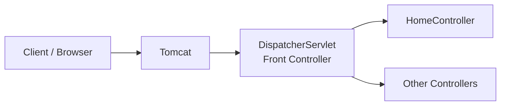

# Spring MVC Without Spring Boot (XML Configuration)

## 1. Introduction

Earlier we built a web application using **Spring Boot MVC**. It worked easily because Spring Boot did most of the setup for us.

There is another way to build the same application: use **Spring MVC directly (Spring Framework), without Spring Boot**.

- The project is the same.
- The controller code is the same.
- The flow is the same.
- **Only the configuration changes.** Here we must do the configuration ourselves.

> Focus on the **configuration** in this tutorial. The rest of the code stays the same.

### Spring Boot MVC vs Spring MVC

| Point | Spring Boot MVC | Spring MVC (without Boot) |
|---|---|---|
| Server | Embedded Tomcat (inside the project) | External Tomcat (installed separately) |
| Configuration | Automatic (auto-configuration) | Manual (XML files) |
| Settings file | `application.properties` | `web.xml` and `<name>-servlet.xml` |
| Setup effort | Very low | High (but done only once per project) |
| Control | Less | More |

---

## 2. What We Need

### 2.1 External Tomcat

Without Spring Boot, there is no embedded Tomcat. We must download Tomcat ourselves.

1. Search for **Apache Tomcat download**.
2. Download **Tomcat 10** (this tutorial uses `10.1.16`) for your operating system.
3. Unzip it. Keep the folder anywhere (for example, the Downloads folder).

> **Tomcat 10 vs Tomcat 9**
> - Tomcat 10 moved from **Java EE** to **Jakarta EE**. So the packages change from `javax.*` to `jakarta.*`.
> - Tomcat 9 still uses `javax.*`.
> - You can use either, but this tutorial uses Tomcat 10 (Jakarta).

The `bin` folder inside Tomcat has the start and stop scripts (`startup.sh`, `shutdown.sh`). We will not use them directly. The IDE will start Tomcat for us.

### 2.2 An IDE That Supports External Servers

- IntelliJ IDEA **Community** edition does **not** support external servers. (Only the Ultimate edition does.)
- **Eclipse is free** and supports external servers. So we use Eclipse.
- Download **Eclipse IDE for Enterprise Java and Web Developers** (the Java EE version), **not** the normal "Eclipse for Java Developers".

---

## 3. Creating the Spring MVC Project

We are not using Spring Initializr now. We create a plain **Maven web project**.

### Steps

1. Open Eclipse and select a workspace.
2. Go to **File → New → Maven Project**.
3. Click **Next**. In **Catalog**, choose **Internal**.
4. Select the archetype **maven-archetype-webapp** (a web application), **not** `quickstart`.
5. Enter:
   - **Group ID:** `com.telusko`
   - **Artifact ID:** `SpringMVCDemo`
6. Click **Finish** (confirm the package name if asked).

### 3.1 Folder Structure You Get

```
SpringMVCDemo
└── src
    └── main
        ├── resources
        └── webapp
            ├── WEB-INF
            │   └── web.xml
            └── index.jsp
```

Things to fix:

- There is **no `java` folder**. Create one: `src/main/java`. Our Java code goes here.
- Delete the default `index.jsp` from `webapp`. We already have our own pages.

### 3.2 Copy the Code from the Spring Boot Project

Copy only what is needed:

| What | Copy to |
|---|---|
| `Alien.java` and `HomeController.java` | `src/main/java` → package `com.telusko.SpringMVCDemo` |
| `views` folder (JSP files) | `src/main/webapp` |

- Create the package `com.telusko.SpringMVCDemo` first, then paste the classes.
- We **do not copy** the main Spring Boot application class.
- We **do not copy** `application.properties`. In this project we use XML configuration instead of property files.

### 3.3 Add the Dependency

The `pom.xml` is empty of Spring. So `HomeController` shows errors. Add **Spring Web MVC**:

```xml
<dependency>
    <groupId>org.springframework</groupId>
    <artifactId>spring-webmvc</artifactId>
    <version>6.1.0</version>
</dependency>
```

- This is **Spring Web MVC**, not Spring Boot. It brings all the Spring core libraries as well.
- Use any recent stable version when you read this.
- If the JSP page does not read `${...}` values or JSTL tags fail on Tomcat 10, also add the Jakarta JSTL library. (Tomcat 9 usually does not need it.)

After saving, the errors in `HomeController` go away.

> Also remove any unused import in `HomeController` (for example `HttpServlet`). It is not needed.

---

## 4. Running Tomcat in Eclipse

### Steps to Add the Server

1. Open the **Servers** tab and click **"No servers are available"**.
2. Choose **Apache → Tomcat v10.1 Server**. Click **Next**.
3. Click **Browse** and select your unzipped Tomcat folder.
   (If you do not have it, you can use **Download and Install**.)
4. Click **Next**. Move your project to the right side (so Tomcat runs your project). Click **Finish**.

### Run the Project

1. Start the server, or right-click the project → **Run As → Run on Server**.
2. Open `http://localhost:8080` in the browser.

**Port already in use?** Another app (for example, a Spring Boot app in IntelliJ) may be using port `8080`. Stop it, or change the Tomcat port.

**First result:** The browser shows **404 – resource is not available**. Why? Let's understand it.

---

## 5. Why 404? The Front Controller and DispatcherServlet

We have a controller with a mapping for the home page. Still, the request fails.

**Reason:** This is a normal Maven project running on Tomcat.

- Tomcat is a **Servlet Container**. It only runs **servlets**.
- Tomcat does not know that `HomeController` exists.
- There must be a mapping between a **request** and a **servlet**. We have not created it.

### 5.1 Front Controller

In Spring there can be many controllers. A request should not go directly to them. It goes to one special controller first, called the **Front Controller**.

The Front Controller:

- Sits between the client and the controllers.
- Receives **every** request.
- Decides which controller should handle it.

Example: for `/` it sends the request to the home controller. For `/add` it sends the request to the controller that adds numbers.

In Spring, the Front Controller is called **`DispatcherServlet`**.



We do **not** write the `DispatcherServlet`. Spring already gives it. We only have to **configure** it and tell Tomcat: *"Send every request to the DispatcherServlet."*

---

## 6. Configuring Tomcat: `web.xml`

Every time a project starts, Tomcat reads the file **`web.xml`** (in `WEB-INF`). This is where we talk to Tomcat.

We use two tags:

| Tag | Purpose |
|---|---|
| `<servlet>` | Declares the servlet class |
| `<servlet-mapping>` | Says which URLs go to that servlet |

Both tags are linked using the same `<servlet-name>`.

### `web.xml`

```xml
<?xml version="1.0" encoding="UTF-8"?>
<web-app xmlns="https://jakarta.ee/xml/ns/jakartaee"
         xmlns:xsi="http://www.w3.org/2001/XMLSchema-instance"
         xsi:schemaLocation="https://jakarta.ee/xml/ns/jakartaee
                             https://jakarta.ee/xml/ns/jakartaee/web-app_6_0.xsd"
         version="6.0">

    <servlet>
        <servlet-name>telusko</servlet-name>
        <servlet-class>org.springframework.web.servlet.DispatcherServlet</servlet-class>
    </servlet>

    <servlet-mapping>
        <servlet-name>telusko</servlet-name>
        <url-pattern>/</url-pattern>
    </servlet-mapping>

</web-app>
```

> The archetype may create an older `web.xml` header (a `web-app` with an old DOCTYPE). For Tomcat 10 use the Jakarta header shown above.

### Code Explanation

- `<servlet-class>`: The full class name of Spring's front controller: `org.springframework.web.servlet.DispatcherServlet`. You can find it in **Maven Dependencies → spring-webmvc → org.springframework.web.servlet**. Use the full name without `.class`.
- `<servlet-name>`: Any name you like (`telusko`, `dispatcher`, etc.). The **same name must be used in both tags**. This is how the servlet and its mapping are connected. A project can have many servlets, so the name is the link.
- `<url-pattern>/</url-pattern>`: Send **all** requests to this servlet.

### 6.1 If It Still Does Not Run: Check Build Path

If the project does not run, check the **Build Path**:

1. Right-click the project → **Build Path → Configure Build Path**.
2. In **Libraries**, set the correct **Java version** (here Java 21).
3. Add the **Tomcat Runtime** library (the server runtime).
4. Click **Apply and Close**, then restart the server.

---

## 7. Now a 500 Error: DispatcherServlet Needs Its Own Configuration

After the mapping, the error changes from `404` to **`500 Internal Server Error`**. This is progress: the request now reaches `DispatcherServlet`.

Read the **Root Cause** in the error. It says that a file named **`telusko-servlet.xml`** was not found.

**Why?**
`DispatcherServlet` is not a magician. It does not automatically know your controllers. It also needs configuration. It looks for its own XML file.

### 7.1 Rules for This File

| Rule | Detail |
|---|---|
| Location | Inside `WEB-INF` |
| Name | `<servlet-name>-servlet.xml` |

Because our servlet name is `telusko`, the file must be **`telusko-servlet.xml`**. If the servlet name was `t1`, the file would be `t1-servlet.xml`.

> **Remember:** `web.xml` = talks to **Tomcat**. `<name>-servlet.xml` = talks to **DispatcherServlet**.

### 7.2 What to Write in This File

We have two things to tell the `DispatcherServlet`:

1. "Scan this package and find my classes."
2. "I am using annotations (like `@Controller`, `@RequestMapping`)."

Because we use annotations on the controller, we do **not** need to map each URL to a method in XML.

These are written with the `context` namespace tags, so the file needs the correct header (namespace definitions).

### `WEB-INF/telusko-servlet.xml`

```xml
<?xml version="1.0" encoding="UTF-8"?>
<beans xmlns="http://www.springframework.org/schema/beans"
       xmlns:xsi="http://www.w3.org/2001/XMLSchema-instance"
       xmlns:ctx="http://www.springframework.org/schema/context"
       xsi:schemaLocation="
           http://www.springframework.org/schema/beans
           http://www.springframework.org/schema/beans/spring-beans.xsd
           http://www.springframework.org/schema/context
           http://www.springframework.org/schema/context/spring-context.xsd">

    <ctx:component-scan base-package="com.telusko" />
    <ctx:annotation-config />

</beans>
```

### Code Explanation

- `xmlns:ctx="..."`: Defines the prefix `ctx` (short for *context*). Now we can use tags like `ctx:component-scan`.
- `ctx:component-scan base-package="com.telusko"`: Tells Spring to look inside the package `com.telusko` (and its sub-packages) for classes such as controllers. You can give a more exact package, but `com.telusko` works.
- `ctx:annotation-config`: Tells Spring that we are using annotation-based configuration. It is a self-closing tag.

### Result After This Step

Run again. The console prints **"home method called"**, so the controller is now reached.

But the browser still shows **404**: *"No endpoint GET /index"*.

**Why?** The controller returns the text `"index"`. `DispatcherServlet` does not know what `index` means:

- Which folder is it in?
- What is its extension?

In Spring Boot we set these in `application.properties`. Here we have not set them yet. We must configure a **View Resolver**.

---

## 8. Configuring the InternalResourceViewResolver

A **View Resolver** converts the view name returned by the controller (like `index`) into the real file path (like `/views/index.jsp`).

For JSP pages we use the class **`InternalResourceViewResolver`**. It needs two properties:

| Property | Meaning | Value here |
|---|---|---|
| `prefix` | Folder where the pages are | `/views/` |
| `suffix` | File extension | `.jsp` |

### Add This Bean to `telusko-servlet.xml`

```xml
<bean class="org.springframework.web.servlet.view.InternalResourceViewResolver">
    <property name="prefix" value="/views/" />
    <property name="suffix" value=".jsp" />
</bean>
```

### Code Explanation

- `<bean class="...">`: Creates an object of that class, managed by Spring.
- The full class name is found in **Maven Dependencies → spring-webmvc → org.springframework.web.servlet.view**.
- `<property name="prefix" value="/views/" />`: Put this **before** the view name.
- `<property name="suffix" value=".jsp" />`: Put this **after** the view name.

So `index` becomes:

```
/views/  +  index  +  .jsp   =   /views/index.jsp
```

> **Common mistake:** Write the data using the **`value` attribute** (`value="/views/"`), not between tags or in brackets. Also make sure it is `.jsp`, not any other extension.

Restart Tomcat and refresh. The home page now opens.

---

## 9. Fixing the Empty Output: `isELIgnored`

When we submit the form, the result page loads, but the value from the model (the `course` attribute, `Java`) is **not shown**.

The controller code is fine. The problem is that the JSP **ignores the Expression Language** (`${...}`).

Fix it in the **result JSP** page by adding `isELIgnored="false"` in the page directive:

```jsp
<%@ page isELIgnored="false" %>
```

- **EL (Expression Language)** is the `${...}` syntax used to read values on the JSP page.
- `isELIgnored="false"` means *"Do not ignore it. Evaluate the expression."*

Refresh the page and the value now appears. The whole application now works **without Spring Boot**.

---

## 10. Full Flow of the Application

```mermaid
flowchart TD
    A[Browser request] --> B[Tomcat reads web.xml]
    B --> C[DispatcherServlet]
    C --> D[Reads telusko-servlet.xml<br/>component-scan + annotation-config]
    D --> E[Finds matching Controller method]
    E --> F[Method returns view name, e.g. index]
    F --> G[InternalResourceViewResolver<br/>prefix + name + suffix]
    G --> H[/views/index.jsp shown in browser]
```

---

## 11. Summary

### Who Talks to Whom

| File | Talks to | What it says |
|---|---|---|
| `web.xml` | **Tomcat** | "Send all requests to `DispatcherServlet`." |
| `<name>-servlet.xml` | **DispatcherServlet** | "Scan `com.telusko`, I use annotations, and here is the view resolver." |

### Steps to Build a Spring MVC Project (without Spring Boot)

1. Create a **Maven web application** project.
2. Add the **`spring-webmvc`** dependency.
3. Write the **controller** (using annotations like `@Controller` and `@RequestMapping`).
4. Configure **`web.xml`** with `DispatcherServlet` (`<servlet>` and `<servlet-mapping>`).
5. Create **`<servlet-name>-servlet.xml`** in `WEB-INF`:
   - `component-scan` for the package
   - `annotation-config`
   - `InternalResourceViewResolver` bean with `prefix` and `suffix`
6. Add the **external Tomcat** server and run the project.

### Common Errors and Their Meaning

| Error | Meaning | Fix |
|---|---|---|
| `404` for home page | Tomcat does not know about the controller | Configure `DispatcherServlet` in `web.xml` |
| `500` with `IOException` for `xxx-servlet.xml` | Servlet config file is missing | Create `<servlet-name>-servlet.xml` in `WEB-INF` |
| `404` with "no endpoint GET /index" | View name cannot be resolved | Add `InternalResourceViewResolver` with prefix and suffix |
| Page opens but values are not shown | EL is ignored | Add `isELIgnored="false"` |
| Project does not run at all | Missing Tomcat runtime or wrong Java version | Check the **Build Path** |
| Port already in use | Another server uses port 8080 | Stop it or change the Tomcat port |

### Spring MVC or Spring Boot?

- **Spring MVC (without Boot):** More control. The configuration is done only once for the whole project, but you add more configuration as you add features.
- **Spring Boot:** Saves time. Most real projects use it.
- Both are used in real projects. The choice depends on the type of project you are building.