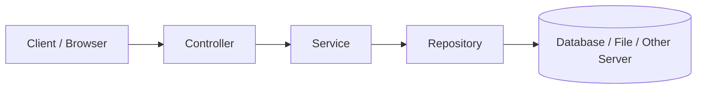
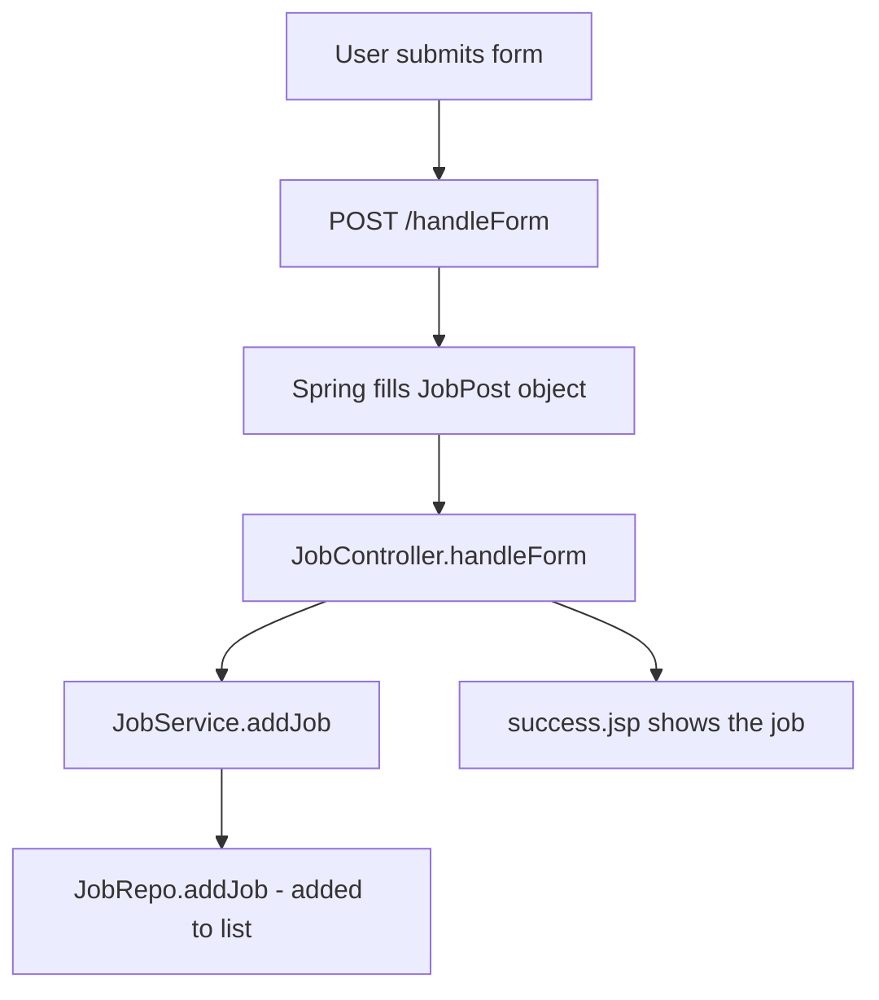
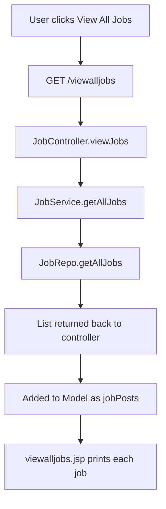

# Building a Job Portal Web App with Spring Boot MVC (JSP)

## 1. What We Are Building

We will build a small **Job Portal** web application using **Spring Boot**, **Spring MVC** and **JSP** for the views.

The app has two types of users:

| User | What they can do | Page |
|---|---|---|
| Job seeker | See all available jobs (profile, description, experience, tech stack) | View All Jobs |
| Employer | Post a new job | Add Job |

### Pages in the App

| Page | Purpose |
|---|---|
| `home.jsp` | Home page with links to the other pages |
| `addjob.jsp` | Form to add a new job |
| `success.jsp` | Shows the job that was just added |
| `viewalljobs.jsp` | Shows the list of all jobs |

> We are **not** focusing on the page design (HTML/CSS). The pages are already ready. Our job is to build the **backend**: controller, service, repository and model.

### Data Storage

We are **not using a database** now. We keep the data in a Java `List`. Because we use a repository layer, we can move to a real database later by changing only one class.

---

## 2. Creating the Project

Create the project using **Spring Initializr** (`start.spring.io`).

| Setting | Value |
|---|---|
| Project | Maven |
| Language | Java |
| Spring Boot | 3.2.1 (or any recent stable version) |
| Java | 21 |
| Artifact | `jobapp` |
| Group | `com.telusko` |
| Dependencies | **Spring Web**, **Lombok** |

Click **Generate**, unzip the project and open it in your IDE.

> **Package name:** Your base package here is `com.telusko.jobapp`. When you create classes or import them, make sure the package name matches your project. A wrong package name causes errors (we will see this below).

### 2.1 What Are These Two Dependencies?

- **Spring Web**: To build web applications and use Spring MVC.
- **Lombok**: A library that reduces the code you write (for example, it creates getters and setters for you). We will use it in the model class.

### 2.2 Extra Dependencies for JSP

Spring Boot does not support JSP by default. So we add three more dependencies in `pom.xml`:

```xml
<!-- Converts JSP pages into servlets -->
<dependency>
    <groupId>org.apache.tomcat.embed</groupId>
    <artifactId>tomcat-embed-jasper</artifactId>
</dependency>

<!-- JSTL API (Jakarta version, because Tomcat 10+ uses Jakarta) -->
<dependency>
    <groupId>jakarta.servlet.jsp.jstl</groupId>
    <artifactId>jakarta.servlet.jsp.jstl-api</artifactId>
    <version>3.0.0</version>
</dependency>

<!-- JSTL implementation -->
<dependency>
    <groupId>org.glassfish.web</groupId>
    <artifactId>jakarta.servlet.jsp.jstl</artifactId>
    <version>3.0.1</version>
</dependency>
```

| Dependency | Why we need it |
|---|---|
| Jasper (`tomcat-embed-jasper`) | Converts JSP pages so Tomcat can run them |
| JSTL API | The tag library API used inside JSP pages |
| JSTL implementation | The actual code that makes the JSTL tags work |

> If you later remove JSP from the project, you can remove these three dependencies as well.

### 2.3 Add the Views Folder

Create this folder structure:

```
src
└── main
    ├── java
    ├── resources
    │   └── application.properties
    └── webapp
        └── views
            ├── home.jsp
            ├── addjob.jsp
            ├── viewalljobs.jsp
            └── success.jsp
```

- Create the `webapp` folder inside `src/main`.
- Put the JSP files inside `webapp/views`.
- Keep the CSS files in the place the pages expect them.

### 2.4 Set the View Resolver in `application.properties`

Tell Spring where the JSP pages are (`prefix`) and their extension (`suffix`):

```properties
spring.mvc.view.prefix=/views/
spring.mvc.view.suffix=.jsp
```

When a controller returns `"home"`, Spring opens `/views/home.jsp`.

---

## 3. Understanding What the Views Need

Before writing Java code, check what each page expects from the backend.

### 3.1 URLs We Must Handle

The pages call these URLs:

| URL | Used for |
|---|---|
| `/` | Home page |
| `/home` | Home page again (the **Home** link) |
| `/viewalljobs` | Show all jobs |
| `/addjob` | Show the add-job form |
| `/handleForm` | Receive the submitted form (**POST**) |

So we have **5 URLs**, but the Home page is shared by two of them.

> The URLs in your controller must match exactly the links in your JSP files. They are **case-sensitive**: `/addjob` is not the same as `/addJob`. Also check the `action` of the form to get the exact name (here `handleForm`).

### 3.2 GET vs POST

| Method | Use | Data in URL? |
|---|---|---|
| **GET** | To **get** data from the server. This is the default for every request. | Yes, values appear in the URL |
| **POST** | To **send** (submit) data to the server | No, values are hidden |

The add-job form sends a **POST** request, so that data (for example a password) does not appear in the URL.

### 3.3 Data Each Page Needs

**Add Job form** sends these 5 values:

| Field | Type |
|---|---|
| Post ID | number |
| Post profile (job title) | text |
| Post description | text |
| Required experience | number |
| Tech stack | many values (a list) |

**View All Jobs** page needs a **list** of jobs. It goes through the list one by one and prints each job's profile, description, experience and tech stack. The page reads the list using the name **`jobPosts`**. So the controller must send the list with the same name.

**Success page** needs **one** job (the job that was just posted). It reads it using the name **`jobPost`**.

---

## 4. The Model Class: `JobPost`

The `JobPost` class holds one job's data. It has the same 5 fields as the form.

It lives in a separate package called `model`.

```java
package com.telusko.jobapp.model;

import java.util.List;

import lombok.AllArgsConstructor;
import lombok.Data;
import lombok.NoArgsConstructor;

@Data
@NoArgsConstructor
@AllArgsConstructor
public class JobPost {

    private int postId;
    private String postProfile;
    private String postDesc;
    private int reqExperience;
    private List<String> postTechStack;
}
```

> The field names must match the names used in the JSP form (the `name` attribute of each input). Spring uses these names to fill the object.

### 4.1 Lombok Annotations Explained

Normally, for private variables we must write getters, setters, `toString()`, `equals()` and `hashCode()`. This is a lot of repeated code. Lombok writes it for us.

| Annotation | What it creates |
|---|---|
| `@Data` | Getters, setters, `toString()`, `equals()`, `hashCode()` |
| `@NoArgsConstructor` | A default constructor (no parameters) |
| `@AllArgsConstructor` | A constructor with all the fields as parameters |

> When you use Lombok in an IDE, enable **annotation processing** (the IDE usually asks you).

---

## 5. Application Layers

Real applications do not put all code in the controller. We split the code into layers. Each layer has one job.



| Layer | Job | Annotation |
|---|---|---|
| **Controller** | Receive the request, send the response (view name). Does **not** store or process data. | `@Controller` |
| **Service** | Business logic and processing. Talks to the repository. | `@Service` |
| **Repository** | Gets and saves data (database, file, other server). | `@Repository` |
| **Model** | Holds data (the `JobPost` class) | (none needed) |

Our packages:

```
com.telusko.jobapp
├── controller   (or keep JobController in the main package)
├── model        → JobPost
├── service      → JobService
└── repo         → JobRepo
```

> **Benefit:** If we later use a real database, we only change the **repo** class. The controller and service stay the same.

### DTO (Data Transfer Object)

An object like `JobPost` that moves **between layers** (controller → service → repo) is called a **DTO**, a *Data Transfer Object*.

---

## 6. Repository Layer: `JobRepo`

This class stores the jobs. We use an `ArrayList` with some demo data (like a fake database).

```java
package com.telusko.jobapp.repo;

import java.util.ArrayList;
import java.util.List;

import org.springframework.stereotype.Repository;

import com.telusko.jobapp.model.JobPost;

@Repository
public class JobRepo {

    // Fake database: a list with demo data
    private List<JobPost> jobs = new ArrayList<>(List.of(
        new JobPost(1, "Java Developer", "Must know Core Java and Advanced Java", 2,
                List.of("Core Java", "J2EE", "Spring Boot", "Hibernate")),
        new JobPost(2, "Frontend Developer", "Experience in building web pages", 3,
                List.of("HTML", "CSS", "JavaScript", "React"))
    ));

    // Return all jobs
    public List<JobPost> getAllJobs() {
        return jobs;
    }

    // Add one job to the list
    public void addJob(JobPost job) {
        jobs.add(job);
    }
}
```

### Code Explanation

- `@Repository`: Marks this class as the data layer, and Spring creates its object (a bean).
- `new ArrayList<>(List.of(...))`: We wrap `List.of(...)` inside a new `ArrayList`.
- `getAllJobs()`: Returns the full list.
- `addJob(JobPost job)`: Adds a new job to the list.

> **Important mistake to avoid:** `List.of(...)` or `Arrays.asList(...)` alone gives a list that **cannot grow** (`List.of` is fully immutable, so `add()` throws an error). Since we want to add jobs later, always wrap it in `new ArrayList<>(...)`.

---

## 7. Service Layer: `JobService`

The service sits between the controller and the repository. It uses a repo object to do the work.

```java
package com.telusko.jobapp.service;

import java.util.List;

import org.springframework.beans.factory.annotation.Autowired;
import org.springframework.stereotype.Service;

import com.telusko.jobapp.model.JobPost;
import com.telusko.jobapp.repo.JobRepo;

@Service
public class JobService {

    @Autowired
    private JobRepo repo;

    // Add a job: pass it to the repo
    public void addJob(JobPost job) {
        repo.addJob(job);
    }

    // Get all jobs from the repo
    public List<JobPost> getAllJobs() {
        return repo.getAllJobs();
    }
}
```

### Code Explanation

- `@Service`: Marks this class as the service layer.
- `@Autowired private JobRepo repo`: Spring gives us the `JobRepo` object. We do not use `new`.
- Both methods only pass the work to the repo. The service is where you would add extra logic later (checks, calculations, and so on).
- Make sure the service calls the **repo** (`repo.addJob`), not itself (`service.addJob`). Calling the same method again would be a mistake.

---

## 8. Controller Layer: `JobController`

The controller handles all 5 URLs.

```java
package com.telusko.jobapp;

import org.springframework.beans.factory.annotation.Autowired;
import org.springframework.stereotype.Controller;
import org.springframework.ui.Model;
import org.springframework.web.bind.annotation.GetMapping;
import org.springframework.web.bind.annotation.PostMapping;
import org.springframework.web.bind.annotation.RequestMapping;

import com.telusko.jobapp.model.JobPost;
import com.telusko.jobapp.service.JobService;

@Controller
public class JobController {

    @Autowired
    private JobService service;

    // Home page: works for "/" and "/home"
    @RequestMapping({"/", "home"})
    public String home() {
        return "home";
    }

    // Show the add job form
    @GetMapping("addjob")
    public String addJob() {
        return "addjob";
    }

    // Handle the submitted form (POST request)
    @PostMapping("handleForm")
    public String handleForm(JobPost jobPost) {
        service.addJob(jobPost);
        return "success";
    }

    // Show all jobs
    @GetMapping("viewalljobs")
    public String viewJobs(Model m) {
        List<JobPost> jobs = service.getAllJobs();
        m.addAttribute("jobPosts", jobs);
        return "viewalljobs";
    }
}
```

> Add `import java.util.List;` for the `List` used in `viewJobs`.

### 8.1 The Home Page

```java
@RequestMapping({"/", "home"})
public String home() {
    return "home";
}
```

- The method returns a `String`, which is the **view name**. With our prefix and suffix, `"home"` becomes `/views/home.jsp`.
- We give **two URLs** in curly braces `{ }` (an array). So both `/` and `/home` call this same method.

### 8.2 The Add Job Page

```java
@GetMapping("addjob")
public String addJob() {
    return "addjob";
}
```

- Opening the add-job page is a normal **GET** request, so we use `@GetMapping`.
- The returned name (`"addjob"`) must match the JSP file name exactly. A wrong letter case gives a 404 error.

### 8.3 Handling the Form (POST)

```java
@PostMapping("handleForm")
public String handleForm(JobPost jobPost) {
    service.addJob(jobPost);
    return "success";
}
```

How this works step by step:

1. The user fills the form and clicks **Submit**. The browser sends a **POST** request to `/handleForm`.
2. Spring sees the method parameter `JobPost jobPost`. It creates a `JobPost` object and **fills its fields** using the form values (matched by field names).
3. The same object is automatically added to the model with the name **`jobPost`**. So the `success.jsp` page can read it.
4. The controller passes the object to the **service**. The service passes it to the **repo**, which adds it to the list.
5. The controller returns `"success"`, so `success.jsp` is shown.

> Using `@ModelAttribute` before the parameter is possible, but not required here.

### 8.4 View All Jobs

```java
@GetMapping("viewalljobs")
public String viewJobs(Model m) {
    List<JobPost> jobs = service.getAllJobs();
    m.addAttribute("jobPosts", jobs);
    return "viewalljobs";
}
```

- If we only return the view name, the page opens but **has no data**. We must send the data to the page.
- `Model` carries data from the controller to the view.
- `m.addAttribute("jobPosts", jobs)`: The first value is the **name** the JSP uses (`jobPosts`). The second is the data. The name must be the same as in the JSP.
- The JSP then loops through the list and prints each job.

---

## 9. `@RequestMapping` vs `@GetMapping` vs `@PostMapping`

| Annotation | Meaning |
|---|---|
| `@RequestMapping` | Handles **any** HTTP method by default, so you must give the method type if needed |
| `@GetMapping` | Handles only **GET** requests |
| `@PostMapping` | Handles only **POST** requests |

From now on, prefer `@GetMapping` and `@PostMapping` because they are clear and short.
(`@RequestMapping` is still fine for URLs that must work for many requests, like our home page.)

---

## 10. Errors We Met and Their Meaning

| Problem | Reason | Fix |
|---|---|---|
| `404` on `/viewalljobs` or `/addjob` | No mapping in the controller yet | Add the controller method with the right URL |
| `404` even after mapping | Wrong letter case in the URL or the view name (`addJob` vs `addjob`) | Match the exact name of the URL and JSP file |
| `404` on submit for `/handleForm` | No method handles the form URL | Add `@PostMapping("handleForm")` |
| `500` error "cannot resolve `JobPost`" | `JobPost` class missing, or imported from the wrong package | Create the model class and use the correct package (`com.telusko.jobapp...`) |
| Page opens but no data | Data was not sent to the view | Add the data to `Model` with the correct name |
| `UnsupportedOperationException` when adding a job | List is immutable | Use `new ArrayList<>(...)` |

---

## 11. Complete Flow of the Application

**Add a job:**



**View all jobs:**



---

## 12. Summary

- We built a **job portal** with Spring Boot MVC and JSP.
- Project setup: **Spring Web** + **Lombok**, plus JSP dependencies (Jasper, JSTL API, JSTL implementation).
- `application.properties` has the **prefix** (`/views/`) and **suffix** (`.jsp`).
- `JobPost` is the model (DTO). Lombok gives getters, setters and constructors with `@Data`, `@NoArgsConstructor`, `@AllArgsConstructor`.
- Layers: **Controller → Service → Repository**. Each layer has its own job and annotation (`@Controller`, `@Service`, `@Repository`).
- `@Autowired` connects the layers.
- Use **`@GetMapping`** to get data and **`@PostMapping`** to submit data.
- A method parameter like `JobPost jobPost` receives form data automatically.
- Use **`Model`** to send data to the view.
- Data is stored in a list for now. Moving to a real database only changes the **repo layer**.
- If you remove JSP from a project, the JSP-related dependencies are not needed anymore.