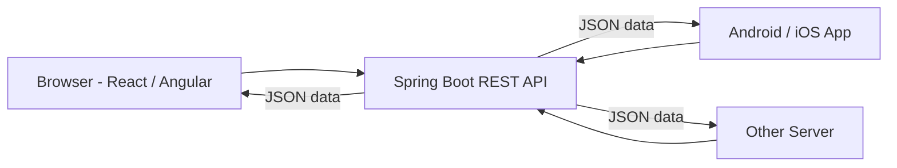

# REST API with Spring Boot

## 1. From Web Pages to REST API

### 1.1 What We Built Before

In the Job Portal app, one project had everything:

- **Front end:** JSP pages
- **Back end:** controllers, service, repository

So it was a **full stack** application in one project. Each time the client asked for something, the server returned a **complete HTML page** (formatted data).

### 1.2 The Problem

Today, one application is used from many clients:

- A browser
- An Android or iOS mobile app
- Another server

A mobile app does not want an HTML page. It has its own screen layout. It only wants **data**.

If we keep returning JSP pages, we would need **one server for browsers** (returns pages) and **another server for mobile apps** (returns data). That is not a good design.

### 1.3 The Solution

Build **one common back end** that:

- Returns **only data**, not pages.
- Uses a data format like **JSON** (or XML).
- Can be used by any client (React, Angular, mobile app, another server).

The front end is built separately (for example, with React). The back end is only a **REST API**.



> In this tutorial we only build the **back end**. We test it with a REST client called **Postman**.

---

## 2. What is REST?

**REST** means **Re**presentational **S**tate **T**ransfer.

Let us understand the words one by one.

### 2.1 Resource

In an application, we mostly do **CRUD** operations:

| Letter | Operation |
|---|---|
| C | Create data |
| R | Read data |
| U | Update data |
| D | Delete data |

The data on the server is treated as a **resource**. Every entity is a resource:

- Job → job resource
- Employee → employee resource
- Employer → employer resource

### 2.2 State

The data of a resource changes with time. For example, an employee's "current company" can be empty today, `Microsoft` after some months, and some other company later.

The value at one particular moment is called the **state**.

### 2.3 Representational State Transfer

- The client asks: "Give me the employee details."
- The server sends the **current state** in a proper, readable format (**representation**), like JSON.
- So we **transfer** the **state** of a resource. That is REST.

### 2.4 Important Rules of REST

**1. Stateless**

- The server does **not remember** the client between two requests.
- Every request must carry all the information needed (who you are, what you want, and so on).

**2. Use nouns in the URL, not actions**

| Old style (actions) | REST style (nouns) |
|---|---|
| `/viewAllJobs` | `/jobPosts` |
| `/addJob` | `/jobPost` |
| `/getJob` | `/jobPost/3` |

**3. Same URL, different HTTP method**

The URL says **what** (the resource). The HTTP method says **what to do** with it. So the same URL `/jobPost` can be used for adding and for getting.

**4. Return data, not pages**

The server returns data in JSON or XML.

### 2.5 JSON and XML

| Format | Notes |
|---|---|
| **JSON** (JavaScript Object Notation) | Newer. Easy to read. Uses less space. Can be used with any language, not only JavaScript. |
| **XML** | Older. Longer and heavier. |

Same data in both:

```json
{
  "postId": 1,
  "postProfile": "Java Developer",
  "reqExperience": 2
}
```

```xml
<JobPost>
  <postId>1</postId>
  <postProfile>Java Developer</postProfile>
  <reqExperience>2</reqExperience>
</JobPost>
```

---

## 3. HTTP Methods

**HTTP** (Hypertext Transfer Protocol) is the protocol used to access the web. It has many methods. These four are the most important:

| CRUD | HTTP Method | Spring Annotation | Meaning |
|---|---|---|---|
| Create | **POST** | `@PostMapping` | Send new data to the server |
| Read | **GET** | `@GetMapping` | Get data from the server |
| Update | **PUT** | `@PutMapping` | Change existing data |
| Delete | **DELETE** | `@DeleteMapping` | Remove data |

Example with the same URL:

| Action | Method | URL |
|---|---|---|
| Get one job | GET | `/jobPost/3` |
| Add a job | POST | `/jobPost` |
| Update a job | PUT | `/jobPost` |
| Delete a job | DELETE | `/jobPost/3` |

> The client must send the right method, and the server must have a mapping for that method.
> A browser can only send **GET** easily when you type a URL. To send POST, PUT or DELETE without building a form or UI, we use a REST client like **Postman**.

---

## 4. Testing with Postman

**Postman** is a REST client. It lets us send any kind of request to a server and see the response, without creating a UI.

Download it from the Postman website and install it.

### 4.1 Send a GET Request

1. Click **+** to open a new request tab.
2. Choose the method (**GET**) and enter the URL.
3. Click **Send**.
4. The response data appears below.

### 4.2 Send a POST Request with Data

1. Choose **POST** and enter the URL.
2. Open the **Body** tab.
3. Select **raw**, then choose **JSON** as the type.
4. Write the JSON data.
5. Click **Send**.

### 4.3 Headers

The **Headers** tab is used to set values like `Accept` (what format we want back) and `Content-Type` (what format we are sending). We will use it later.

> For simple GET requests, you can also use the browser. But for POST, PUT and DELETE you need a tool like Postman.

---

## 5. Creating the REST Project

We reuse the layers from the Job Portal (model, repo, service). Only the **controller** changes, because it will now return data instead of page names.

### 5.1 Create a New Project

Use Spring Initializr:

| Setting | Value |
|---|---|
| Project | Maven |
| Language | Java |
| Java | 21 |
| Dependencies | **Spring Web**, **Lombok** |

We do **not** need JSP, JSTL or Jasper dependencies now.

### 5.2 Copy These from the Old Project

- `model` package → `JobPost`
- `repo` package → `JobRepo`
- `service` package → `JobService`

### 5.3 What We Do Not Need

- The `webapp/views` folder (no JSP pages).
- The prefix and suffix in `application.properties` (no views to find).

> After copying, check the **package names** and **imports** in all classes. They must match the new project.

### 5.4 Reminder: Model, Repo and Service

**JobPost.java**

```java
@Data
@NoArgsConstructor
@AllArgsConstructor
public class JobPost {
    private int postId;
    private String postProfile;
    private String postDesc;
    private int reqExperience;
    private List<String> postTechStack;
}
```

**JobRepo.java** (we add more methods later)

```java
@Repository
public class JobRepo {

    private List<JobPost> jobs = new ArrayList<>(List.of(
        new JobPost(1, "Java Developer", "Must know Core Java", 2,
                List.of("Core Java", "J2EE", "Spring Boot")),
        new JobPost(2, "Frontend Developer", "Build web pages", 3,
                List.of("HTML", "CSS", "JavaScript")),
        new JobPost(3, "Network Engineer", "Manage networks", 5,
                List.of("Networking", "Security")),
        new JobPost(4, "Data Analyst", "Analyse data", 2,
                List.of("SQL", "Python")),
        new JobPost(5, "Cloud Engineer", "Manage cloud systems", 4,
                List.of("AWS", "Docker"))
    ));

    public List<JobPost> getAllJobs() {
        return jobs;
    }

    public void addJob(JobPost job) {
        jobs.add(job);
    }
}
```

**JobService.java**

```java
@Service
public class JobService {

    @Autowired
    private JobRepo repo;

    public List<JobPost> getAllJobs() {
        return repo.getAllJobs();
    }

    public void addJob(JobPost job) {
        repo.addJob(job);
    }
}
```

---

## 6. Creating a REST Controller

### 6.1 First Try: Return the Data

Create `JobController` and add one method to get all the jobs.

```java
@Controller
public class JobController {

    @Autowired
    private JobService service;

    @GetMapping("jobPosts")
    public List<JobPost> getAllJobs() {
        return service.getAllJobs();
    }
}
```

Important points:

- The URL is a **noun**: `jobPosts` (not `viewAllJobs`).
- The method returns **`List<JobPost>`**, the actual data, not a `String` view name.
- Do not forget to import `JobPost` and `List` from the correct packages.

### 6.2 Run and Test

Run the app and open `http://localhost:8080/jobPosts`.

**Result: `500 Internal Server Error`**, and the error talks about a **view resolver**.

**Why?**

- `@Controller` assumes that the returned value is a **view name**.
- Spring tries to find a page with that name, which does not exist.

We must tell Spring: "This is **data**, not a view name. Send it as the response body."

### 6.3 Fix 1: `@ResponseBody`

```java
@GetMapping("jobPosts")
@ResponseBody
public List<JobPost> getAllJobs() {
    return service.getAllJobs();
}
```

- `@ResponseBody` means: "Whatever I return is the **body of the response**. Do not look for a view."
- Spring converts the list into **JSON** and sends it.

Now `http://localhost:8080/jobPosts` returns JSON data. You can also test it in Postman.

> **Common problem:** "Port 8080 already in use". Stop the old project before you run the new one.

### 6.4 Fix 2 (Better): `@RestController`

If **all** methods in a class return data, writing `@ResponseBody` on each method is boring. Use **`@RestController`** instead of `@Controller`.

```java
@RestController
public class JobController {

    @Autowired
    private JobService service;

    @GetMapping("jobPosts")
    public List<JobPost> getAllJobs() {
        return service.getAllJobs();
    }
}
```

| Annotation | Meaning |
|---|---|
| `@Controller` | Returned values are **view names** (use with JSP or Thymeleaf) |
| `@ResponseBody` | Returned value of **one method** is the response body |
| `@RestController` | `@Controller` + `@ResponseBody` for **all methods** in the class |

### 6.5 Method Must Match

If you send a **POST** request to `/jobPosts` in Postman, but the server only has `@GetMapping` for it, you get:

**`405 Method Not Allowed`**

The URL exists, but not for that HTTP method.

### 6.6 How Does a List Become JSON?

Spring uses a library called **Jackson** to convert Java objects to JSON (and JSON back to Java objects). It comes with `spring-boot-starter-web`, so we do not add it. (You can see it under External Libraries.)

---

## 7. Connecting a Front End: `@CrossOrigin`

A front end (for example, a React app on `http://localhost:3000`) can call our REST API. We only change the URL in the front end to point to our server (`http://localhost:8080/jobPosts`).

But the browser blocks the call with a **network error**. The reason is a browser security rule called **CORS** (Cross-Origin Resource Sharing).

- **Origin** = protocol + host + port.
- `localhost:3000` (front end) and `localhost:8080` (back end) are **different origins**.
- By default, the browser does not allow a page from one origin to call another origin.

### Fix: Allow the Front End Origin

Add `@CrossOrigin` on the controller:

```java
@RestController
@CrossOrigin(origins = "http://localhost:3000")
public class JobController {
    // methods
}
```

- `origins` is the full URL of the front end.
- It tells the server: "Allow requests that come from this URL."

> Postman and server-to-server calls are not affected by CORS. It is only a browser rule.

---

## 8. `@PathVariable`: Get One Record

Now we want only **one** job by its ID.

URL example: `http://localhost:8080/jobPost/3`

In REST, such a URL is also called a **URI** (Uniform Resource Identifier), because it identifies one resource.

### 8.1 Dynamic Value in the URL

We put the changing part in **curly brackets** `{ }` and read it using `@PathVariable`.

```java
@GetMapping("jobPost/{postId}")
public JobPost getJob(@PathVariable("postId") int postId) {
    return service.getJob(postId);
}
```

### Code Explanation

- `"jobPost/{postId}"`: `{postId}` is a **placeholder**. For `/jobPost/3`, the value is `3`.
- `@PathVariable("postId")`: Takes the value from the path and puts it in the parameter `int postId`.
- If the placeholder name and the parameter name are the same, you can write only `@PathVariable int postId`.
- If you have many placeholders, write the name to say which one is which, for example `jobPost/{postId}/{name}`.

### 8.2 Service Method

```java
public JobPost getJob(int postId) {
    return repo.getJob(postId);
}
```

### 8.3 Repository Method

The repo must find the job in the list with the matching ID.

```java
public JobPost getJob(int postId) {
    for (JobPost job : jobs) {
        if (job.getPostId() == postId) {
            return job;
        }
    }
    return null;
}
```

- Loop through all jobs.
- If the ID matches, return that job.
- If nothing matches, return `null` (an empty response).

### 8.4 Test in Postman

| Request | Result |
|---|---|
| `GET /jobPost/3` | Job with ID 3 |
| `GET /jobPost/5` | Job with ID 5 |
| `GET /jobPost/10` | Empty response (no such job) |

### 8.5 `@PathVariable` vs `@RequestParam`

| | `@PathVariable` | `@RequestParam` |
|---|---|---|
| Where is the value? | In the path | In the query string |
| Example | `/jobPost/3` | `/jobPost?id=3` |
| Mapping | `jobPost/{id}` | `jobPost` |

> Do not hard-code the ID in the controller (for example, always `3`). Use `@PathVariable` so the value is dynamic.

---

## 9. `@RequestBody`: Send Data to the Server (POST)

Now we add a new job. The client sends the job data as **JSON** in the **body** of a **POST** request.

### 9.1 Controller Method

```java
@PostMapping("jobPost")
public JobPost addJob(@RequestBody JobPost jobPost) {
    service.addJob(jobPost);
    return service.getJob(jobPost.getPostId());
}
```

### Code Explanation

- `@PostMapping("jobPost")`: Handles POST requests for `/jobPost`.
- **Same URL, different method:** We already have `GET jobPost/{postId}`. There is no conflict, because the methods are different (GET vs POST).
- `@RequestBody JobPost jobPost`: Takes the JSON from the request body and converts it into a `JobPost` object (using Jackson).
- `service.addJob(jobPost)`: Saves the job.
- `return service.getJob(...)`: Returns the saved job, taken from the list. This confirms the data is really stored, not only echoed back.

### 9.2 `@RequestBody` vs `@ResponseBody`

| Annotation | Direction | Use |
|---|---|---|
| `@RequestBody` | Client → Server | Read the data sent by the client |
| `@ResponseBody` | Server → Client | Send data as the response |

### 9.3 Test in Postman

1. Method: **POST**, URL: `http://localhost:8080/jobPost`
2. Body → **raw** → **JSON**:

```json
{
  "postId": 6,
  "postProfile": "iOS Developer",
  "postDesc": "Experience in mobile development for iOS",
  "reqExperience": 2,
  "postTechStack": ["Swift", "iOS"]
}
```

3. Click **Send**. You get status **200 OK**.
4. Check with `GET /jobPosts`. The new job (ID 6) is at the end of the list.

> Data is stored in a list in memory. It is lost when the application restarts. A database will fix this later.

---

## 10. `@PutMapping`: Update Data

**PUT** is used to change an existing resource. We use the **same URL** `/jobPost`, but the PUT method.

Example: change a job's profile from "Frontend Developer" to "React Developer" and the experience from 3 to 2.

### 10.1 Controller

```java
@PutMapping("jobPost")
public JobPost updateJob(@RequestBody JobPost jobPost) {
    service.updateJob(jobPost);
    return service.getJob(jobPost.getPostId());
}
```

- The client sends the **full updated object** in the body.
- We update, then return the job from the list to confirm the change.

### 10.2 Service

```java
public void updateJob(JobPost jobPost) {
    repo.updateJob(jobPost);
}
```

### 10.3 Repository

```java
public void updateJob(JobPost jobPost) {
    for (JobPost job : jobs) {
        if (job.getPostId() == jobPost.getPostId()) {
            job.setPostProfile(jobPost.getPostProfile());
            job.setPostDesc(jobPost.getPostDesc());
            job.setReqExperience(jobPost.getReqExperience());
            job.setPostTechStack(jobPost.getPostTechStack());
        }
    }
}
```

### Code Explanation

- Find the job that has the same ID.
- Set all fields from the new data. (We do not check which field changed. Setting all of them is simple and fast for an in-memory list.)
- If the ID is not found, nothing is updated.

### 10.4 Test in Postman

1. Method: **PUT**, URL: `http://localhost:8080/jobPost`
2. Body (raw, JSON): the job with `postId` 2 and new values:

```json
{
  "postId": 2,
  "postProfile": "React Developer",
  "postDesc": "Build web pages with React",
  "reqExperience": 2,
  "postTechStack": ["HTML", "CSS", "JavaScript", "React"]
}
```

3. Click **Send**, then check `GET /jobPosts`. Job 2 is now "React Developer".

> If you send PUT to `/jobPost` before creating the `@PutMapping`, you get an error (405), not 404. The URL exists, but not for the PUT method.

---

## 11. `@DeleteMapping`: Delete Data

To delete, we send the ID in the URL, like `DELETE /jobPost/3`.

### 11.1 Controller

```java
@DeleteMapping("jobPost/{postId}")
public String deleteJob(@PathVariable int postId) {
    service.deleteJob(postId);
    return "Deleted";
}
```

- We use `@PathVariable` to read the ID from the URL.
- For now we return a simple message. In a real project, return a proper status based on the result (deleted or not found).

### 11.2 Service

```java
public void deleteJob(int postId) {
    repo.deleteJob(postId);
}
```

### 11.3 Repository

```java
public void deleteJob(int postId) {
    jobs.removeIf(job -> job.getPostId() == postId);
}
```

- `removeIf` goes through the list and removes the matching job safely.

> **Why not a `for` loop with `jobs.remove(job)`?**
> Removing items from a list while looping over it throws **`ConcurrentModificationException`**. Using `removeIf` avoids this. (If you do use a loop, stop with `break` right after you remove.)

### 11.4 Test in Postman

1. Method: **DELETE**, URL: `http://localhost:8080/jobPost/3`
2. Click **Send**. The response is `Deleted`.
3. Check `GET /jobPosts`. Job 3 is gone.

---

## 12. Complete Controller

```java
@RestController
@CrossOrigin(origins = "http://localhost:3000")
public class JobController {

    @Autowired
    private JobService service;

    @GetMapping("jobPosts")
    public List<JobPost> getAllJobs() {
        return service.getAllJobs();
    }

    @GetMapping("jobPost/{postId}")
    public JobPost getJob(@PathVariable int postId) {
        return service.getJob(postId);
    }

    @PostMapping("jobPost")
    public JobPost addJob(@RequestBody JobPost jobPost) {
        service.addJob(jobPost);
        return service.getJob(jobPost.getPostId());
    }

    @PutMapping("jobPost")
    public JobPost updateJob(@RequestBody JobPost jobPost) {
        service.updateJob(jobPost);
        return service.getJob(jobPost.getPostId());
    }

    @DeleteMapping("jobPost/{postId}")
    public String deleteJob(@PathVariable int postId) {
        service.deleteJob(postId);
        return "Deleted";
    }
}
```

### REST API Summary Table

| Operation | HTTP Method | URL | Body | Annotation |
|---|---|---|---|---|
| Get all jobs | GET | `/jobPosts` | No | `@GetMapping` |
| Get one job | GET | `/jobPost/{postId}` | No | `@GetMapping` + `@PathVariable` |
| Add a job | POST | `/jobPost` | JSON | `@PostMapping` + `@RequestBody` |
| Update a job | PUT | `/jobPost` | JSON | `@PutMapping` + `@RequestBody` |
| Delete a job | DELETE | `/jobPost/{postId}` | No | `@DeleteMapping` + `@PathVariable` |

---

## 13. Content Negotiation

By default, our API sends **JSON**. **Content negotiation** means the client and the server agree on the data format.

### 13.1 Client Asks for XML

In Postman, open **Headers** and add:

| Key | Value |
|---|---|
| `Accept` | `application/xml` |

This means: "Please send me the response in XML."

**Result: `406 Not Acceptable`**

**Why?**

- Jackson (the library that converts objects) supports only **JSON** by default.
- There is no library to convert objects to XML yet.

### 13.2 Add XML Support

Add the Jackson XML library in `pom.xml`:

```xml
<dependency>
    <groupId>com.fasterxml.jackson.dataformat</groupId>
    <artifactId>jackson-dataformat-xml</artifactId>
</dependency>
```

- It is **Jackson Dataformat XML**.
- With Spring Boot, you do not need to write the version. Spring Boot manages a matching version. (If you do write a version, use the same version as the other Jackson libraries.)
- Reload Maven and restart the application.

Now with `Accept: application/xml`, the same data comes back as **XML**. If no `Accept` header is sent, JSON is still used by default.

> **Summary:** Spring gives JSON support by default. For XML you must add the `jackson-dataformat-xml` library.

### 13.3 Restrict What the Server Produces: `produces`

What if the server must send **only JSON**? We say what it can produce:

```java
@GetMapping(path = "jobPosts", produces = {"application/json"})
public List<JobPost> getAllJobs() {
    return service.getAllJobs();
}
```

- `path`: The URL (we now write it with the name `path`, then add more options).
- `produces`: The formats this method can return. You can give more than one in the curly brackets.

Now:

| Request header `Accept` | Result |
|---|---|
| `application/json` (or nothing) | 200 OK, JSON data |
| `application/xml` | `406 Not Acceptable` |

### 13.4 Restrict What the Server Accepts: `consumes`

We can also say which format the server **accepts** from the client (in the body):

```java
@PostMapping(path = "jobPost", consumes = {"application/xml"})
public JobPost addJob(@RequestBody JobPost jobPost) {
    service.addJob(jobPost);
    return service.getJob(jobPost.getPostId());
}
```

- `consumes`: The formats this method accepts in the request body.
- The client tells its format with the **`Content-Type`** header.

Now if the client sends JSON (`Content-Type: application/json`) to this method, the result is:

**`415 Unsupported Media Type`**

> Most of the time we do not need `produces` and `consumes`. Use them only when you have a special need to control the formats.

### 13.5 Headers Used in Content Negotiation

| Header | Sent by | Meaning |
|---|---|---|
| `Accept` | Client | The format the client **wants to receive** |
| `Content-Type` | Client | The format of the data the client **is sending** |

| Controller option | Compared with | Meaning |
|---|---|---|
| `produces` | `Accept` | What the method can return |
| `consumes` | `Content-Type` | What the method can accept |

---

## 14. HTTP Status Codes We Saw

| Code | Name | When it happens |
|---|---|---|
| 200 | OK | The request worked |
| 404 | Not Found | No mapping for this URL |
| 405 | Method Not Allowed | URL exists, but not for this HTTP method |
| 406 | Not Acceptable | Server cannot produce the format asked in `Accept` |
| 415 | Unsupported Media Type | Server does not accept the format sent in `Content-Type` |
| 500 | Internal Server Error | Error in the server (for example, a view could not be found) |

---

## 15. Final Summary

- A **REST API** returns **data** (JSON or XML) instead of pages, so any client can use it.
- **REST** = transfer the current **state** of a **resource**. It is **stateless**, uses **nouns** in URLs, and uses **HTTP methods** for actions.
- Methods: **GET** (read), **POST** (create), **PUT** (update), **DELETE** (delete). Spring annotations: `@GetMapping`, `@PostMapping`, `@PutMapping`, `@DeleteMapping`.
- Use **`@RestController`** (= `@Controller` + `@ResponseBody`) to return data.
- **`@PathVariable`**: read a value from the URL path (`/jobPost/{postId}`).
- **`@RequestBody`**: convert the JSON in the request body into a Java object.
- **`@CrossOrigin`**: allow a front end on another origin to call the API.
- **Postman** is used to test all the methods without a front end.
- **Content negotiation:** Jackson gives JSON by default. Add `jackson-dataformat-xml` for XML. Use `produces` and `consumes` to control formats.
- Data is saved in a list for now, so it is lost on restart. Changing only the repository layer will let us use a database later.