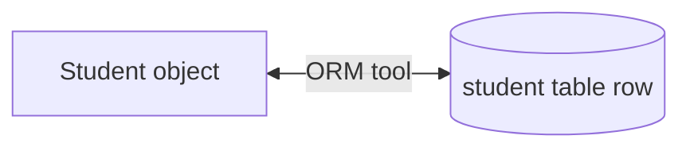
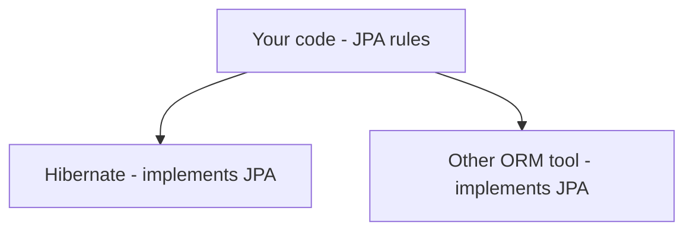
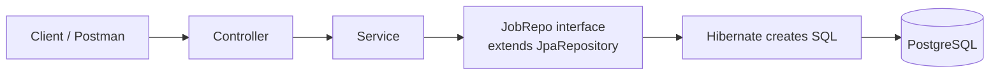

# Spring Data JPA

## 1. Why Spring Data JPA?

In the Job Portal app we have these layers:

| Layer | Job |
|---|---|
| Controller | Accept the request, give a response |
| Service | Do the processing |
| Repository | Connect to the database |

Until now, our repository layer used a **fake database** (a Java `List`). Now we will connect a **real database** (PostgreSQL).

### Ways to Work with a Database in Spring

| Way | Notes |
|---|---|
| Plain JDBC / Spring JDBC | We write all SQL queries ourselves |
| Spring ORM | Needs a lot of code |
| **Spring Data JPA** | Easiest. Very little code. |

We will use **Spring Data JPA**. To learn it, we first use a small **Student** console project, then move to the Job App.

> In the Spring JDBC version of the Student project, we wrote SQL queries and a `schema.sql` file to create the table. With JPA we can avoid both.

---

## 2. ORM and JPA

### 2.1 The Problem: Objects vs Tables

- Java is **object-oriented**. We think in **objects**.
- A **relational database** stores data in **tables** (rows and columns).

Example: a `Student` class.

```java
class Student {
    int rollNo;
    String name;
    int marks;
}
```

We can create many `Student` objects. Each object has different data.

To save this in a relational database, we normally have to decide the table name, the columns and the column types ourselves.

### 2.2 The Idea of ORM

What if a tool could create the table **from the class** for us?

| Java world | Database world |
|---|---|
| Class name (`Student`) | Table name (`student`) |
| Variables (`rollNo`, `name`, `marks`) | Columns (`rollno`, `name`, `marks`) |
| Variable type (`int`, `String`) | Column type (`INT`, `VARCHAR`) |
| One **object** | One **row** |

This mapping is called **ORM: Object Relational Mapping**. It connects the object world and the relational world.



- Saving an object → the tool creates a **new row**.
- Asking for data → the tool reads the **row** and gives you an **object**.

### 2.3 ORM Tools

There are many ORM tools. The most famous is **Hibernate**. Another one is TopLink.

### 2.4 What is JPA?

- If we write code that is specific to Hibernate and later want another tool, we must change a lot of code.
- So Java has a **common specification** (a set of rules): **JPA** (**J**ava **P**ersistence **A**PI).
- ORM tools **implement** JPA. Hibernate implements JPA.



> JPA is only a **specification**. Hibernate is the real **tool** that does the work.

### 2.5 Spring Data JPA

- You can use Hibernate or Spring ORM directly, but you must write a lot of code.
- **Spring Data JPA** is a Spring module that **simplifies** this. It uses Hibernate behind the scenes.

---

## 3. Student Project with Spring Data JPA

### 3.1 Create the Project

Use Spring Initializr:

| Setting | Value |
|---|---|
| Project | Maven |
| Language | Java |
| Java | 21 |
| Packaging | Jar |
| Dependencies | **Spring Data JPA**, **PostgreSQL Driver** |

- **Spring Data JPA**: Stores data in a SQL database using JPA and Hibernate.
- **PostgreSQL Driver**: The driver needed to connect to PostgreSQL. (You can use H2 instead.)
- We are building a **console application**, so we do not add Spring Web now.

### 3.2 Database Settings: `application.properties`

```properties
spring.datasource.url=jdbc:postgresql://localhost:5432/telusko
spring.datasource.username=postgres
spring.datasource.password=your_password
spring.datasource.driver-class-name=org.postgresql.Driver

spring.jpa.hibernate.ddl-auto=update
spring.jpa.show-sql=true
```

| Property | Meaning |
|---|---|
| `spring.datasource.url` | Database address (here PostgreSQL, database `telusko`) |
| `spring.datasource.username` / `password` | Database login |
| `driver-class-name` | The PostgreSQL driver class |
| `spring.jpa.hibernate.ddl-auto` | What Hibernate should do with the tables (see below) |
| `spring.jpa.show-sql` | Print the SQL that Hibernate creates |

**`ddl-auto`** (DDL = Data Definition Language, the SQL for creating and deleting tables):

| Value | What it does |
|---|---|
| `create` | Creates the table **every time** the app starts (it drops the old table first, so old data is lost) |
| `update` | Creates the table if it does not exist. If it exists, only updates it. **(Use this)** |

> Before running, make sure there is no old `student` table in the database, so Hibernate can create it.

### 3.3 The Entity Class

```java
package com.telusko.springdatajpaexample.model;

import jakarta.persistence.Entity;
import jakarta.persistence.Id;
import lombok.AllArgsConstructor;
import lombok.Data;
import lombok.NoArgsConstructor;

@Entity
@Data
@NoArgsConstructor
@AllArgsConstructor
public class Student {

    @Id
    private int rollNo;
    private String name;
    private int marks;
}
```

| Annotation | Meaning |
|---|---|
| `@Entity` | This class is a **table** in the database |
| `@Id` | This variable is the **primary key** |

Every table needs a primary key, so every entity needs one `@Id`.

### 3.4 The Repository: An Interface, Not a Class

```java
package com.telusko.springdatajpaexample.repo;

import org.springframework.data.jpa.repository.JpaRepository;
import org.springframework.stereotype.Repository;

import com.telusko.springdatajpaexample.model.Student;

@Repository
public interface StudentRepo extends JpaRepository<Student, Integer> {
}
```

### Code Explanation

- It is an **interface** (we do not write a class). It is **empty**.
- It extends `JpaRepository<Student, Integer>`. We give **two types**:
  1. `Student`: the entity (class) we work with.
  2. `Integer`: the type of the **primary key** (`rollNo` is `int`).
- `@Repository` marks it as the repository layer.

### 3.5 Where Do the Methods Come From?

`JpaRepository` already has many ready-made methods: `save`, `findAll`, `findById`, `delete`, `count`, and more. (They are defined in the interfaces it extends, such as `CrudRepository`, which holds the CRUD methods.)

We never write the code for these methods. **Spring Data JPA creates the implementation for us at runtime.**

### 3.6 Errors We Can Meet

| Error | Reason | Fix |
|---|---|---|
| "Not a managed type: Student" | Class is not marked as an entity | Add `@Entity` |
| "Student has no identifier" | No primary key | Add `@Id` on one variable |
| "Relation student does not exist" | Table is not created | Add `spring.jpa.hibernate.ddl-auto=update` |

---

## 4. CRUD Operations

### 4.1 Save (Insert)

```java
@SpringBootApplication
public class SpringDataJpaExampleApplication {

    public static void main(String[] args) {
        ApplicationContext context =
            SpringApplication.run(SpringDataJpaExampleApplication.class, args);

        StudentRepo repo = context.getBean(StudentRepo.class);

        Student s1 = new Student(101, "Navin", 75);
        Student s2 = new Student(102, "Kiran", 80);
        Student s3 = new Student(103, "Harsh", 68);

        repo.save(s1);
        repo.save(s2);
        repo.save(s3);
    }
}
```

### Code Explanation

- `context.getBean(StudentRepo.class)`: Get the repository object from Spring.
- We create three `Student` objects.
- `repo.save(student)`: Saves the object as a **new row**.

When we run the app for the first time, the console shows the SQL Hibernate created:

- `create table student (...)`: with `roll_no` as primary key.
- `insert into student ...`: for each object.

We did **not** write any SQL. Check the database: the `student` table has the three rows.

> On later runs, the table already exists, so only `insert` queries run.

### 4.2 Find All

```java
System.out.println(repo.findAll());
```

- `findAll()` returns **all rows** as a `List<Student>`.

### 4.3 Find By ID

```java
System.out.println(repo.findById(103));
```

- `findById(id)` finds one row using the **primary key**.
- The SQL is `select ... from student where roll_no = ?`.

**It returns an `Optional<Student>`, not a `Student`.**

Why? If you search for an ID that does not exist (for example `104`), there is no data. `Optional` helps avoid `NullPointerException`. (`Optional` is a Java 8 feature. It is not special to Spring or Hibernate.)

```java
Student s = repo.findById(103).orElse(new Student());
System.out.println(s);
```

- `orElse(new Student())`: If the data is found, return it. If not, return an empty `Student` object (with default values).
- Other choices: return `null` or throw an exception.

### 4.4 Update

There is **no separate update method**. Use `save()` again with an **existing primary key**.

```java
Student s = new Student(102, "Kiran", 65);
repo.save(s);
```

How `save()` works:

1. It first runs a `select` to check if a row with this ID exists.
2. If **yes** → it runs an `update`.
3. If **no** → it runs an `insert`.

### 4.5 Delete

```java
repo.delete(s2);
```

- Hibernate checks if the row exists, then runs `delete ... where roll_no = ?`.
- There is also `deleteById(id)`.

### 4.6 Method Summary

| Task | Method |
|---|---|
| Insert | `save(object)` |
| Update | `save(object)` (with existing ID) |
| Get all | `findAll()` |
| Get one | `findById(id)` (returns `Optional`) |
| Delete | `delete(object)` or `deleteById(id)` |
| Count rows | `count()` |
| Insert many | `saveAll(list)` |

---

## 5. Custom Search Methods

### 5.1 The Problem

`JpaRepository` has `findById` (primary key). But what about searching by **name** or **marks**?

```java
repo.findByName("Navin");   // Error: method does not exist
```

Spring cannot guess the variable names of your class. So we declare the method in **our repository interface**.

### 5.2 Option 1: Write a Query with `@Query` (JPQL)

```java
@Repository
public interface StudentRepo extends JpaRepository<Student, Integer> {

    @Query("select s from Student s where s.name = ?1")
    List<Student> findByName(String name);
}
```

### Code Explanation

- The method returns a **`List`**, because many students can have the same name.
- **JPQL** (Java Persistence Query Language) looks like SQL, but:

| SQL | JPQL |
|---|---|
| Uses **table** names | Uses **class** names (`Student`) |
| Uses **column** names | Uses **variable** names (`s.name`) |

- `Student s`: `s` is an **alias** (a short name). An alias is required.
- `?1`: A placeholder for the **first parameter** (`name`). If you have more parameters, use `?2`, `?3`, and so on.

Use it:

```java
System.out.println(repo.findByName("Navin"));
```

### 5.3 Option 2: No Query Needed (Query DSL)

The same method works **without** `@Query`:

```java
@Repository
public interface StudentRepo extends JpaRepository<Student, Integer> {

    List<Student> findByName(String name);

    List<Student> findByMarks(int marks);

    List<Student> findByMarksGreaterThan(int marks);
}
```

Spring Data JPA reads the **method name** and creates the query for you. This is called a **domain-specific language (DSL)** (also called *derived queries* or *query methods*).

**Rules:**

1. The method name must start with **`findBy`**.
2. Then write the **variable name** (property) from your class: `Name`, `Marks`, or `Id`.
3. Then, if needed, add an **operator**: `GreaterThan`, `LessThan`, and so on.
4. The parameter type must match the variable type (`String name`, `int marks`).

Example:

```java
System.out.println(repo.findByMarksGreaterThan(72));
```

Output: Navin (75) and Kiran (80).

> If the name does not match a variable, for example `findBySName`, it will **not** work. Spring does not know what `SName` is.
> If you need something that the DSL cannot give, write your own `@Query`.

### 5.4 Common Keywords for Method Names

| Keyword | Example | Meaning |
|---|---|---|
| (none) | `findByName` | `name = ?` |
| `GreaterThan` | `findByMarksGreaterThan` | `marks > ?` |
| `LessThan` | `findByMarksLessThan` | `marks < ?` |
| `Containing` | `findByNameContaining` | `name like %?%` |
| `And` | `findByNameAndMarks` | both conditions |
| `Or` | `findByNameOrMarks` | any one condition |

---

## 6. Using JPA in the Job App

Now we replace the fake `List` in the Job App with a real database. We make only a few changes.

### 6.1 Add Dependencies in `pom.xml`

```xml
<dependency>
    <groupId>org.springframework.boot</groupId>
    <artifactId>spring-boot-starter-data-jpa</artifactId>
</dependency>

<dependency>
    <groupId>org.postgresql</groupId>
    <artifactId>postgresql</artifactId>
    <scope>runtime</scope>
</dependency>
```

Reload Maven after adding them.

### 6.2 Database Settings

Add the same properties in `application.properties` (use your own database name and password):

```properties
spring.datasource.url=jdbc:postgresql://localhost:5432/telusko
spring.datasource.username=postgres
spring.datasource.password=your_password
spring.datasource.driver-class-name=org.postgresql.Driver

spring.jpa.hibernate.ddl-auto=update
spring.jpa.show-sql=true
```

### 6.3 Make `JobPost` an Entity

```java
@Entity
@Data
@NoArgsConstructor
@AllArgsConstructor
public class JobPost {

    @Id
    private int postId;
    private String postProfile;
    private String postDesc;
    private int reqExperience;
    private List<String> postTechStack;
}
```

- `@Entity`: This class becomes a table (`job_post`).
- `@Id`: `postId` is the primary key.
- The list `postTechStack` is stored in PostgreSQL as a **`varchar` array** column. (Another way is a separate table with a relationship, but the array is simple.)

### 6.4 Change `JobRepo` to an Interface

Remove the old class code (the list and its methods) and write:

```java
@Repository
public interface JobRepo extends JpaRepository<JobPost, Integer> {
}
```

- Entity type: `JobPost`. Primary key type: `Integer` (`postId`).
- The interface is **empty**. All the methods come from `JpaRepository`.

### 6.5 Update the Service

Use the JPA methods in `JobService`:

```java
@Service
public class JobService {

    @Autowired
    private JobRepo repo;

    public void addJob(JobPost jobPost) {
        repo.save(jobPost);
    }

    public List<JobPost> getAllJobs() {
        return repo.findAll();
    }

    public JobPost getJob(int postId) {
        return repo.findById(postId).orElse(new JobPost());
    }

    public void updateJob(JobPost jobPost) {
        repo.save(jobPost);
    }

    public void deleteJob(int postId) {
        repo.deleteById(postId);
    }
}
```

| Old repo method | New JPA method |
|---|---|
| `addJob(job)` | `save(job)` |
| `getAllJobs()` | `findAll()` |
| `getJob(id)` | `findById(id)` (returns `Optional`, so use `orElse`) |
| `updateJob(job)` | `save(job)` |
| `deleteJob(id)` | `deleteById(id)` |

> **The controller does not change at all.** It does not know that the repository now uses a database. This is the benefit of layers.
> Also notice that we do not write any loops, SQL or search logic in the repository anymore.

### 6.6 Load Some Starting Data

The table is empty at first. We add a method to save a few sample jobs.

**Service:**

```java
public void load() {
    List<JobPost> jobs = new ArrayList<>(List.of(
        new JobPost(1, "Java Developer", "Must know Core Java and Spring Boot, REST API", 2,
                List.of("Core Java", "Spring Boot", "REST API")),
        new JobPost(2, "Frontend Developer", "Experience in building web pages, API usage", 3,
                List.of("HTML", "CSS", "JavaScript", "React")),
        new JobPost(3, "Data Scientist", "Experience in data analysis, API usage", 4,
                List.of("Python", "Machine Learning", "API"))
    ));

    repo.saveAll(jobs);
}
```

- `saveAll(list)` saves the full list in the database.

**Controller:**

```java
@GetMapping("load")
public String loadData() {
    service.load();
    return "success";
}
```

Call `GET http://localhost:8080/load` **once** to fill the table.

### 6.7 Run and Test

1. Start the app. The console shows `create table job_post (...)`.
2. Call `GET /load`. The console shows `insert` queries, and the rows appear in the database.
3. Test the REST API in Postman:

| Request | Result |
|---|---|
| `GET /jobPosts` | All jobs, read from the database |
| `GET /jobPost/2` | Job with ID 2 |
| `POST /jobPost` | Adds a job |
| `PUT /jobPost` | Updates a job |
| `DELETE /jobPost/2` | Deletes a job |

All of them work with only small changes in the code.

---

## 7. Search by Keyword

Now we add a **search** feature: find jobs where the **profile** or the **description** contains a word (for example `Java`, `API`, or `developer`).

### 7.1 Repository Method (Query DSL)

```java
@Repository
public interface JobRepo extends JpaRepository<JobPost, Integer> {

    List<JobPost> findByPostProfileContainingOrPostDescContaining(String profile, String desc);
}
```

### Method Name Explanation

`findBy` + `PostProfile` + `Containing` + `Or` + `PostDesc` + `Containing`

| Part | Meaning |
|---|---|
| `findBy` | Start of a query method |
| `PostProfile` | Search in the variable `postProfile` |
| `Containing` | The text must **contain** the given word (not exact match) |
| `Or` | Either condition is enough |
| `PostDesc` | Also search in the variable `postDesc` |
| `Containing` | Again, contains the word |

- Because there are **two** conditions, the method needs **two** parameters (one for each).
- The names must match the variable names in `JobPost` exactly.

### 7.2 Service

```java
public List<JobPost> search(String keyword) {
    return repo.findByPostProfileContainingOrPostDescContaining(keyword, keyword);
}
```

We pass the same keyword two times: once for the profile and once for the description.

### 7.3 Controller

```java
@GetMapping("jobPost/keyword/{keyword}")
public List<JobPost> searchByKeyword(@PathVariable("keyword") String keyword) {
    return service.search(keyword);
}
```

- URL example: `GET /jobPost/keyword/API`
- `@PathVariable` takes the keyword from the URL.
- It does not clash with `jobPost/{postId}`, because the fixed word `keyword` in the path makes this URL more specific.

### 7.4 Test

`GET http://localhost:8080/jobPost/keyword/API` returns every job that has `API` in its profile or description. A job with no `API` is not in the result.

> We did not write any query. If you need something special, you can also write your own `@Query`.

---

## 8. Complete Flow



> The Spring Data JPA module is used by any client (Postman, a React app, a mobile app). The client only calls the REST API URLs. It does not know about JPA.

---

## 9. Summary

- **ORM** maps **classes to tables**, **variables to columns**, and **objects to rows**.
- **JPA** is the specification. **Hibernate** is the tool that implements it.
- **Spring Data JPA** gives you a repository with **no code**: create an **interface** that extends `JpaRepository<Entity, PrimaryKeyType>`.
- Mark the class with **`@Entity`** and the primary key with **`@Id`**.
- Properties to remember:
  - `spring.jpa.hibernate.ddl-auto=update`: creates and updates the table.
  - `spring.jpa.show-sql=true`: prints the SQL.
- Ready-made methods: `save`, `saveAll`, `findAll`, `findById`, `deleteById`, `count`.
- `findById` returns an **`Optional`**. Use `orElse(...)` to handle a missing value.
- `save` works for both **insert** and **update** (it checks the ID).
- Custom search: name the method `findBy<Property><Operator>` (like `findByMarksGreaterThan`), or write your own query with **`@Query`** and **JPQL** (class and variable names, not table and column names).
- In the Job App, we changed only the **repository** (interface) and the **service**. The controller stayed the same.