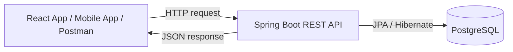
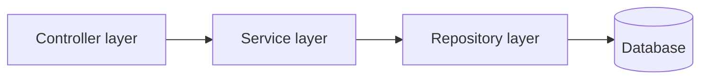
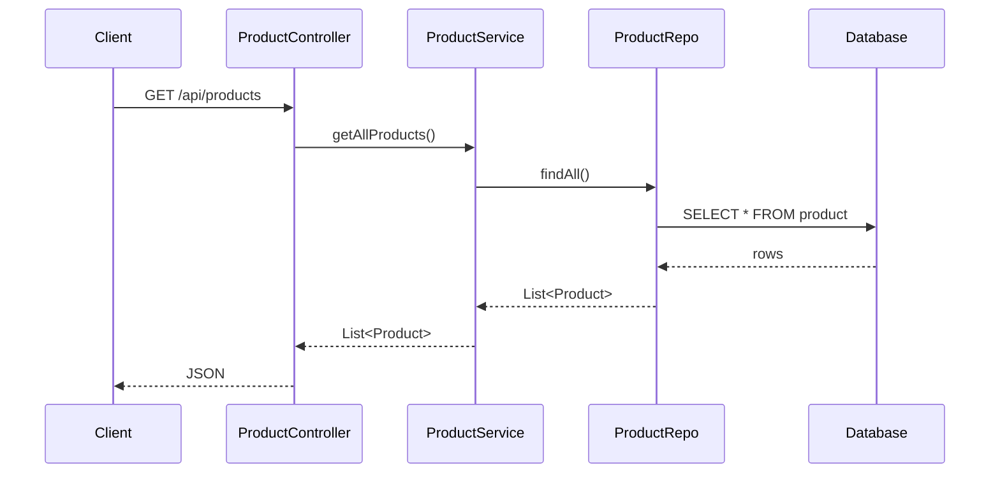
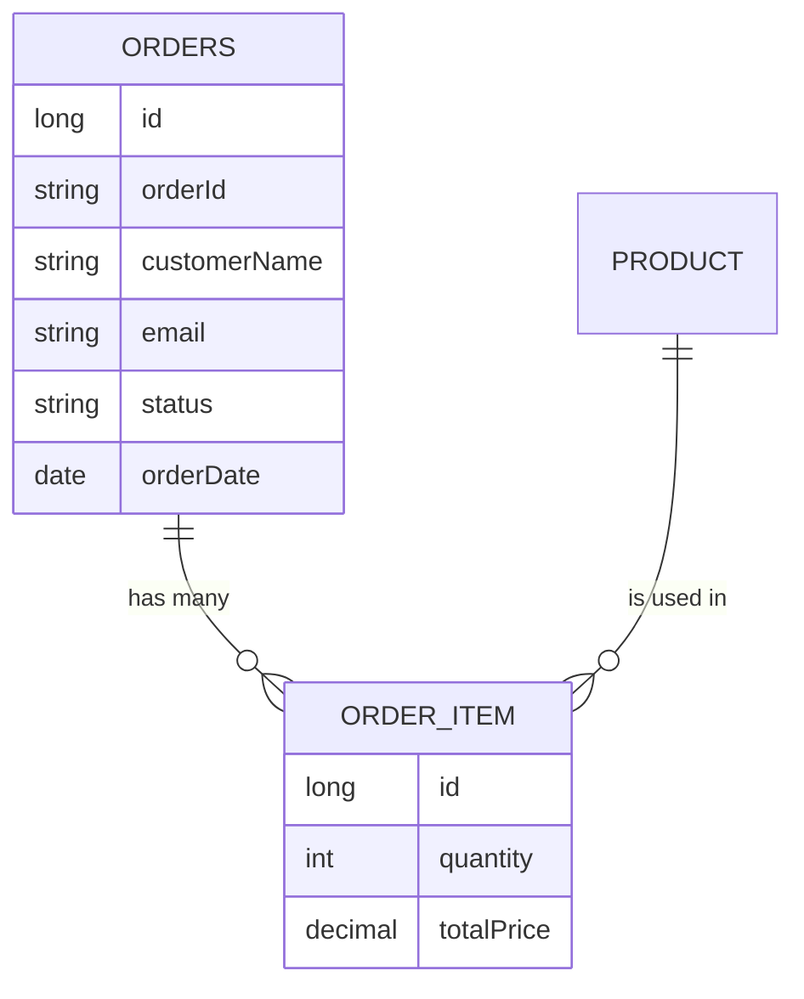
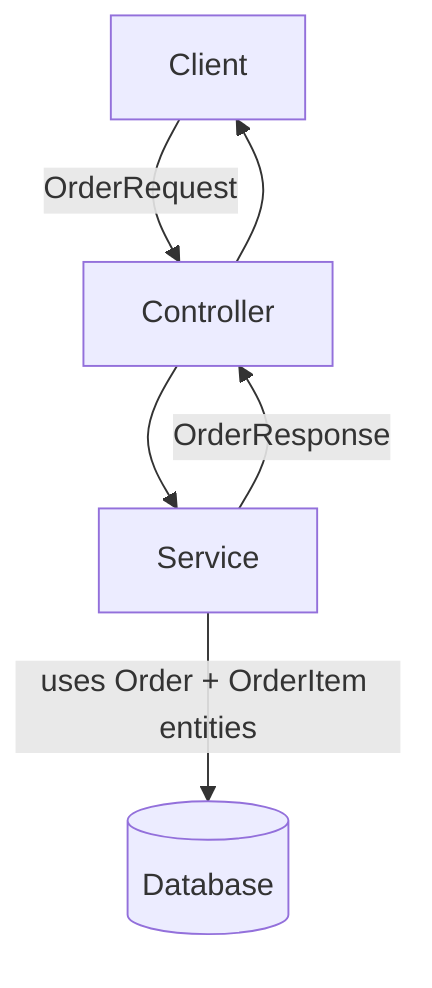
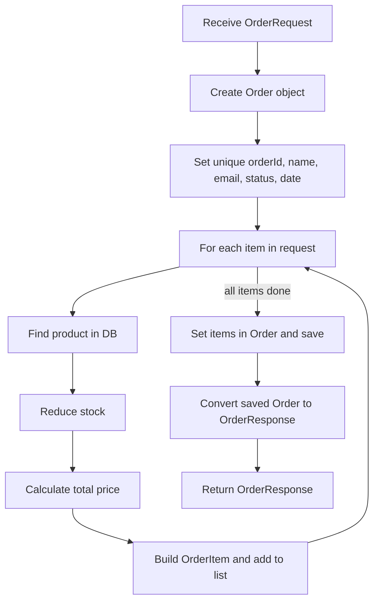

# Spring Boot E-Commerce Project: Complete Backend Tutorial

In this tutorial we build the **backend** of a simple e-commerce application using **Spring Boot**, **Spring Data JPA** and **PostgreSQL**.

The frontend is a ready-made React application. We do **not** learn React here. We only build the REST API that the frontend calls.

**What the finished backend can do:**

- Show all products
- Show one product with its details and image
- Add a new product (with an image)
- Update a product
- Delete a product
- Search products by a keyword
- Place an order (with many items) and reduce the stock
- Show all orders

---

## Table of Contents

1. [Project Overview and Architecture](#1-project-overview-and-architecture)
2. [Creating the Spring Boot Project](#2-creating-the-spring-boot-project)
3. [Product Model and Database Table](#3-product-model-and-database-table)
4. [Fetching All Products (Controller → Service → Repo)](#4-fetching-all-products)
5. [ResponseEntity and HTTP Status Codes](#5-responseentity-and-http-status-codes)
6. [Fetching One Product by Id](#6-fetching-one-product-by-id)
7. [Adding a Product with an Image](#7-adding-a-product-with-an-image)
8. [Fetching the Product Image](#8-fetching-the-product-image)
9. [Updating and Deleting a Product](#9-updating-and-deleting-a-product)
10. [Searching Products](#10-searching-products)
11. [Order Feature: Planning and Design](#11-order-feature-planning-and-design)
12. [DTOs for Orders](#12-dtos-for-orders)
13. [Entities for Orders](#13-entities-for-orders)
14. [Order Repository and Order Controller](#14-order-repository-and-order-controller)
15. [Placing an Order in the Service](#15-placing-an-order-in-the-service)
16. [Getting All Orders](#16-getting-all-orders)
17. [Quick Reference](#17-quick-reference)
18. [Practice Questions](#18-practice-questions)

---

## 1. Project Overview and Architecture

### What are we building?

A simple e-commerce website. It is not a full shop. It only has the basic features listed above.

### Why React + REST API and not JSP / Thymeleaf?

Spring supports view technologies such as **JSP**, **Thymeleaf** and **Velocity**. But in real projects the client can be many things:

- A web browser
- A mobile app
- Another server

All these clients already have their own screen layout. They only need **data** from the server. So the server sends **JSON** data, and the client shows it in its own way.

> **Why JSON and not XML?** XML also works, but it is bulky. JSON is lighter, so it is the common choice.

### Architecture



You can use any database (MySQL, H2, etc.). We use PostgreSQL.

### Layers inside the Spring Boot application



| Layer | Job |
|---|---|
| **Controller** | Receives the HTTP request and sends the response |
| **Service** | Business logic and calculations |
| **Repository** | Talks to the database |
| **Model / Entity** | Java class that represents a table |

### How the project is built step by step

The project is built in small features. At each step the frontend grows. Always make sure the backend URLs match what the frontend calls. If you change a URL in the backend, you must change it in the frontend too. You can also test every API with **Postman** if you do not want to use the UI.

---

## 2. Creating the Spring Boot Project

### Step 1: Generate the project

Go to **https://start.spring.io** and choose:

| Setting | Value |
|---|---|
| Project | Maven |
| Language | Java |
| Group | `com.telusko` |
| Artifact | `SpringEcom` |
| Java | 21 |

**Dependencies to add:**

| Dependency | Why we need it |
|---|---|
| **Spring Web** | To build REST APIs |
| **Lombok** | Reduces boilerplate code (getters, setters, constructors) |
| **PostgreSQL Driver** | To connect to PostgreSQL |
| **Spring Data JPA** | To work with the database using entities and repositories |

> **Tip:** If you forget Spring Data JPA, add this in `pom.xml` and reload Maven:
>
> ```xml
> <dependency>
>     <groupId>org.springframework.boot</groupId>
>     <artifactId>spring-boot-starter-data-jpa</artifactId>
> </dependency>
> ```

Click **Generate**, unzip the project and open it in any IDE (IntelliJ, Eclipse, VS Code).

### Step 2: A simple "Hello" controller

Before building real features, test that the server works.

```java
package com.telusko.springecom.controller;

import org.springframework.web.bind.annotation.GetMapping;
import org.springframework.web.bind.annotation.RestController;

@RestController
public class HelloController {

    @GetMapping("/hello")
    public String greet() {
        return "Welcome to Telusko";
    }
}
```

**Explanation:**

- `@RestController` tells Spring: "this class handles web requests and returns data (not a web page)".
- `@GetMapping("/hello")` maps a **GET** request for `/hello` to this method.
- The returned text is sent as the response.

Run the application. It starts on port **8080**. In Postman, send `GET http://localhost:8080/hello`. You will see `Welcome to Telusko`.

### Step 3: Product controller (first version)

Keep all controllers in one package called `controller`.

```java
@RestController
@RequestMapping("/api")
public class ProductController {

    @GetMapping("/products")
    public String getProducts() {
        return "All Products";
    }
}
```

**Explanation:**

- `@RequestMapping("/api")` on the class puts `/api` in front of **every** URL in this class. This way you do not repeat `/api` in each method.
- So `@GetMapping("/products")` becomes `GET /api/products`.

Postman shows `All Products`. This is only a test. The frontend needs a **list of products**, not a string. To send a list of products we need a **Product model** and a **database table**.

---

## 3. Product Model and Database Table

### The Product entity

Create a package `model` and a class `Product` inside it.

```java
package com.telusko.springecom.model;

import jakarta.persistence.*;
import lombok.AllArgsConstructor;
import lombok.Data;
import lombok.NoArgsConstructor;
import java.math.BigDecimal;
import java.util.Date;

@Entity
@Data
@NoArgsConstructor
@AllArgsConstructor
public class Product {

    @Id
    @GeneratedValue(strategy = GenerationType.IDENTITY)
    private int id;

    private String name;
    private String description;
    private String brand;
    private BigDecimal price;
    private String category;
    private Date releaseDate;
    private boolean productAvailable;
    private int stockQuantity;
}
```

**Explanation of each annotation:**

| Annotation | Meaning |
|---|---|
| `@Entity` | This class becomes a database table |
| `@Data` (Lombok) | Creates getters, setters, `toString`, `equals`, `hashCode` |
| `@NoArgsConstructor` | Creates an empty constructor (JPA needs it) |
| `@AllArgsConstructor` | Creates a constructor with all fields |
| `@Id` | This field is the **primary key** |
| `@GeneratedValue(strategy = IDENTITY)` | The database generates the id automatically |

> **Why `BigDecimal` for price?** `double` and `float` can give small rounding errors. `BigDecimal` is safe for money.

### Connect to the database

Open `src/main/resources/application.properties`:

```properties
spring.datasource.url=jdbc:postgresql://localhost:5432/telusko
spring.datasource.username=postgres
spring.datasource.password=your_password

spring.jpa.hibernate.ddl-auto=update
```

**Explanation:**

| Property | Meaning |
|---|---|
| `spring.datasource.url` | JDBC URL. Format: `jdbc:postgresql://host:port/databaseName` |
| `spring.datasource.username` / `password` | Your database login |
| `spring.jpa.hibernate.ddl-auto=update` | If the table does not exist, **create** it. If it exists, **update** it |

Port numbers for other databases: MySQL uses `3306`. For H2 you can give just the database name.

### Important: create the database first

Spring Boot **creates tables**, but it does **not create the database**. Open pgAdmin and create a database named `telusko`. If it is missing, you will get an error like *"Unable to determine Dialect"*.

Run the application. Refresh the tables in pgAdmin. You will see a `product` table with all columns, and `id` as the primary key.

> **Anti-pattern:** `ddl-auto=update` is fine for learning. In production, use a migration tool (Flyway or Liquibase) instead.

---

## 4. Fetching All Products

### Flow



The controller should not talk to the database directly. It asks the **service**. The service asks the **repository**.

### Step 1: Repository

Create a package `repo` and an **interface**:

```java
package com.telusko.springecom.repo;

import com.telusko.springecom.model.Product;
import org.springframework.data.jpa.repository.JpaRepository;
import org.springframework.stereotype.Repository;

@Repository
public interface ProductRepo extends JpaRepository<Product, Integer> {
}
```

**Explanation:**

- We only write an **interface**. Spring Data JPA creates the implementation for us.
- `JpaRepository<Product, Integer>`: first type = the entity, second type = the type of its primary key (`int` id → `Integer`).
- We get ready-made methods: `findAll()`, `findById()`, `save()`, `deleteById()` and more.

### Step 2: Service

Create a package `service`:

```java
package com.telusko.springecom.service;

@Service
public class ProductService {

    @Autowired
    private ProductRepo repo;

    public List<Product> getAllProducts() {
        return repo.findAll();
    }
}
```

`@Service` marks this class as the service layer, so Spring creates its object.

### Step 3: Controller

```java
@RestController
@RequestMapping("/api")
public class ProductController {

    @Autowired
    private ProductService service;

    @GetMapping("/products")
    public List<Product> getProducts() {
        return service.getAllProducts();
    }
}
```

The response is empty (`[]`) because the table has no data yet.

### Step 4: Add some sample data

You can write `INSERT` statements by hand, or ask an AI tool to generate sample `INSERT` statements for your table. Run them in pgAdmin's query tool. Then call `GET /api/products` again. You get all products as JSON.

> Note: ids may not start from 1 if you inserted and deleted rows before. That is normal with auto-generated ids.

### Step 5: The CORS problem

The React app runs on port **5173**, but the backend runs on **8080**. Two different ports mean two different "origins". The browser **blocks** such requests by default. This is a browser security rule called **CORS** (Cross-Origin Resource Sharing).

Postman does not have this problem, but the browser does. Fix it by adding `@CrossOrigin` on the controller:

```java
@RestController
@CrossOrigin
@RequestMapping("/api")
public class ProductController { ... }
```

> **Anti-pattern:** A plain `@CrossOrigin` allows requests from **any** origin. For production, allow only your frontend: `@CrossOrigin("https://myshop.com")`.

---

## 5. ResponseEntity and HTTP Status Codes

By default, Spring sends status **200 (OK)**. To control the status, return a `ResponseEntity`.

### Common HTTP status codes

| Range | Meaning | Examples |
|---|---|---|
| 1xx | Informational | 100 Continue |
| **2xx** | **Success** | 200 OK, 201 Created, 202 Accepted |
| 3xx | Redirect | 301 Moved Permanently |
| **4xx** | **Client error** | 400 Bad Request, 401 Unauthorized, 404 Not Found, 405 Method Not Allowed |
| **5xx** | **Server error** | 500 Internal Server Error |

### Using ResponseEntity

`ResponseEntity<T>` holds **both** the data and the status.

```java
@GetMapping("/products")
public ResponseEntity<List<Product>> getProducts() {
    return new ResponseEntity<>(service.getAllProducts(), HttpStatus.OK);
}
```

- First parameter: the **body** (data).
- Second parameter: the **status**, using the `HttpStatus` enum.

If you change it to `HttpStatus.ACCEPTED`, Postman shows **202 Accepted**. That is not logical for a simple read, so we keep `HttpStatus.OK`. The point is: you now control the status.

You can also send **only a status without a body**:

```java
return new ResponseEntity<>(HttpStatus.NOT_FOUND);
```

---

## 6. Fetching One Product by Id

**Goal:** `GET /api/product/8` returns the product with id 8.

### Controller

```java
@GetMapping("/product/{id}")
public ResponseEntity<Product> getProduct(@PathVariable int id) {
    Product product = service.getProductById(id);

    if (product != null) {
        return new ResponseEntity<>(product, HttpStatus.OK);
    } else {
        return new ResponseEntity<>(HttpStatus.NOT_FOUND);
    }
}
```

**Explanation:**

- `{id}` in the URL is a **path variable** (a value inside the URL).
- `@PathVariable int id` reads that value.
- If the product is found we send it with **200**. If not, we send **404** with no body.

### Service

```java
public Product getProductById(int id) {
    return repo.findById(id).orElse(null);
}
```

**Explanation:**

- `findById()` returns an `Optional<Product>`, because the product may not exist.
- `.orElse(null)` gives the product if present, otherwise `null`.
- If you use `.get()` on an empty Optional, you get a `NoSuchElementException` (*"No value present"*). So `.get()` is risky.

> **Anti-pattern:** Returning `null` is not the best style. Better options: return an `Optional` to the controller, or throw a custom "ProductNotFound" exception. We use `null` here because the controller checks it.

### Formatting the date in JSON

The date may look ugly in the frontend. Use Jackson's `@JsonFormat` in the entity:

```java
@JsonFormat(shape = JsonFormat.Shape.STRING, pattern = "dd-MM-yyyy")
private Date releaseDate;
```

- `Jackson` is the library that converts Java objects to JSON.
- `shape = STRING` means send the date as a text.
- `pattern` is the format you want. Use any format you like. (The frontend can also format the date itself.)

---

## 7. Adding a Product with an Image

### Two ways to send an image

| Way | How it works |
|---|---|
| 1. Base64 | Convert the image to text, put it inside the JSON, and decode it on the server |
| 2. **Multipart (we use this)** | Send the JSON and the image as **two separate parts** in one request |

### Step 1: Add image fields to the entity

```java
private String imageName;
private String imageType;

@Lob
private byte[] imageData;
```

| Field | Meaning |
|---|---|
| `imageName` | File name, like `phone.jpg` |
| `imageType` | Content type, like `image/jpeg` |
| `imageData` | The actual image bytes |

`@Lob` means **Large Object**. It tells JPA to store big data (images, big text) in a special large-object column. Because we use `ddl-auto=update`, the new columns are added to the table automatically.

### Step 2: Controller

```java
@PostMapping("/product")
public ResponseEntity<?> addProduct(@RequestPart Product product,
                                    @RequestPart MultipartFile imageFile) {
    try {
        Product saved = service.addOrUpdateProduct(product, imageFile);
        return new ResponseEntity<>(saved, HttpStatus.CREATED);
    } catch (Exception e) {
        return new ResponseEntity<>(e.getMessage(), HttpStatus.INTERNAL_SERVER_ERROR);
    }
}
```

**Explanation:**

- `ResponseEntity<?>` — the `?` means "any type". On success we return a `Product`; on error we return a `String`.
- `@RequestPart` reads one **part** of a multipart request. We have two parts: the product JSON and the image file.
- `MultipartFile` represents the uploaded file.
- The **name of the method parameter must match the part name** sent by the client. The frontend sends the part `imageFile`, so our parameter is named `imageFile`. (If the names differ, use `@RequestPart("partName")`.)
- `HttpStatus.CREATED` (201) is correct when we create a new resource.
- The `try/catch` returns the error message with status **500** if saving fails.

### @RequestBody vs @RequestPart

| | `@RequestBody` | `@RequestPart` |
|---|---|---|
| Used for | The whole body is one JSON object | Request has several parts (JSON + file) |
| Content type | `application/json` | `multipart/form-data` |

### Step 3: Service

```java
public Product addOrUpdateProduct(Product product, MultipartFile image) throws IOException {
    product.setImageName(image.getOriginalFilename());
    product.setImageType(image.getContentType());
    product.setImageData(image.getBytes());
    return repo.save(product);
}
```

**Explanation:**

- `getOriginalFilename()` gives the file name.
- `getContentType()` gives the type, like `image/jpeg`.
- `getBytes()` gives the image as a byte array. It can throw `IOException`, so the method declares `throws IOException`.
- `repo.save(product)` stores the product with its image and returns the saved object.

### Testing with Postman

1. Create a **POST** request to `http://localhost:8080/api/product`.
2. Open **Body → form-data**.
3. Add key `product`. Type = Text. Put the product JSON as value. Set the content type of this part to `application/json`.
4. Add key `imageFile`. Change its type to **File** and choose an image.
5. Send. You should get **201 Created**. The response contains the image data (a very long text).

Check pgAdmin: the new row has `image_name`, `image_type` and `image_data`.

---

## 8. Fetching the Product Image

The product JSON does not carry the image separately for display, so the frontend calls another URL to get the image:

`GET /api/product/{productId}/image`

### Controller

```java
@GetMapping("/product/{productId}/image")
public ResponseEntity<byte[]> getImageByProductId(@PathVariable int productId) {
    Product product = service.getProductById(productId);
    byte[] imageFile = product.getImageData();

    return ResponseEntity.ok()
            .contentType(MediaType.valueOf(product.getImageType()))
            .body(imageFile);
}
```

**Explanation:**

- We return `ResponseEntity<byte[]>` because we send raw image bytes.
- We only need the image, so we take `getImageData()` from the product.
- `contentType(...)` tells the browser what kind of image this is (for example `image/jpeg`). This is a small extra that makes the response correct.
- In Postman you will see the picture in the response preview.

> **Tip:** Also check for `product == null` and return **404**, to avoid a `NullPointerException`.

---

## 9. Updating and Deleting a Product

### Update

The frontend sends a **PUT** request to `/api/product/{id}` with the same two parts (product + image).

```java
@PutMapping("/product/{id}")
public ResponseEntity<String> updateProduct(@PathVariable int id,
                                            @RequestPart Product product,
                                            @RequestPart MultipartFile imageFile) {
    try {
        service.addOrUpdateProduct(product, imageFile);
        return new ResponseEntity<>("Updated", HttpStatus.OK);
    } catch (IOException e) {
        return new ResponseEntity<>("Failed to update", HttpStatus.BAD_REQUEST);
    }
}
```

**Key idea:** Spring Data JPA has **no separate update method**. `save()` does both:

- If the object has **no id** (or the id does not exist) → **INSERT**.
- If the object has an **existing id** → **UPDATE**.

That is why we reuse the same service method `addOrUpdateProduct()` for both add and update.

### Delete

```java
@DeleteMapping("/product/{id}")
public ResponseEntity<String> deleteProduct(@PathVariable int id) {
    Product product = service.getProductById(id);

    if (product != null) {
        service.deleteProduct(id);
        return new ResponseEntity<>("Deleted", HttpStatus.OK);
    } else {
        return new ResponseEntity<>("Product not found", HttpStatus.NOT_FOUND);
    }
}
```

Service:

```java
public void deleteProduct(int id) {
    repo.deleteById(id);
}
```

**Explanation:** First we check that the product exists. If yes, delete it and send 200. If not, send 404.

### HTTP methods used so far

| Action | Method | URL |
|---|---|---|
| Get all | GET | `/api/products` |
| Get one | GET | `/api/product/{id}` |
| Get image | GET | `/api/product/{id}/image` |
| Add | POST | `/api/product` |
| Update | PUT | `/api/product/{id}` |
| Delete | DELETE | `/api/product/{id}` |

---

## 10. Searching Products

The frontend sends: `GET /api/products/search?keyword=lego`

### Controller

```java
@GetMapping("/products/search")
public ResponseEntity<List<Product>> searchProducts(@RequestParam String keyword) {
    List<Product> products = service.searchProducts(keyword);
    return new ResponseEntity<>(products, HttpStatus.OK);
}
```

### PathVariable vs RequestParam

| | `@PathVariable` | `@RequestParam` |
|---|---|---|
| Looks like | `/product/5` | `/products/search?keyword=lego` |
| Used for | Identifying one resource | Filters, search, optional values |

> Make sure the URL matches the frontend exactly. In the lesson, a wrong URL (`product` instead of `products`) caused "no data".

### Service

```java
public List<Product> searchProducts(String keyword) {
    return repo.searchProducts(keyword);
}
```

### Repository: a custom query with JPQL

`JpaRepository` has no "search by keyword in many columns" method. We **declare** our own method and give it a query with `@Query`. We do not write the method body. Spring implements it.

```java
@Query("SELECT p FROM Product p WHERE " +
       "LOWER(p.name) LIKE LOWER(CONCAT('%', :keyword, '%')) OR " +
       "LOWER(p.description) LIKE LOWER(CONCAT('%', :keyword, '%')) OR " +
       "LOWER(p.brand) LIKE LOWER(CONCAT('%', :keyword, '%')) OR " +
       "LOWER(p.category) LIKE LOWER(CONCAT('%', :keyword, '%'))")
List<Product> searchProducts(String keyword);
```

**Explanation:**

- This is **JPQL** (Java Persistence Query Language). It is like SQL, but it uses **class names and field names**, not table and column names. `Product p` is the class, `p.name` is the field.
- `:keyword` is a **named parameter**. It takes the value from the method argument named `keyword`.
- `LOWER(...)` on both sides makes the search **case-insensitive**.
- `LIKE '%keyword%'` matches the keyword anywhere in the text.
- We search in **name, description, brand and category**. So searching "ultra" can return a laptop whose description says "Ultrabook".

### Problem with Large Objects in PostgreSQL

Because we store images as large objects, PostgreSQL may throw an error like *"Large Objects may not be used in auto-commit mode"*. Fix it in `application.properties`:

```properties
spring.datasource.hikari.auto-commit=false
```

Restart the app and search again. It works.

> **Tip:** The frontend sends a request on **every key press**. This creates many server calls. You can reduce this by searching only after 3 or more characters, or by using a search button.

---

## 11. Order Feature: Planning and Design

### What the user does

1. Adds products to the cart. **This happens only in the frontend.** The backend knows nothing yet.
2. Clicks checkout and enters name and email.
3. Clicks purchase. **Now the backend is called.**
4. Later, opens the Orders page to see all orders and their items.

### What the backend must do

- Receive the order (customer name, email, list of product ids and quantities).
- Do **not** trust the price from the client. **Calculate** the price on the server using the product price from the database.
- Reduce the stock of each product.
- Save the order and its items.
- Return all orders when asked. For the user, show the product **name** (not the id).

### The data problem

One order can have **many items**. So we need **two tables**: `orders` and `order_item`.



### Entities vs DTOs

We do not want to send whole entities to the client or accept them from the client. They have extra fields (like internal ids) and many null values. So we use **DTOs (Data Transfer Objects)**: simple classes (or records) made only to carry data.



Four DTOs:

- `OrderItemRequest` — one item coming **from** the client
- `OrderRequest` — the full order coming **from** the client
- `OrderItemResponse` — one item going **to** the client
- `OrderResponse` — the full order going **to** the client

Two entities:

- `Order` — saved in the `orders` table
- `OrderItem` — saved in the `order_item` table

### Classes and methods we will create

- **Controller:** `placeOrder`, `getAllOrderResponses`
- **Service:** `placeOrder`, `getAllOrderResponses`
- **Repo:** `OrderRepo` with `findByOrderId`
- **Entities:** `Order`, `OrderItem`
- **DTOs:** the four records above

> **Setup check:** Start from the working product project (with search). Make sure the `product` table exists and has data. Before the order code exists, placing an order in the UI fails because the backend has no such URL (the error says the method is not available).

---

## 12. DTOs for Orders

Create a package `model/dto`. We use Java **records**.

> **Why records?** A record is a short way to write a class that only carries data. It automatically gives a constructor, getters (like `customerName()`), `equals`, `hashCode` and `toString`. Fields are **final** (cannot change).

### OrderItemRequest (client → server)

```java
public record OrderItemRequest(int productId, int quantity) {}
```

We send only the product id and quantity. **No price.** The server will calculate the price, so nobody can cheat by sending a fake price.

### OrderRequest (client → server)

```java
public record OrderRequest(String customerName,
                           String email,
                           List<OrderItemRequest> items) {}
```

### OrderItemResponse (server → client)

```java
public record OrderItemResponse(String productName,
                                int quantity,
                                BigDecimal totalPrice) {}
```

The client wants the product **name**, not the id.

### OrderResponse (server → client)

```java
public record OrderResponse(String orderId,
                            String customerName,
                            String email,
                            String status,
                            LocalDate orderDate,
                            List<OrderItemResponse> items) {}
```

### How they connect

```
OrderRequest
  └── List of OrderItemRequest (productId, quantity)
         ↓  (server converts productId → product name, adds price)
OrderResponse
  └── List of OrderItemResponse (productName, quantity, totalPrice)
```

---

## 13. Entities for Orders

### OrderItem entity

```java
@Entity
@Data
@NoArgsConstructor
@AllArgsConstructor
@Builder
public class OrderItem {

    @Id
    @GeneratedValue(strategy = GenerationType.IDENTITY)
    private Long id;

    @ManyToOne
    private Product product;

    private int quantity;
    private BigDecimal totalPrice;

    @ManyToOne(fetch = FetchType.LAZY)
    private Order order;
}
```

### Order entity

```java
@Entity
@Table(name = "orders")
@Data
@NoArgsConstructor
@AllArgsConstructor
public class Order {

    @Id
    @GeneratedValue(strategy = GenerationType.IDENTITY)
    private Long id;

    @Column(unique = true)
    private String orderId;

    private String customerName;
    private String email;
    private String status;
    private LocalDate orderDate;

    @OneToMany(mappedBy = "order", cascade = CascadeType.ALL)
    private List<OrderItem> orderItems;
}
```

### Explanation

**Two ids in Order:**

| Field | Purpose |
|---|---|
| `id` | Primary key of the table (a number) |
| `orderId` | A unique text (like `A1B2C3D4`) that the user sees. `@Column(unique = true)` makes sure no two orders share it |

**`@Table(name = "orders")`:** `order` is a reserved word in SQL (`ORDER BY`). So we name the table `orders` to avoid problems.

**Relationship annotations:**

| Annotation | Meaning here |
|---|---|
| `@ManyToOne` on `OrderItem.product` | Many order items can point to **one** product |
| `@ManyToOne` on `OrderItem.order` | Many items belong to **one** order |
| `@OneToMany` on `Order.orderItems` | One order has **many** items |
| `mappedBy = "order"` | The mapping is **owned by** the `order` field in `OrderItem`. The foreign key column is created there. You map a two-way relation only once; without `mappedBy`, JPA would create an extra table |
| `cascade = CascadeType.ALL` | When we save an order, its items are saved too (same for delete, etc.) |
| `fetch = FetchType.LAZY` | Load the order only when it is really needed |

**`@Builder`:** Lombok creates a builder so you can create an `OrderItem` step by step:

```java
OrderItem.builder().product(p).quantity(2).build();
```

> **Anti-pattern:** With `@Data` on two classes that point to each other, the generated `toString()` / `hashCode()` can call each other forever and cause a `StackOverflowError`. If you ever print such entities, add `@ToString.Exclude` (and `@EqualsAndHashCode.Exclude`) on one side of the relationship.

> **Good idea for later:** Create a `Customer` entity and link it, instead of storing customer name and email inside the order.

---

## 14. Order Repository and Order Controller

### OrderRepo

```java
@Repository
public interface OrderRepo extends JpaRepository<Order, Long> {

    Optional<Order> findByOrderId(String orderId);
}
```

**Explanation:**

- `JpaRepository<Order, Long>` — entity `Order`, primary key type `Long`.
- `findByOrderId` is a **derived query method**. Spring reads the method name and builds the query for you. No `@Query` needed.
- It returns `Optional<Order>` because an order with that id may not exist.

### OrderController

```java
@RestController
@CrossOrigin
@RequestMapping("/api")
public class OrderController {

    @Autowired
    private OrderService orderService;

    @PostMapping("/orders/place")
    public ResponseEntity<OrderResponse> placeOrder(@RequestBody OrderRequest request) {
        OrderResponse orderResponse = orderService.placeOrder(request);
        return new ResponseEntity<>(orderResponse, HttpStatus.CREATED);
    }

    @GetMapping("/orders")
    public ResponseEntity<List<OrderResponse>> getAllOrderResponses() {
        List<OrderResponse> responses = orderService.getAllOrderResponses();
        return new ResponseEntity<>(responses, HttpStatus.OK);
    }
}
```

**Explanation:**

- `@RequestBody` converts the JSON body into an `OrderRequest` object (a normal JSON request, so no `@RequestPart` here).
- Placing an order creates something new, so we return **201 Created**.
- The URLs must match the frontend: `POST /api/orders/place` and `GET /api/orders`.
- The method is named `getAllOrderResponses` (not `getAllOrders`) because it returns **responses**, not `Order` entities.
- The controller does no work itself. It just passes the request to the service.

---

## 15. Placing an Order in the Service

### Plan (what `placeOrder` does)



### Generating a unique order id

We use `UUID`:

```java
String orderId = "ORD" + UUID.randomUUID().toString().substring(0, 8).toUpperCase();
```

- `UUID.randomUUID()` gives a random unique text.
- We take only the first 8 characters and make them uppercase, so the id is short.
- Using only 8 characters can (rarely) repeat. That is why the `orderId` column is `unique`. For more safety, use more characters.

### Full service code

```java
@Service
public class OrderService {

    @Autowired
    private ProductRepo productRepo;

    @Autowired
    private OrderRepo orderRepo;

    @Transactional
    public OrderResponse placeOrder(OrderRequest request) {

        // 1. Create the order and set simple values
        Order order = new Order();
        order.setOrderId("ORD" + UUID.randomUUID().toString().substring(0, 8).toUpperCase());
        order.setCustomerName(request.customerName());
        order.setEmail(request.email());
        order.setStatus("PLACED");
        order.setOrderDate(LocalDate.now());

        // 2. Build the list of order items
        List<OrderItem> orderItems = new ArrayList<>();

        for (OrderItemRequest itemRequest : request.items()) {

            // find the product, or throw an error if it does not exist
            Product product = productRepo.findById(itemRequest.productId())
                    .orElseThrow(() -> new RuntimeException("Product not found"));

            // reduce the stock and save the product
            product.setStockQuantity(product.getStockQuantity() - itemRequest.quantity());
            productRepo.save(product);

            // build the order item
            OrderItem orderItem = OrderItem.builder()
                    .product(product)
                    .quantity(itemRequest.quantity())
                    .totalPrice(product.getPrice()
                            .multiply(BigDecimal.valueOf(itemRequest.quantity())))
                    .order(order)
                    .build();

            orderItems.add(orderItem);
        }

        // 3. Put the items into the order and save
        order.setOrderItems(orderItems);
        Order savedOrder = orderRepo.save(order);

        // 4. Convert to response
        return toOrderResponse(savedOrder);
    }
}
```

### Explanation step by step

1. **Create the order.** The `orderId` is generated by us. The status is `PLACED`. The date is today.
2. **Loop over the items.** For each item:
   - `findById(...)` finds the product. `orElseThrow` stops with an error if it is missing.
   - **Reduce the stock:** new stock = old stock − ordered quantity. We `save` the product so the `product` table is updated.
   - **Calculate the price:** `BigDecimal` cannot use `*`. We use `multiply()`, and convert the int quantity with `BigDecimal.valueOf(...)`.
   - **Build the `OrderItem`** with the builder. `.order(order)` links the item to its order.
3. **Save the order.** Because of `cascade = ALL`, saving the order also saves all its items. So **three tables change**: `orders`, `order_item`, `product`.
4. **Create the response** from the saved order.

### Why `@Transactional`?

If something fails in the middle (for example the third product is missing), a transaction **rolls back** all changes. Without it, the stock of the first two products could stay reduced even though no order was saved.

> **Good idea:** Also check the stock before reducing it: `if (product.getStockQuantity() < itemRequest.quantity()) throw new RuntimeException("Not enough stock");`. The frontend limits the quantity, but the backend should never rely only on the frontend.

### Converting an Order to OrderResponse

Both "place order" and "get all orders" need this conversion, so we keep it in one private method:

```java
private OrderResponse toOrderResponse(Order order) {

    List<OrderItemResponse> itemResponses = new ArrayList<>();

    for (OrderItem item : order.getOrderItems()) {
        OrderItemResponse itemResponse = new OrderItemResponse(
                item.getProduct().getName(),
                item.getQuantity(),
                item.getTotalPrice()
        );
        itemResponses.add(itemResponse);
    }

    return new OrderResponse(
            order.getOrderId(),
            order.getCustomerName(),
            order.getEmail(),
            order.getStatus(),
            order.getOrderDate(),
            itemResponses
    );
}
```

**Explanation:**

- We create an `OrderItemResponse` for each item. The product **name** comes from `item.getProduct().getName()`. This is where the product id becomes a name.
- Then we create one `OrderResponse` using the order values and the list of item responses.
- Records have no setters, so all values go through the constructor, in the **same order** as declared in the record.

### Common problem: "null value in column id"

If you see an error like *null value in column "id" of relation "orders"*, the table was created **before** you added `@GeneratedValue(strategy = GenerationType.IDENTITY)`. `ddl-auto=update` does not always fix existing columns.

**Fix:** Drop the `orders` and `order_item` tables in pgAdmin and restart the app. Spring recreates them with auto-generated ids.

### Checking the result

After placing an order, check pgAdmin:

- `orders` has one new row with the generated `order_id` and status `PLACED`.
- `order_item` has one row per item, with quantity and total price.
- `product` has a reduced `stock_quantity`.

---

## 16. Getting All Orders

Add this method to `OrderService`:

```java
public List<OrderResponse> getAllOrderResponses() {

    List<Order> orders = orderRepo.findAll();

    List<OrderResponse> orderResponses = new ArrayList<>();

    for (Order order : orders) {
        orderResponses.add(toOrderResponse(order));
    }

    return orderResponses;
}
```

**Explanation:**

1. `orderRepo.findAll()` reads all orders from the database.
2. We loop through each order and convert it to an `OrderResponse` using the helper method from the previous section.
3. We return the list. The frontend shows it on the Orders page, and "View details" shows the items.

> **Stream version:** You can write the loop in one line: `orders.stream().map(this::toOrderResponse).toList()`. We used a normal loop to keep it simple.

### Final test

1. Add products to the cart in the UI and click purchase. The UI says the order is placed.
2. Open the product: its stock is lower.
3. Open Orders: you see the new order. Click details to see the items, quantities and prices.

**Ideas to extend the project:**

- Add login so the user does not type name and email every time.
- Add a search-by-email feature using a repo method like `findByEmail`.
- Add a `Customer` entity.

---

## 17. Quick Reference

### All APIs

| Method | URL | Purpose | Success Status |
|---|---|---|---|
| GET | `/hello` | Test | 200 |
| GET | `/api/products` | All products | 200 |
| GET | `/api/product/{id}` | One product | 200 / 404 |
| GET | `/api/product/{id}/image` | Product image | 200 |
| POST | `/api/product` | Add product + image | 201 |
| PUT | `/api/product/{id}` | Update product + image | 200 |
| DELETE | `/api/product/{id}` | Delete product | 200 / 404 |
| GET | `/api/products/search?keyword=` | Search | 200 |
| POST | `/api/orders/place` | Place order | 201 |
| GET | `/api/orders` | All orders | 200 |

### Annotations used

| Annotation | Use |
|---|---|
| `@RestController` | Class returns data, not views |
| `@RequestMapping("/api")` | Common URL prefix |
| `@GetMapping / @PostMapping / @PutMapping / @DeleteMapping` | Map HTTP methods |
| `@PathVariable` | Value inside the URL |
| `@RequestParam` | Query value (`?key=value`) |
| `@RequestBody` | Whole JSON body |
| `@RequestPart` | One part of a multipart request |
| `@CrossOrigin` | Allow requests from another origin |
| `@Service` / `@Repository` | Service and repository layers |
| `@Entity`, `@Id`, `@GeneratedValue` | Table, primary key, auto id |
| `@Lob` | Large data such as images |
| `@Query` | Custom JPQL query |
| `@ManyToOne`, `@OneToMany` | Relationships between entities |
| `@Transactional` | All-or-nothing database work |

### Properties used

```properties
spring.datasource.url=jdbc:postgresql://localhost:5432/telusko
spring.datasource.username=postgres
spring.datasource.password=your_password
spring.jpa.hibernate.ddl-auto=update
spring.datasource.hikari.auto-commit=false
```

### Common mistakes

| Mistake | Result | Fix |
|---|---|---|
| Database not created | "Unable to determine Dialect" | Create the DB in pgAdmin first |
| Missing `@CrossOrigin` | Browser blocks the request | Add `@CrossOrigin` |
| Part name differs from parameter name | Error adding product | Match names or use `@RequestPart("name")` |
| Wrong URL compared to frontend | No data / 404 | Match the URL exactly |
| `.get()` on empty Optional | "No value present" | Use `orElse` / `orElseThrow` |
| Large objects with auto-commit | Search error in PostgreSQL | `hikari.auto-commit=false` |
| Table named `order` | SQL error | Use `@Table(name = "orders")` |
| Missing `@GeneratedValue` at first run | "null value in column id" | Drop the table and restart |

---

## 18. Practice Questions

**Q1. Why do we use JSON and a REST API instead of JSP or Thymeleaf?**
Clients can be browsers, mobile apps or other servers. They already have their own layout. They only need data, so the server sends JSON.

**Q2. What is the job of the controller, service and repository?**
Controller handles HTTP requests/responses. Service has business logic. Repository talks to the database.

**Q3. Why do we return `ResponseEntity` instead of the object directly?**
It lets us control both the data and the HTTP status code (201, 404, 500, etc.).

**Q4. What is CORS and how did we fix it?**
The browser blocks requests between different origins (different ports). We added `@CrossOrigin` on the controller.

**Q5. What is the difference between `@RequestBody` and `@RequestPart`?**
`@RequestBody` reads the whole body as one JSON object. `@RequestPart` reads one part of a multipart request, used when sending JSON and a file together.

**Q6. How does JPA decide between insert and update in `save()`?**
No id (or an id that is not in the DB) → insert. Existing id → update.

**Q7. What does `@Lob` do?**
It stores large data (like image bytes) in a large-object column.

**Q8. What is the difference between JPQL and SQL?**
JPQL uses entity class names and field names. SQL uses table and column names.

**Q9. Why is `mappedBy` used in `@OneToMany`?**
It says the other side owns the relationship, so the mapping and foreign key exist only once.

**Q10. Why do we use DTOs for orders?**
To send and receive only the needed fields, avoid null values and avoid exposing entities.

**Q11. Why do we not accept the price from the client when placing an order?**
The client could send a fake price. The server should calculate the price from the database.

**Q12. Why is `@Transactional` useful in `placeOrder`?**
If any step fails, all database changes (stock, order, items) are rolled back, so data stays correct.