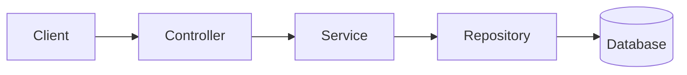
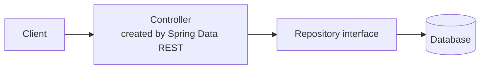

# Spring Data REST

## 1. The Idea Behind Spring Data REST

### 1.1 The Layers We Normally Build

In a web application with a database, we usually have these layers:



| Layer | Annotation | Job |
|---|---|---|
| Controller | `@Controller` / `@RestController` | Accept the request and give the response |
| Service | `@Service` | Do the processing (business logic) |
| Repository | `@Repository` | Connect to the database |

### 1.2 What We Learned About the Repository

With **Spring Data JPA**, we do not write JDBC code or SQL queries. We create an interface, and Spring gives us ready-made methods. We only write a method ourselves for something advanced.

### 1.3 Look at Our Own Job App

Now check what our service and controller really do:

- **Service layer:** It does no real processing. It only calls the repository and returns the result.
- **Controller layer:** It does no processing either. It only has URL mappings and calls the service.

So these two layers have **no logic** of their own. They only pass the request along.

### 1.3.1 The Question

> If the controller and service only pass things along, can we remove them?

- The **service** layer is specific to our project. In this project it is not needed, so we can remove it.
- The **controller** is different. Something must accept the requests. But **we do not have to write it**. Someone else can give it to us.

### 1.4 What is Spring Data REST?

**Spring Data** is a big Spring project with many modules. Two of them are:

| Module | What it does |
|---|---|
| **Spring Data JPA** | Gives you the repository layer without writing code |
| **Spring Data REST** | Creates the **REST API (controller)** for you from your repository |

With Spring Data REST, you only write:

1. The **model** (entity) class
2. The **repository** interface

And you get a full REST API **without writing any controller or service**.



---

## 2. Creating the Project

Use Spring Initializr.

| Setting | Value |
|---|---|
| Project | Maven |
| Language | Java |
| Java | 21 |
| Group | `com.telusko` |
| Artifact | `spring-data-rest-demo` |

### Dependencies

| Dependency (in Initializr) | Why |
|---|---|
| **Spring Data JPA** | To work with the database using JPA |
| **Rest Repositories** | Exposes Spring Data repositories as REST APIs (this is Spring Data REST) |
| **PostgreSQL Driver** | To connect to PostgreSQL |
| **Lombok** | Reduces code in the model class |

> We do **not** add the normal **Spring Web** dependency in the same way as before. The **Rest Repositories** dependency brings what is needed for a REST application.

### In `pom.xml`

The important dependencies are:

```xml
<dependency>
    <groupId>org.springframework.boot</groupId>
    <artifactId>spring-boot-starter-data-jpa</artifactId>
</dependency>

<dependency>
    <groupId>org.springframework.boot</groupId>
    <artifactId>spring-boot-starter-data-rest</artifactId>
</dependency>

<dependency>
    <groupId>org.postgresql</groupId>
    <artifactId>postgresql</artifactId>
    <scope>runtime</scope>
</dependency>

<dependency>
    <groupId>org.projectlombok</groupId>
    <artifactId>lombok</artifactId>
    <optional>true</optional>
</dependency>
```

Reload Maven after any change in `pom.xml`.

---

## 3. Reusing the Existing Code

We reuse the model and repository from the Job App. We do **not** copy the controller or the service.

```
src/main/java/com/telusko/springdatarestdemo
├── model
│   └── JobPost.java
└── repo
    └── JobRepo.java
```

### 3.1 Model: `JobPost`

```java
@Entity
@Data
@NoArgsConstructor
@AllArgsConstructor
public class JobPost {

    @Id
    private int postId;
    private String postProfile;
    private String postDesc;
    private int reqExperience;
    private List<String> postTechStack;
}
```

### 3.2 Repository: `JobRepo`

Keep only the clean interface. Remove the custom search methods; we use the default methods.

```java
@Repository
public interface JobRepo extends JpaRepository<JobPost, Integer> {
}
```

> After copying, fix the **package names** and **imports** in both files (for example, import `JobPost` from the new `model` package).

### 3.3 Database Settings: `application.properties`

Use the same database settings as before, so we use the same `job_post` table:

```properties
spring.datasource.url=jdbc:postgresql://localhost:5432/telusko
spring.datasource.username=postgres
spring.datasource.password=your_password
spring.datasource.driver-class-name=org.postgresql.Driver

spring.jpa.hibernate.ddl-auto=update
spring.jpa.show-sql=true
```

### 3.4 What Is Missing?

Compare with the old project:

| Old project | This project |
|---|---|
| Controller with many methods | **None** |
| Service class | **None** |
| Repository | Same |
| Model | Same |

We have only **two classes** (model and repository), plus the main application class.

---

## 4. Running the Project

Run the main application class. Tomcat starts with no errors.

There is no controller, and we did not write any URL. So what URL do we use?

### 4.1 Default URL

Spring Data REST creates the URL from the **entity name**:

- Take the entity name `JobPost`.
- Make the first letter small: `jobPost`.
- Make it **plural**: `jobPosts`.

So the URL is:

```
GET http://localhost:8080/jobPosts
```

In REST, the URL uses a **noun** (a resource), so it is plural by default.

### 4.2 Test in Postman

Send a `GET` request to `http://localhost:8080/jobPosts`.

You get **all the jobs** from the database in JSON. The response looks like this (shortened):

```json
{
  "_embedded": {
    "jobPosts": [
      {
        "postProfile": "Java Developer",
        "postDesc": "Must know Core Java and Spring Boot",
        "reqExperience": 2,
        "postTechStack": ["Core Java", "Spring Boot"],
        "_links": {
          "self":    { "href": "http://localhost:8080/jobPosts/1" },
          "jobPost": { "href": "http://localhost:8080/jobPosts/1" }
        }
      }
    ]
  },
  "_links": {
    "self": { "href": "http://localhost:8080/jobPosts" }
  }
}
```

### 4.3 What are `_links`? (HATEOAS)

The response has extra `_links` data. This idea is called **HATEOAS** (*Hypermedia As The Engine Of Application State*).

> **HATEOAS says:** when the server sends data, it should also tell the client **where to find related data**.

- Each job has a `self` link that points to **that one job**.
- The client can just click or call this link to get one job. It does not need to build the URL itself.

### 4.4 Get One Job

Use the link from the response:

```
GET http://localhost:8080/jobPosts/1
```

This returns only the job with ID `1`. For another job, change the ID (`/jobPosts/2`).

> The controller was **not written by us**. Spring Data REST creates all these URLs by looking at the methods available in our repository.

---

## 5. Update (PUT)

Example: change the job with ID `3` to a **Frontend Developer** with experience `1`.

### Steps in Postman

1. Method: **PUT**
2. URL: the link of that job, for example `http://localhost:8080/jobPosts/3`
3. **Body** → **raw** → **JSON**
4. Write the new data. **Do not copy the `_links` part.**

```json
{
  "postId": 3,
  "postProfile": "Frontend Developer",
  "postDesc": "Build web pages",
  "reqExperience": 1,
  "postTechStack": ["HTML", "CSS", "JavaScript"]
}
```

5. Click **Send**.

You get a response with the updated data. Check the database: the third row now shows **Frontend Developer** and experience **1**. The update works.

> The `postId` in the body should be the same as the ID in the URL.

---

## 6. Delete

1. Method: **DELETE**
2. URL: the link of the job to delete, for example `http://localhost:8080/jobPosts/3`
3. **Body**: select **none** (do not send anything).
4. Click **Send**.

The server answers with a success status. In the database, the row with ID `3` is gone.

> The URL is the same as the one used for GET and PUT. Only the **HTTP method** changes.

---

## 7. All the Operations You Get for Free

| Operation | HTTP Method | URL | Body |
|---|---|---|---|
| Get all jobs | GET | `/jobPosts` | No |
| Get one job | GET | `/jobPosts/{id}` | No |
| Update a job | PUT | `/jobPosts/{id}` | JSON (without `_links`) |
| Delete a job | DELETE | `/jobPosts/{id}` | No |
| Add a job | POST | `/jobPosts` | JSON |

> The POST request to add a job works the same way. Because our `postId` has no auto-generation, send the `postId` in the JSON body.

---

## 8. Change the URL Name (Optional)

If you do not like the default `jobPosts`, you can change it on the repository with `@RepositoryRestResource`:

```java
@RepositoryRestResource(path = "jobs")
public interface JobRepo extends JpaRepository<JobPost, Integer> {
}
```

Now the URL is `http://localhost:8080/jobs`.

---

## 9. Summary

- A controller and a service often only **pass the request** to the repository. In such a project, Spring Data REST can remove the need for them.
- Spring Data REST **creates the REST controller for you** from your repository interface.
- You need only:
  1. The **entity** class (`@Entity`, `@Id`)
  2. The **repository** interface (`extends JpaRepository`)
  3. The database settings
- Dependencies: **Spring Data JPA**, **Rest Repositories** (Spring Data REST), the database driver, and Lombok.
- Default URL: the **plural, small-letter entity name** (`JobPost` → `/jobPosts`).
- The response contains `_links` (**HATEOAS**), which tell the client where to find each resource.
- GET, PUT and DELETE all use the **same URL pattern**. Only the HTTP method changes.
- This is a very fast way to build a simple RESTful web service. When you need business logic or custom rules, you can still write your own service and controller.