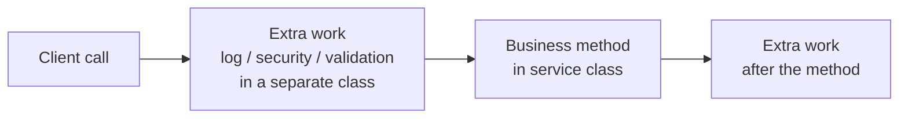
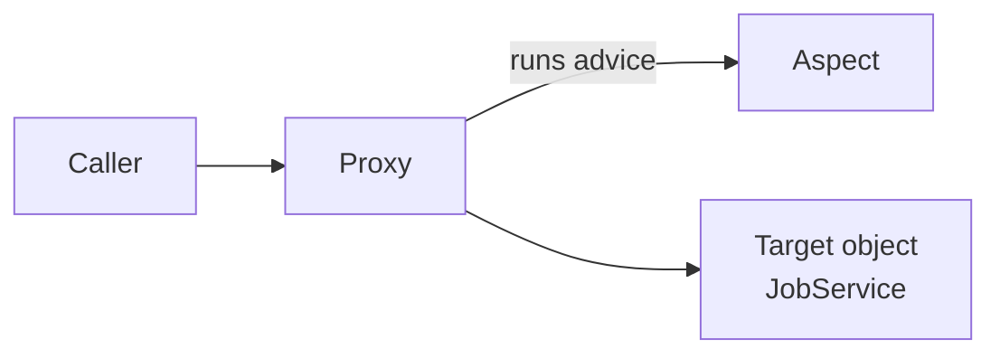

# Spring AOP (Aspect Oriented Programming)

## 1. What is AOP?

**AOP** means **Aspect Oriented Programming**.

- AOP does **not** replace OOP (Object Oriented Programming). Objects are still the base of Java.
- AOP **adds to** OOP. It solves one special problem: **cross-cutting concerns**.

---

## 2. The Problem: Cross-Cutting Concerns

### 2.1 Business Logic and Other Work

In an application, most code is **business logic** (what the client asked for).

But we also do other work that the client did not ask for. We do it to protect or understand the application:

| Extra work | Example |
|---|---|
| Logging | Write which method was called and when |
| Security | Check who can call a method |
| Validation | Check if the input data is correct |
| Exception handling | Handle errors |
| Performance monitoring | Measure how long a method takes |

### 2.2 The Simple Way (Not Good)

Suppose we have a service method:

```java
public void updateJob(JobPost jobPost) {
    // log: method started
    // security check
    // validate input
    try {
        repo.save(jobPost);          // <-- the only business logic
    } catch (Exception e) {
        // handle exception
    }
    // log: method ended
}
```

Look at it: the real business logic is **one line**. The rest is extra code.

Problems:

- The code becomes **hard to read**. A new developer must search for the business logic.
- The code becomes **hard to maintain**.
- We must **repeat** the same extra code in many methods (`getJob`, `getAllJobs`, `deleteJob`, `load`, and so on).

### 2.3 What is a Cross-Cutting Concern?

Logging, security, validation, and so on are **not related to one method**. They are needed in **many places** across the application. They "cut across" the code. So they are called **cross-cutting concerns**.

### 2.4 A Better Idea

1. Move all this extra code to a **separate class**.
2. **Do not call** these methods yourself. Let Spring call them **automatically** at the right time.

That is exactly what AOP does.



> The service class has **no idea** that logging or validation is happening. The business code stays clean.

---

## 3. Setup

Add the AOP starter in `pom.xml` (needed for the AOP annotations):

```xml
<dependency>
    <groupId>org.springframework.boot</groupId>
    <artifactId>spring-boot-starter-aop</artifactId>
</dependency>
```

- The logger (`slf4j`) is already included in Spring Boot. We do not need to add it.
- We keep all aspect classes in a separate package, for example `com.telusko.springbootrest.aop`.

Our example uses a `JobService` class:

```
com.telusko.springbootrest
├── service
│   └── JobService     (methods: getJob, getAllJobs, updateJob, addJob, deleteJob, load)
└── aop
    ├── LoggingAspect
    ├── PerformanceMonitorAspect
    └── ValidationAspect
```

---

## 4. A First Try (and Why It Fails)

We create a class `LoggingAspect` and a method that prints a log message:

```java
public class LoggingAspect {

    private static final Logger LOGGER = LoggerFactory.getLogger(LoggingAspect.class);

    public void logMethodCall() {
        LOGGER.info("Method called");
    }
}
```

We want this method to run every time a `JobService` method is called. But when we call the API, **nothing is printed**.

**Why?** Spring does not know that this method is special. We only wrote a normal class and a normal method. Nothing connects it to the service methods. This connection is called **weaving**.

To make it work we need:

- Some **annotations**, and
- To understand the **AOP terms**.

---

## 5. AOP Terms (Concepts)

AOP has a few special words. Learn them first, and the code becomes easy.

### 5.1 The Movie Example

Think of a **movie**. The main actor does the main work. The director adds extra scenes at certain moments.

| AOP term | Meaning | Movie example | Our example |
|---|---|---|---|
| **Aspect** | A **class** that holds the cross-cutting code | The script of the extra scenes | `LoggingAspect` class |
| **Advice** | **What** to do (the code) and **when** (before, after, around) | The action in a scene | The `logMethodCall` method |
| **Join point** | A **moment** in the execution where advice can run (in Spring AOP: a **method call**) | A scene in the movie | Calling `getJob()` |
| **Pointcut** | An **expression** that says **which** join points to use | Choosing which scenes get the extra action | `execution(* ...JobService.*(..))` |
| **Target object** | The object whose methods are advised | The main character (the hero) | The `JobService` object |
| **Proxy** | A **wrapper** object around the target. Calls go through the proxy. | The stunt double | Spring's proxy of `JobService` |
| **Weaving** | **Connecting** aspects with the target code | Turning the script into the movie | Done by Spring at **runtime** |

### 5.2 Join Point vs Pointcut

These two look similar:

- **Join point** = a possible place (any method execution).
- **Pointcut** = the **rule** that picks the places we really want.

### 5.3 Proxy and Weaving in Spring AOP

- Spring does **not** change the original class.
- It creates a **proxy** around the target object. When you call a method, the call goes to the proxy first. The proxy runs the advice and then calls the real method.
- Weaving happens at **runtime** in Spring AOP.
- Other tools like **AspectJ** can weave at **compile time**.



### 5.4 Types of Advice

| Advice | Annotation | Runs |
|---|---|---|
| Before | `@Before` | **Before** the method |
| After (finally) | `@After` | **After** the method, always (success or error) |
| After returning | `@AfterReturning` | After the method **finishes successfully** |
| After throwing | `@AfterThrowing` | After the method **throws an exception** |
| Around | `@Around` | **Before and after**, around the method |

---

## 6. Before Advice

### 6.1 Make the Class an Aspect

```java
package com.telusko.springbootrest.aop;

import org.aspectj.lang.annotation.Aspect;
import org.aspectj.lang.annotation.Before;
import org.slf4j.Logger;
import org.slf4j.LoggerFactory;
import org.springframework.stereotype.Component;

@Component
@Aspect
public class LoggingAspect {

    private static final Logger LOGGER = LoggerFactory.getLogger(LoggingAspect.class);

    @Before("execution(* com.telusko.springbootrest.service.JobService.*(..))")
    public void logMethodCall() {
        LOGGER.info("Method called");
    }
}
```

### Code Explanation

| Part | Meaning |
|---|---|
| `@Component` | Spring creates and manages this class as a bean |
| `@Aspect` | This class is an **aspect** (it holds cross-cutting code) |
| `@Before(...)` | This method is an **advice** that runs **before** the matching methods |
| `"execution(...)"` | The **pointcut expression** (which methods to match) |
| `LoggerFactory.getLogger(...)` | Gets the logger. You can also write logs to a file instead of the console. |

### 6.2 The Pointcut Expression

```
execution( return-type  package.Class.method(arguments) )
```

Our expression:

```
execution(* com.telusko.springbootrest.service.JobService.*(..))
```

| Part | Meaning |
|---|---|
| `execution` | Match method **executions** (method calls) |
| `*` (first) | **Any return type** |
| `com.telusko.springbootrest.service.JobService` | The **full class name** (package + class) |
| `.*` | **Any method** in that class |
| `(..)` | **Any arguments** (any number, any type). Use `..`, not `*`, for arguments. |

To match **one** method only, give its name and its return type if you want:

```java
@Before("execution(void com.telusko.springbootrest.service.JobService.addJob(..))")
```

> **Be careful:** Do not write `execution(* *.*(..))` to match everything. It matches methods of Spring's own classes too, and can cause problems. Always give the **package and class** of your own code.

### 6.3 Test

Call any API that uses a `JobService` method, for example `GET /jobPost/4`. The console prints:

```
Method called
```

The service class was **not changed at all**. It has no idea about the logging. That is the power of AOP.

---

## 7. Join Point: Know Which Method Was Called

"Method called" is not very useful. We want to know **which** method was called.

### 7.1 Match Only Specific Methods

```java
@Before("execution(* com.telusko.springbootrest.service.JobService.getJob(..))")
```

Now it works **only** for `getJob`.

### 7.2 Match More Than One Method (`||`)

Use the **pipe** symbol `||` (or) and write the expression again:

```java
@Before("execution(* com.telusko.springbootrest.service.JobService.getJob(..)) || "
      + "execution(* com.telusko.springbootrest.service.JobService.updateJob(..))")
```

### 7.3 Use `JoinPoint` to Get Method Details

Add a `JoinPoint` parameter to the advice method:

```java
@Before("execution(* com.telusko.springbootrest.service.JobService.getJob(..))")
public void logMethodCall(JoinPoint jp) {
    LOGGER.info("Method called " + jp.getSignature().getName());
}
```

### Code Explanation

- `JoinPoint jp`: Spring gives us the object of the **method that is being called**.
- `jp.getSignature()`: The **signature** of that method.
- `.getName()`: The **name** of the method (for example, `getJob`).

Output:

```
Method called getJob
```

(You can also get the method arguments with `jp.getArgs()`.)

---

## 8. After Advice

Add more advice methods in the same aspect. They can use the same pointcut.

```java
@After("execution(* com.telusko.springbootrest.service.JobService.getJob(..)) || "
     + "execution(* com.telusko.springbootrest.service.JobService.updateJob(..))")
public void logMethodExecuted(JoinPoint jp) {
    LOGGER.info("Method executed " + jp.getSignature().getName());
}

@AfterThrowing("execution(* com.telusko.springbootrest.service.JobService.getJob(..)) || "
             + "execution(* com.telusko.springbootrest.service.JobService.updateJob(..))")
public void logMethodCrash(JoinPoint jp) {
    LOGGER.info("Method has some issues " + jp.getSignature().getName());
}

@AfterReturning("execution(* com.telusko.springbootrest.service.JobService.getJob(..)) || "
              + "execution(* com.telusko.springbootrest.service.JobService.updateJob(..))")
public void logMethodExecutedSuccess(JoinPoint jp) {
    LOGGER.info("Method executed successfully " + jp.getSignature().getName());
}
```

> **Tip:** To avoid repeating the same expression, write it once and reuse it with a named pointcut:
> ```java
> @Pointcut("execution(* com.telusko.springbootrest.service.JobService.getJob(..))")
> public void getJobPointcut() {}
>
> @Before("getJobPointcut()")
> public void logBefore(JoinPoint jp) { ... }
> ```
> (A syntax error like a missing round bracket in the expression gives the error "pointcut not well defined".)

### 8.1 How They Work Together

Think of `try / catch / finally`:

| Advice | Like | When it runs |
|---|---|---|
| `@Before` | code before `try` | Before the method |
| `@AfterReturning` | `try` finishes OK | Only if **no exception** |
| `@AfterThrowing` | `catch` | Only if there **is an exception** |
| `@After` | `finally` | **Always**, after everything |

### 8.2 Results

**Case 1: The method works fine**

```
Method called getJob
Method executed successfully getJob
Method executed getJob
```

`@Before` runs first. Then `@AfterReturning` runs. Last, `@After` runs.

**Case 2: The method throws an exception**

To test, we add a line like `int x = 10 / 0;` in `getJob`. The output:

```
Method called getJob
Method has some issues getJob
Method executed getJob
```

`@AfterThrowing` runs (like `catch`), and then `@After` runs (like `finally`). `@AfterReturning` does **not** run.

> Because of this, we can watch the application (success, error, and calls) from **outside**, without changing the business code.

---

## 9. Around Advice: Performance Monitoring

`@Before` and `@After` run before **or** after the method. **`@Around`** runs **before and after** in one method, and it controls the method call.

### 9.1 Use Case: How Long Does a Method Take?

To measure time we need:

1. The **start time** (before the method).
2. The **end time** (after the method).
3. The **difference** = time taken.

We create a new aspect so the service code stays clean.

### 9.2 `PerformanceMonitorAspect`

```java
package com.telusko.springbootrest.aop;

import org.aspectj.lang.ProceedingJoinPoint;
import org.aspectj.lang.annotation.Around;
import org.aspectj.lang.annotation.Aspect;
import org.slf4j.Logger;
import org.slf4j.LoggerFactory;
import org.springframework.stereotype.Component;

@Component
@Aspect
public class PerformanceMonitorAspect {

    private static final Logger LOGGER = LoggerFactory.getLogger(PerformanceMonitorAspect.class);

    @Around("execution(* com.telusko.springbootrest.service.JobService.*(..))")
    public Object monitorTime(ProceedingJoinPoint jp) throws Throwable {

        long start = System.currentTimeMillis();

        Object obj = jp.proceed();      // call the real method

        long end = System.currentTimeMillis();

        LOGGER.info("Time taken by " + jp.getSignature().getName()
                + ": " + (end - start) + " ms");

        return obj;
    }
}
```

### Code Explanation

| Part | Meaning |
|---|---|
| `@Around` | The advice runs around the method |
| `ProceedingJoinPoint jp` | A special join point that can **continue** (proceed) to the real method |
| `System.currentTimeMillis()` | Current time in **milliseconds** |
| `jp.proceed()` | **Calls the real method** (for example `getJob`) |
| `Object obj = ...` | `proceed()` returns the method result |
| `return obj` | We **must return** the result to the caller |
| `throws Throwable` | `proceed()` can throw exceptions |

### 9.3 Common Mistakes with `@Around`

| Mistake | What happens |
|---|---|
| Forget `jp.proceed()` | The real method is **never called**. You get an empty response. |
| Forget `return obj` | The caller gets **no result** (empty output) |
| Use `JoinPoint` instead of `ProceedingJoinPoint` | You cannot call `proceed()` |

> With `@Around`, **you** decide when (and if) the real method runs.

### 9.4 Output

```
Time taken by getJob: 97 ms
```

If we call it again, it takes less time, because the data is already loaded (the first call is usually slower). The method name in the log comes from `jp.getSignature().getName()`, so one aspect can monitor **all** the methods (`getAllJobs`, `deleteJob`, and so on).

---

## 10. Around Advice: Validate and Change the Input

### 10.1 The Problem

When a client calls `GET /jobPost/-4`, the value `-4` is wrong. The database returns an empty job (all values empty or `0`). Maybe the user meant `4`.

We can **check and fix the input** before it reaches the service.

> We can also stop the request if the data is wrong. Here we fix it.

### 10.2 `ValidationAspect`

```java
package com.telusko.springbootrest.aop;

import org.aspectj.lang.ProceedingJoinPoint;
import org.aspectj.lang.annotation.Around;
import org.aspectj.lang.annotation.Aspect;
import org.slf4j.Logger;
import org.slf4j.LoggerFactory;
import org.springframework.stereotype.Component;

@Component
@Aspect
public class ValidationAspect {

    private static final Logger LOGGER = LoggerFactory.getLogger(ValidationAspect.class);

    @Around("execution(* com.telusko.springbootrest.service.JobService.getJob(..)) && args(postId)")
    public Object validateAndUpdate(ProceedingJoinPoint jp, int postId) throws Throwable {

        if (postId < 0) {
            LOGGER.info("postId is negative, updating it");
            postId = -postId;
            LOGGER.info("New value " + postId);
        }

        Object obj = jp.proceed(new Object[] { postId });

        return obj;
    }
}
```

### Code Explanation

- `execution(... getJob(..))`: We only target the `getJob` method.
- `&& args(postId)`: This **captures the argument** of `getJob` and gives it the name `postId`. The same name is then used as a method parameter (`int postId`). So whatever value the client sends (for example `-4`) comes into our variable.
- `if (postId < 0)`: If the value is negative, we make it positive (`-(-4)` = `4`).
- `jp.proceed(new Object[] { postId })`: We call the real method **with our new value**.

### 10.3 Why `proceed(...)` With Arguments?

| Call | Meaning |
|---|---|
| `jp.proceed()` | Calls the method with the **original** arguments from the client |
| `jp.proceed(Object[] args)` | Calls the method with the arguments **we give** (changed values) |

If you have more than one argument, add them in the array, separated by commas.

### 10.4 Test

| Request | Console | Result |
|---|---|---|
| `GET /jobPost/4` | (nothing special) | Job 4 |
| `GET /jobPost/-4` | `postId is negative, updating it` then `New value 4` | Job 4 |

> If you only want to **check** the value and not change it, you can use `@Before` advice. But `@Before` cannot change the arguments. To **change** the arguments, use `@Around`.

---

## 11. Summary

- **AOP** helps with **cross-cutting concerns**: logging, security, validation, exception handling, performance monitoring.
- Put this extra code in a separate class called an **aspect** (`@Aspect` + `@Component`). The business code stays clean.
- Main terms:

| Term | One-line meaning |
|---|---|
| Aspect | The class with the cross-cutting code |
| Advice | The method: what to do and when |
| Join point | A place where advice can run (a method call) |
| Pointcut | The expression that selects the methods |
| Target object | The object being advised |
| Proxy | The wrapper that runs advice, then the real method |
| Weaving | Connecting aspect and target (at runtime in Spring AOP) |

- Pointcut syntax: `execution(returnType package.Class.method(args))`, with `*` for any name or type and `(..)` for any arguments. Use `||` to join expressions.
- Advice types:

| Advice | Use |
|---|---|
| `@Before` | Run before the method (logging, checks) |
| `@After` | Run always after the method (like `finally`) |
| `@AfterReturning` | Run only after success |
| `@AfterThrowing` | Run only after an exception |
| `@Around` | Run before and after, and control the method call (timing, changing input or output) |

- `JoinPoint` gives details like the method name (`jp.getSignature().getName()`).
- `ProceedingJoinPoint` is used in `@Around`. You **must** call `proceed()` and **return** its result.
- Use `args(name)` in the pointcut to read the method argument, and `proceed(new Object[]{...})` to send a changed value.