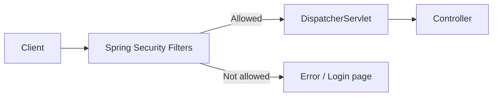
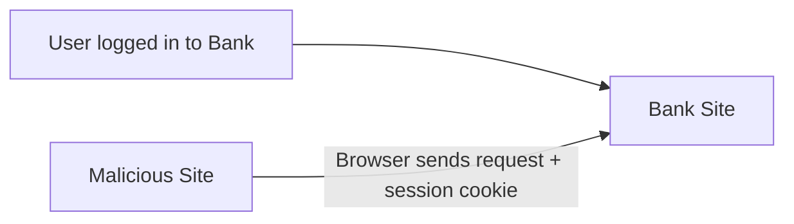
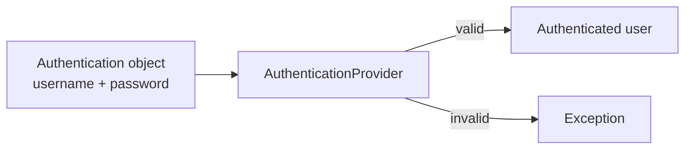
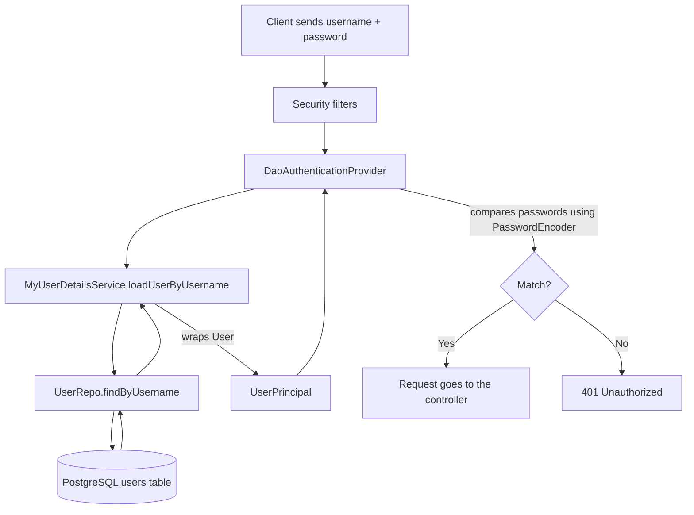
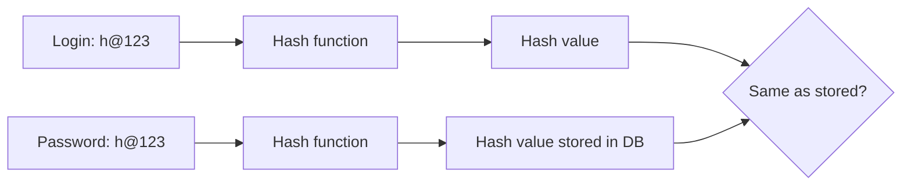

# Spring Security – Complete Beginner Tutorial

> **Tech used:** Spring Boot 3.2.x, Java 21, Spring Security 6, Spring Data JPA, PostgreSQL, Lombok, Postman

---

## Table of Contents

1. [Why Security Matters](#1-why-security-matters)
2. [OWASP Top 10](#2-owasp-top-10)
3. [Creating a Project to Secure](#3-creating-a-project-to-secure)
4. [Spring Security Default Behavior](#4-spring-security-default-behavior)
5. [Security Filter Chain](#5-security-filter-chain)
6. [Session and Session ID](#6-session-and-session-id)
7. [Setting Your Own Username and Password](#7-setting-your-own-username-and-password)
8. [Basic Authentication with Postman](#8-basic-authentication-with-postman)
9. [CSRF Attack and CSRF Token](#9-csrf-attack-and-csrf-token)
10. [SameSite Cookie and Stateless REST APIs](#10-samesite-cookie-and-stateless-rest-apis)
11. [Custom Security Configuration](#11-custom-security-configuration)
12. [Configuring with Lambda Style](#12-configuring-with-lambda-style)
13. [Understanding the Same Code in Normal (Imperative) Style](#13-understanding-the-same-code-in-normal-imperative-style)
14. [Multiple Users with In-Memory Authentication](#14-multiple-users-with-in-memory-authentication)
15. [Users from a Database – Setup](#15-users-from-a-database--setup)
16. [Authentication Provider (DAO)](#16-authentication-provider-dao)
17. [UserDetailsService and User Repository](#17-userdetailsservice-and-user-repository)
18. [UserPrincipal (Implementing UserDetails)](#18-userprincipal-implementing-userdetails)
19. [How All Parts Work Together](#19-how-all-parts-work-together)
20. [Password Storage: Encryption vs Hashing vs BCrypt](#20-password-storage-encryption-vs-hashing-vs-bcrypt)
21. [User Registration](#21-user-registration)
22. [Saving Passwords with BCrypt](#22-saving-passwords-with-bcrypt)
23. [Quick Reference Summary](#23-quick-reference-summary)
24. [Practice Questions](#24-practice-questions)

---

## 1. Why Security Matters

When we build an application, a developer usually thinks about these things first:

| Priority | What it means |
|----------|---------------|
| **Working** | The features must work for the client. |
| **Stable** | The app must handle wrong inputs and exceptions, and still work when many users come. |
| **Performance** | Every feature must be fast, not only one or two. |
| **Security** | Only the right people can use the right features, and data is safe. |

Many developers think, *"Security is not my job. Another team will do it."* This is a wrong idea. Security must be part of the application itself.

### What does security include?

- **Authentication** – *Who are you?* (Example: login with username and password.)
- **Authorization** – *What are you allowed to do?* (Example: only an admin can create or delete a job.)

Example: In a job portal application, right now anyone can add, delete, or search a job. That is not good. Different users should have different access.

### One small hole is enough

Hackers are always looking for weak points. If you secure 99 places and leave 1 small loophole, the attacker will attack exactly that place.

### How much security is needed?

It depends on the data:

| Type of application | Security level |
|---------------------|----------------|
| Public website (all data is public) | Low |
| Handles personal data | High |
| Handles credit card or medical records | Very high |
| Handles money (banking) | Extremely high |

> **Why personal data is very important:** If your credit card is stolen, you can block it. If your bank account is attacked, you can block it. But if your medical or personal records leak, they are gone forever. Also, by law, if you leak user data you may have to pay a heavy penalty or even go to jail.

---

## 2. OWASP Top 10

How do we know which attacks to protect against? We use the **OWASP Top 10**.

- **OWASP** = **O**pen **W**eb **A**pplication **S**ecurity **P**roject.
- It publishes a list of the 10 most common security risks.
- The list is updated every few years (2017, 2021, and so on). Always check the latest list.
- "Top 10" does **not** mean these are the only risks. It means: *solve these first.*

### The 2021 list in simple words

| # | Risk | Simple meaning |
|---|------|----------------|
| 1 | **Broken Access Control** | A user can see or change things they should not be allowed to. |
| 2 | **Cryptographic Failures** | Data is not encrypted, or a weak/old algorithm is used (like MD5 or old SHA for passwords). |
| 3 | **Injection** | Attacker sends harmful input (like SQL) that runs as a command. |
| 4 | **Insecure Design** | The application is designed in a weak way (a design problem, not a coding problem). |
| 5 | **Security Misconfiguration** | Default settings of tools, servers, or frameworks are left unchanged. |
| 6 | **Vulnerable and Outdated Components** | Using old libraries or databases that no longer get security updates. |
| 7 | **Identification and Authentication Failures** | Passwords stored as plain text, no multi-factor authentication. |
| 8 | **Software and Data Integrity Failures** | Data or software updates are trusted without checking if they are changed. |
| 9 | **Security Logging and Monitoring Failures** | No logs, or nobody watches the logs, so attacks are not noticed. |
| 10 | **Server-Side Request Forgery (SSRF)** | Attacker tricks the server into sending requests to places the attacker chooses. |

### Example: SQL Injection

Suppose the login query is written like this using a normal `Statement`:

```sql
SELECT * FROM users WHERE username = 'navin' AND password = 'abc'
```

If a login returns a row, the user is valid. An attacker can enter this as username:

```
navin' OR '1'='1
```

Now the condition becomes always **true**, and the attacker gets in without a password.

**How to prevent it:** Use `PreparedStatement` (or JPA/Spring Data, which does this for you). It treats the input only as a value, not as part of the query.

### Logging – two sides

- If you do **not** log, you will never know someone is attacking.
- If you log **everything** and never read it, you cannot find the real attack.
- So: log properly and keep monitoring the important logs.

> Spring Security helps with many of these risks, as you will see below.

---

## 3. Creating a Project to Secure

We first create a fresh project, so we can learn Spring Security step by step.

### Step 1: Create the project from Spring Initializr

| Setting | Value |
|---------|-------|
| Project | Maven |
| Language | Java |
| Spring Boot | 3.2.x |
| Group | `com.telusko` |
| Artifact | `springsecdemo` |
| Packaging | Jar |
| Java | 21 |
| Dependencies | **Spring Web**, **Spring Security**, **Spring Boot DevTools** |

> **DevTools** restarts the app quickly when code changes. It is optional.

### Step 2: Create a controller with public resources

First, keep the Spring Security dependency **commented out** in `pom.xml`, so we can see the app without security.

```java
@RestController
public class HelloController {

    @GetMapping("hello")
    public String greet() {
        return "Hello World";
    }
}
```

- `@RestController` → the method returns data (not a page).
- `@GetMapping("hello")` → handles `GET /hello`.

Run the app and open `http://localhost:8080/hello`. You see **Hello World**. **Anyone** can open this page. Now we want only logged-in users to see it.

> **Remember:** After you change `pom.xml`, always **reload Maven** and then restart the app.

---

## 4. Spring Security Default Behavior

Now un-comment the Spring Security dependency:

```xml
<dependency>
    <groupId>org.springframework.boot</groupId>
    <artifactId>spring-boot-starter-security</artifactId>
</dependency>
```

Reload Maven, restart the app, and open `http://localhost:8080/hello`.

**Result:** A **login form** appears. We did not write any HTML, controller, or logic for it. Spring Boot auto-configuration did all this.

### Default login details

| Item | Value |
|------|-------|
| Username | `user` |
| Password | A random password printed in the console, like: `Using generated security password: xxxx-xxxx...` |

- The password changes **every time** you restart the app.
- Wrong password → **Bad credentials** message.
- Correct password → you can see the page.

### Default logout

Open `http://localhost:8080/logout`. A logout page appears with a confirmation. After logout, you must log in again.

### What you get just by adding one dependency

- A login form
- Username and password checking
- A logout page
- Protection for **all** URLs in your app (every controller and method)

> ⚠️ **Warning from Spring itself:** The console says the generated password is *for development only*. For production you must change it.

---

## 5. Security Filter Chain

### What happens behind the scenes?

Normally, in Spring MVC:

```
Client → DispatcherServlet → Controller
```

When you add Spring Security, one more layer comes **before** the DispatcherServlet. This layer has many **filters**.



### What is a filter chain?

This idea comes from **Servlet filters**. Example without Spring: a client sends two numbers to add. Before the servlet, you can add filters:

1. Filter 1 → check numbers are not negative
2. Filter 2 → check client location
3. Filter 3 → check something else

The filters run **one by one**. The servlet does not know about them. If a filter rejects the request, it sends the response back and the servlet is never called. The group of connected filters is called a **FilterChain**.

Spring Security uses the same idea. It has a `DefaultSecurityFilterChain` with many filters in a fixed order. Some examples:

| Filter | Job |
|--------|-----|
| `DisableEncodeUrlFilter` | Stops session id from showing in URLs |
| `WebAsyncManagerIntegrationFilter` | Works with async requests |
| `SecurityContextHolderFilter` | Holds the current user's security info |
| CSRF filter | Protects against CSRF attacks |
| Logout filter | Handles `/logout` |
| Username-password authentication filter | Handles the login form |

- You can change the order of filters, but normally you should not.
- When all security filters allow the request, only then it goes to the DispatcherServlet.

> **Note:** After a successful login a **session** is created, so you do not need to log in again for every request.

---

## 6. Session and Session ID

After you log in once, you can open other URLs without logging in again. This works because of a **session**.

- The server creates a session after login and gives the browser a **session ID** inside a **cookie**.
- On every next request, the browser sends this cookie. The server sees the session ID and knows you are already logged in.
- If you delete the cookie (or log out), the session is lost and you must log in again.

### Print the session ID in code

We can get the session from `HttpServletRequest`:

```java
@RestController
public class HelloController {

    @GetMapping("hello")
    public String greet(HttpServletRequest request) {
        return "Hello World " + request.getSession().getId();
    }

    @GetMapping("about")
    public String about(HttpServletRequest request) {
        return "Telusko " + request.getSession().getId();
    }
}
```

**Explanation:**
- `HttpServletRequest request` → Spring gives us the current request object.
- `request.getSession().getId()` → returns the current session ID.

**Test:**
1. Log in and open `/hello` → note the last few characters of the session ID.
2. Open `/about` → the **same** session ID appears.
3. Log out and log in again → a **new** session ID appears.

> ⚠️ **Anti-pattern:** Never print the session ID in a response in a real project. This is only for learning.

---

## 7. Setting Your Own Username and Password

A new random password on each run is not comfortable. We can set our own in `application.properties`:

```properties
spring.security.user.name=telusko
spring.security.user.password=1234
```

Restart the app (always restart after changing properties) and log in with `telusko` / `1234`.

### Problems with this approach

| Problem | Why it is bad |
|---------|---------------|
| Hard-coded in a file | Anyone who sees the file knows the password |
| Plain text password | Not safe |
| Only **one** user for the whole app | Real apps need many users, each with their own login |

> So, use this **only for learning**. For real projects, users must come from a database and passwords must be encoded. We will do this later in this tutorial.

---

## 8. Basic Authentication with Postman

A browser can show a login **form**. But a REST API client (like Postman, or another application) cannot use a form. For them we use **HTTP Basic Authentication**.

### Steps in Postman

1. Create a `GET` request to `http://localhost:8080/hello`.
2. Click **Send** without any authorization → you get **401 Unauthorized**.
3. Open the **Authorization** tab → select **Basic Auth**.
4. Enter username `telusko` and password `1234`.
5. Click **Send** → you get **200 OK** and the response.

So, we have two ways to log in:

| Method | Used by |
|--------|---------|
| **Form login** | Browser users |
| **Basic Auth** | REST clients (Postman, other apps) |

> ⚠️ In Basic Auth, the username and password are only **Base64 encoded**, which is very easy to decode. It is not real encryption. Use it only over **HTTPS** in real projects.

---

## 9. CSRF Attack and CSRF Token

### What is CSRF?

**CSRF** = **C**ross-**S**ite **R**equest **F**orgery.

**The problem:** When you log in to a site (say your bank), your browser stores a session cookie. Now you visit another **malicious** website. That site can make your browser send a request to your bank site, and your browser will automatically attach the session cookie. The bank thinks the request is from you.



### How Spring Security protects you

Spring Security uses a **CSRF token**:

- With the page, the server gives a secret token.
- For changing requests, the client must send this token back.
- A malicious site does not know the token, so its request fails.

### Which HTTP methods are protected?

| Method | CSRF check by default? | Reason |
|--------|-----------------------|--------|
| GET | No | GET only reads data; it does not change the server |
| POST, PUT, DELETE, PATCH | **Yes** | They change data on the server |

### Example: see the problem

Create a `Student` model using Lombok:

```java
@Data
@AllArgsConstructor
@NoArgsConstructor
public class Student {
    private int id;
    private String name;
    private String technology;
}
```

> Add the Lombok dependency in `pom.xml` and reload Maven.

Create a controller with a GET and a POST method:

```java
@RestController
public class StudentController {

    private List<Student> students = new ArrayList<>(List.of(
            new Student(1, "Navin", "Java"),
            new Student(2, "Kiran", "Blockchain")
    ));

    @GetMapping("students")
    public List<Student> getStudents() {
        return students;
    }

    @PostMapping("students")
    public void addStudent(@RequestBody Student student) {
        students.add(student);
    }
}
```

**Explanation:**
- A simple in-memory list is used to keep the example short (a real project would use service and repository layers).
- `@RequestBody` converts the incoming JSON into a `Student` object.

**Test in Postman (Basic Auth set):**
- `GET /students` → works (200).
- `POST /students` with this JSON body → **fails**, because there is no CSRF token:

```json
{
  "id": 3,
  "name": "Harsh",
  "technology": "JavaScript"
}
```

### Get and send the CSRF token

Spring puts the token in the request as an attribute named `_csrf`. We can create an endpoint to read it:

```java
@GetMapping("csrf-token")
public CsrfToken getCsrfToken(HttpServletRequest request) {
    return (CsrfToken) request.getAttribute("_csrf");
}
```

- `request.getAttribute("_csrf")` returns an `Object`, so we **cast** it to `CsrfToken`.
- `CsrfToken` is from `org.springframework.security.web.csrf`.

**Steps:**
1. Send `GET /csrf-token` in Postman. The response has the token value and the header name `X-CSRF-TOKEN`.
2. Copy only the token value (without quotes).
3. In the `POST /students` request, open **Headers** and add:

   | Key | Value |
   |-----|-------|
   | `X-CSRF-TOKEN` | *(the token you copied)* |

4. Send → now you get **200 OK**.
5. `GET /students` → you now see three students.

> Each session gets its own token. For every state-changing request you must send the token.

---

## 10. SameSite Cookie and Stateless REST APIs

There are two more ways to deal with CSRF.

### Way 1: SameSite cookie

We can tell the browser: *"Send this cookie only if the request comes from the same website."* Then a malicious site cannot use the session cookie.

In `application.properties`:

```properties
server.servlet.session.cookie.same-site=strict
```

| Value | Meaning |
|-------|---------|
| `strict` | Cookie is sent only for requests from the same site |
| `lax` | Default in many browsers; a bit more relaxed |
| `none` | Cookie is sent everywhere (needs `Secure`) |

### Way 2: Make the REST API stateless

A REST API can be:

| Type | Meaning |
|------|---------|
| **Stateful** | The server keeps a session. The same session ID is used on every request. |
| **Stateless** | The server keeps **no** session. The client sends username/password (or a token) with **every** request. |

Most REST APIs are **stateless**. In that case:
- No session cookie exists → a malicious site cannot reuse it.
- So we **do not need** the CSRF token, and we can disable it.

To do this, we need our own security configuration (next section).

---

## 11. Custom Security Configuration

Until now, Spring Boot gave us a **default** security configuration. To change it, we must write our own configuration class.

### Step 1: Create the class

```java
@Configuration
@EnableWebSecurity
public class SecurityConfig {

    @Bean
    public SecurityFilterChain securityFilterChain(HttpSecurity http) throws Exception {
        return http.build();
    }
}
```

**Explanation:**

| Part | Meaning |
|------|---------|
| `@Configuration` | This class has configuration/bean methods. |
| `@EnableWebSecurity` | Turns on web security support, and tells Spring to use **our** configuration. |
| `SecurityFilterChain` | The object that holds all the security filters. To change security, we return our own. |
| `HttpSecurity http` | A builder object. We use it to set the rules. |
| `http.build()` | Creates the `SecurityFilterChain` object. |

### What happens if we only write `http.build()`?

Run the app and open `/hello`. **There is no login and no security at all.**

**Why?** The default configuration (login form, logout, CSRF, etc.) is applied only when you do not provide your own. Once you create your own `SecurityFilterChain`, **you are responsible for everything**. We told Spring "I will handle it" and then did not configure anything.

So next we add the settings ourselves.

---

## 12. Configuring with Lambda Style

There are two ways to write the settings: **lambda style** (short, used in real projects) and **normal/imperative style** (long, good for understanding). First, the lambda style.

### Final configuration

```java
@Configuration
@EnableWebSecurity
public class SecurityConfig {

    @Bean
    public SecurityFilterChain securityFilterChain(HttpSecurity http) throws Exception {

        http.csrf(customizer -> customizer.disable());

        http.authorizeHttpRequests(request -> request.anyRequest().authenticated());

        http.httpBasic(Customizer.withDefaults());

        http.sessionManagement(session ->
                session.sessionCreationPolicy(SessionCreationPolicy.STATELESS));

        return http.build();
    }
}
```

### Line-by-line explanation

**1. Disable CSRF**
```java
http.csrf(customizer -> customizer.disable());
```
The old way `http.csrf().disable()` is deprecated. Now `csrf(...)` takes a customizer object, and we call `disable()` on it.

**2. Authenticate every request**
```java
http.authorizeHttpRequests(request -> request.anyRequest().authenticated());
```
Every request must be authenticated (the user must log in). Without this line, requests would not be protected.

**3. Enable HTTP Basic**
```java
http.httpBasic(Customizer.withDefaults());
```
Enables Basic Auth (for Postman and REST clients). `Customizer.withDefaults()` means "use the default settings".

**4. Make it stateless**
```java
http.sessionManagement(session ->
        session.sessionCreationPolicy(SessionCreationPolicy.STATELESS));
```

| `SessionCreationPolicy` | Meaning |
|-------------------------|---------|
| `ALWAYS` | Always create a session |
| `IF_REQUIRED` | Create only if needed (default) |
| `NEVER` | Do not create, but use if it exists |
| `STATELESS` | **Never** create or use a session |

### Optional: form login

If you also want the browser login form, add:

```java
http.formLogin(Customizer.withDefaults());
```

> But with `STATELESS`, the form login is not useful, because no session is kept after the login. For a stateless REST API, **remove form login**.

### What changes after this configuration?

- Browser (`/hello`) → shows a **login popup** (Basic Auth), not a form.
- Postman without auth → **401 Unauthorized**; with Basic Auth → **200 OK**.
- Each request gets a **new session ID** (because it is stateless, no session is reused).
- `POST /students` works **without** a CSRF token (CSRF is disabled).
- `/logout` does not work anymore, because there is no session to end. In a browser, close the window to "log out".

### Same code in builder style

`HttpSecurity` follows the **builder pattern**, so you can chain the calls without repeating `http`:

```java
@Bean
public SecurityFilterChain securityFilterChain(HttpSecurity http) throws Exception {
    return http
            .csrf(customizer -> customizer.disable())
            .authorizeHttpRequests(request -> request.anyRequest().authenticated())
            .httpBasic(Customizer.withDefaults())
            .sessionManagement(session ->
                    session.sessionCreationPolicy(SessionCreationPolicy.STATELESS))
            .build();
}
```

This is how you will see it in most projects.

---

## 13. Understanding the Same Code in Normal (Imperative) Style

The lambda code hides what objects are used. Here is the same thing written in the long way, so you can understand it. **You do not need to write code this way.**

### CSRF

`http.csrf(...)` needs a `Customizer<CsrfConfigurer<HttpSecurity>>`. `Customizer` is an interface with one method: `customize(...)`.

```java
Customizer<CsrfConfigurer<HttpSecurity>> custCsrf = new Customizer<CsrfConfigurer<HttpSecurity>>() {
    @Override
    public void customize(CsrfConfigurer<HttpSecurity> configurer) {
        configurer.disable();
    }
};

http.csrf(custCsrf);
```

### Authorize requests

```java
Customizer<AuthorizeHttpRequestsConfigurer<HttpSecurity>.AuthorizationManagerRequestMatcherRegistry> custHttp =
        new Customizer<AuthorizeHttpRequestsConfigurer<HttpSecurity>.AuthorizationManagerRequestMatcherRegistry>() {
            @Override
            public void customize(AuthorizeHttpRequestsConfigurer<HttpSecurity>.AuthorizationManagerRequestMatcherRegistry registry) {
                registry.anyRequest().authenticated();
            }
        };

http.authorizeHttpRequests(custHttp);
```

### What this tells us

- Each method takes a **`Customizer` object** (a functional interface with one method).
- The object given inside `customize(...)` (here `configurer` and `registry`) is the thing you configure.
- A lambda is just a short way to write the anonymous class: `customizer -> customizer.disable()`.
- The type names are very long, so everyone uses lambdas.

---

## 14. Multiple Users with In-Memory Authentication

So far we have only one user, set in `application.properties`. Let us define several users in code.

### How Spring finds users

Spring Security uses a **`UserDetailsService`** to get user data. By default, it reads the user from `application.properties`. If we create our own `UserDetailsService` bean, Spring uses **ours**, and ignores the properties values.

### Code

```java
@Bean
public UserDetailsService userDetailsService() {

    UserDetails user1 = User
            .withDefaultPasswordEncoder()
            .username("navin")
            .password("n@123")
            .roles("USER")
            .build();

    UserDetails user2 = User
            .withDefaultPasswordEncoder()
            .username("admin")
            .password("admin@789")
            .roles("ADMIN")
            .build();

    return new InMemoryUserDetailsManager(user1, user2);
}
```

### Explanation

| Part | Meaning |
|------|---------|
| `UserDetailsService` | Interface with one method `loadUserByUsername`. Spring Security calls it to get a user. |
| `InMemoryUserDetailsManager` | A ready-made class that stores users in memory. It indirectly implements `UserDetailsService`. |
| Its constructor | Accepts many `UserDetails` objects (varargs). |
| `UserDetails` | Interface that represents a user. |
| `User` | Spring Security's ready-made class. `User.withDefaultPasswordEncoder()` returns a builder. |
| `.username().password().roles()` | Set the values. You can give many roles, like `.roles("USER", "ADMIN")`. |
| `.build()` | Creates the `UserDetails` object. |

> ⚠️ `withDefaultPasswordEncoder()` is **deprecated**. It does not protect the password. Use it only to learn.

### Test

- `telusko / 1234` (from properties) → **not working** anymore.
- `navin / n@123` → works.
- `admin / admin@789` → works.

This is still not good for a real application, because users are hard-coded in code. Next, we move them to a **database**.

---

## 15. Users from a Database – Setup

Now we want users to come from a database. You can use any database (MySQL, PostgreSQL, H2, etc.). Here we use **PostgreSQL**.

### Step 1: Create the table

Table name is `users` (not `user`, because `user` is a reserved table in PostgreSQL).

```sql
CREATE TABLE users (
    id        INT PRIMARY KEY,
    username  VARCHAR(100),
    password  VARCHAR(100)
);
```

Insert some data:

```sql
INSERT INTO users (id, username, password) VALUES (1, 'kiran', 'n@789');
INSERT INTO users (id, username, password) VALUES (2, 'harsh', 'h@123');
```

Check:

```sql
SELECT * FROM users;
```

> **Tips:**
> - The `username` should be **unique** (or use it as the primary key).
> - You can add a `roles` column later so each user has different roles. Here we keep it simple.
> - For now the passwords are plain text. We fix this later with BCrypt.

### Step 2: Database settings in `application.properties`

```properties
spring.datasource.url=jdbc:postgresql://localhost:5432/telusko
spring.datasource.username=postgres
spring.datasource.password=your_db_password
```

| Property | Meaning |
|----------|---------|
| `spring.datasource.url` | JDBC URL: database type, host, port, database name |
| `spring.datasource.username` | **Database** username (not the app user) |
| `spring.datasource.password` | **Database** password |

> If you use MySQL, change the URL to `jdbc:mysql://localhost:3306/<dbname>` and use your own MySQL username and password. The default MySQL port is `3306`; PostgreSQL's is `5432`.

### Step 3: Add dependencies in `pom.xml`

```xml
<dependency>
    <groupId>org.springframework.boot</groupId>
    <artifactId>spring-boot-starter-data-jpa</artifactId>
</dependency>

<dependency>
    <groupId>org.postgresql</groupId>
    <artifactId>postgresql</artifactId>
    <scope>runtime</scope>
</dependency>
```

Reload Maven after adding them.

### What else is needed?

Only setting up the database is not enough. Spring Security still has no idea how to read users from the database. We need these parts:

| Part | Job |
|------|-----|
| **AuthenticationProvider** | Does the actual authentication using a data source. |
| **UserDetailsService** | Tells the provider how to load a user from the database. |
| **Entity class (`User`)** | Maps to the `users` table. |
| **Repository (`UserRepo`)** | Talks to the database. |
| **UserDetails class (`UserPrincipal`)** | Wraps our `User` in the format Spring Security understands. |

You do this setup **only once** in a project. After that, it works for the whole application.

---

## 16. Authentication Provider (DAO)

### What is authentication?

When a user sends username and password, they are put into an **`Authentication`** object. An **`AuthenticationProvider`** checks this object.



`AuthenticationProvider` is an **interface** with a method `authenticate(...)`. There are different providers for different ways to authenticate. Because our data is in a database, we use **`DaoAuthenticationProvider`** (DAO = Data Access Object).

### Code

Add this bean in `SecurityConfig`:

```java
@Autowired
private UserDetailsService userDetailsService;

@Bean
public AuthenticationProvider authProvider() {
    DaoAuthenticationProvider provider = new DaoAuthenticationProvider();
    provider.setUserDetailsService(userDetailsService);
    provider.setPasswordEncoder(NoOpPasswordEncoder.getInstance());
    return provider;
}
```

Also **remove (or comment out)** the earlier `InMemoryUserDetailsManager` bean, because we now want users from the database.

### Explanation

| Line | Meaning |
|------|---------|
| `new DaoAuthenticationProvider()` | The ready-made provider class for database users. |
| `setUserDetailsService(...)` | Tells the provider **how to load the user** (our own service class, created in the next section). |
| `setPasswordEncoder(...)` | Tells the provider **how to compare passwords**. |
| `NoOpPasswordEncoder.getInstance()` | "No operation" encoder: passwords are compared as plain text. Use it only for learning; we replace it with BCrypt later. |

> The provider alone does not know your DBMS, table name, or user class. That information comes from the `UserDetailsService` we write next.

---

## 17. UserDetailsService and User Repository

### Step 1: Create the `UserDetailsService` class

`UserDetailsService` is an interface with one method: `loadUserByUsername(String username)`. We create our own class:

```java
@Service
public class MyUserDetailsService implements UserDetailsService {

    @Autowired
    private UserRepo repo;

    @Override
    public UserDetails loadUserByUsername(String username) throws UsernameNotFoundException {

        User user = repo.findByUsername(username);

        if (user == null) {
            System.out.println("User 404");
            throw new UsernameNotFoundException("User 404");
        }

        return new UserPrincipal(user);
    }
}
```

**Explanation:**
- `@Service` → makes it a Spring bean, so it can be auto-wired in `SecurityConfig`.
- The method gets a `username`, and we need to find that user in the database.
- Database work is done by the **repository layer**, not the service. So we auto-wire `UserRepo`.
- If no user is found → throw `UsernameNotFoundException`.
- If found → return a `UserDetails` object. Our `User` entity is not a `UserDetails`, so we wrap it in `UserPrincipal` (next sections).

> **Important:** Import the `User` class from **your own model package**, not from `org.springframework.security...`.

### Step 2: Create the `User` entity

The class has the same fields as the table:

```java
@Entity
@Data
@Table(name = "users")
public class User {

    @Id
    private int id;
    private String username;
    private String password;
}
```

| Annotation | Meaning |
|------------|---------|
| `@Entity` | This class maps to a database table. |
| `@Id` | `id` is the primary key. |
| `@Table(name = "users")` | Needed because the class name is `User` but the table name is `users`. |
| `@Data` (Lombok) | Generates getters, setters, `toString`, etc. |

> If your table has 5 columns, you will have 5 fields here.

### Step 3: Create the `UserRepo`

```java
public interface UserRepo extends JpaRepository<User, Integer> {

    User findByUsername(String username);
}
```

- `JpaRepository<User, Integer>` → first type is the entity, second is the primary key type.
- `findByUsername` → Spring Data JPA creates the query for us from the method name. We do not write any SQL.

---

## 18. UserPrincipal (Implementing UserDetails)

Spring Security needs a `UserDetails` object, but our `User` entity is a plain class. So we create a class that implements `UserDetails` and wraps our `User`.

**Why "Principal"?** In Spring Security, the **current user** being authenticated is called the **principal**. You can give the class any name, like `UserDetailsImpl`, but `UserPrincipal` is common.

### Code

```java
public class UserPrincipal implements UserDetails {

    private User user;

    public UserPrincipal(User user) {
        this.user = user;
    }

    @Override
    public Collection<? extends GrantedAuthority> getAuthorities() {
        return Collections.singleton(new SimpleGrantedAuthority("USER"));
    }

    @Override
    public String getPassword() {
        return user.getPassword();
    }

    @Override
    public String getUsername() {
        return user.getUsername();
    }

    @Override
    public boolean isAccountNonExpired() {
        return true;
    }

    @Override
    public boolean isAccountNonLocked() {
        return true;
    }

    @Override
    public boolean isCredentialsNonExpired() {
        return true;
    }

    @Override
    public boolean isEnabled() {
        return true;
    }
}
```

### Methods explained

| Method | Purpose |
|--------|---------|
| `getAuthorities()` | Returns the roles/permissions of the user. |
| `getPassword()` | Returns the password stored for the user. |
| `getUsername()` | Returns the username. |
| `isAccountNonExpired()` | Is the account still valid (not expired)? |
| `isAccountNonLocked()` | Is the account not locked? |
| `isCredentialsNonExpired()` | Are the credentials (password) not expired? |
| `isEnabled()` | Is the account enabled? |

- We return `true` for the last four methods, because we do not use those features here. In a real app you can use them, for example: expire a password after 3 months, or lock an inactive account.
- `getAuthorities()` returns one hard-coded authority `"USER"`. `Collections.singleton(...)` returns a collection with one item, and `SimpleGrantedAuthority` is the class that implements `GrantedAuthority`. If you add a `roles` column in the table, read the role from the `User` object here instead.

### Test it

Run the app and open `/hello` (a login popup appears):

| Test | Result |
|------|--------|
| `kiran` with a wrong password | Fails |
| `kiran / n@789` | Works |
| `harsh / h@123` | Works |
| A username not in the database | Fails, console prints `User 404` |

Users are now verified from the database.

---

## 19. How All Parts Work Together

### Full list of files

| File | Role |
|------|------|
| `SecurityConfig` | Security rules + `AuthenticationProvider` bean |
| `MyUserDetailsService` | Loads user from the database |
| `UserRepo` | Database access (JPA) |
| `User` (entity) | Represents the `users` table |
| `UserPrincipal` | Wraps `User` as `UserDetails` for Spring Security |
| `application.properties` | Database connection settings |
| `pom.xml` | `data-jpa` and `postgresql` dependencies |

### Authentication flow



### Same flow as a nested list

- Request comes with username and password
  - `DaoAuthenticationProvider` handles authentication
    - Calls `UserDetailsService` (our `MyUserDetailsService`)
      - Calls `UserRepo.findByUsername(...)`
        - Returns `User` entity, or `null`
      - If `null` → `UsernameNotFoundException`
      - Else wraps `User` in `UserPrincipal` and returns it
    - Compares the password using the `PasswordEncoder`
  - Success → access granted

> The setup is large, but it is done only **once**. It is more files than the actual logic (controllers), but in a big application the number of configuration files stays small.

---

## 20. Password Storage: Encryption vs Hashing vs BCrypt

Our passwords are stored (and sent) as **plain text**. This is a big security problem. If someone sees the database, they see every password.

### Option 1: Encryption (two-way)

- Password is **encrypted** with a key and stored.
- To check, it is **decrypted** with the key.
- **Problem:** If someone gets the key, all passwords are exposed.

### Option 2: Hashing (one-way)

- Password is converted to a **hash** value.
- A hash **cannot be converted back** to the original password.
- To check a login: hash the entered password again and compare the two hashes.



| | Encryption | Hashing |
|---|-----------|---------|
| Direction | Two-way | One-way |
| Needs a key? | Yes | No |
| Can get original back? | Yes | No |
| Good for passwords? | No | **Yes** |

### Not all hashing is equal

- **MD5** and plain **SHA** are fast and old. Attackers can try billions of guesses quickly. Do not use them for passwords.
- A better idea: repeat the hashing **many times (rounds)**. Each round takes some time, so guessing becomes very slow for an attacker.

### BCrypt

**BCrypt** is a password hashing algorithm that does exactly this. It hashes in many rounds.

A BCrypt hash looks like this:

```
$2a$12$XyZ...(60 characters in total)
```

| Part | Meaning |
|------|---------|
| `$2a$` | Version of BCrypt (`2a`, `2b`, `2y` exist) |
| `12` | **Strength** (log rounds). The work done is 2¹² = 4096 rounds |
| Rest | Salt + hash value |

- Default strength is **10**. Strength 12 means 4 times more work than 10.
- Higher strength = more secure, but slower login. Choose a good balance.
- BCrypt is part of Spring Security (`BCryptPasswordEncoder`). No extra library is needed.
- BCrypt adds a random **salt**, so even if two users have the same password, their hashes are different.

> Because the hash is 60 characters, make sure the `password` column is long enough (for example `VARCHAR(100)`).

---

## 21. User Registration

Before we use BCrypt, we create a way to **register a new user** and save him in the database.

### Controller

```java
@RestController
public class UserController {

    @Autowired
    private UserService service;

    @PostMapping("register")
    public User register(@RequestBody User user) {
        return service.saveUser(user);
    }
}
```

### Service

```java
@Service
public class UserService {

    @Autowired
    private UserRepo repo;

    public User saveUser(User user) {
        repo.save(user);
        return user;
    }
}
```

**Explanation:**
- The controller receives the user JSON using `@RequestBody` and passes it to the service.
- The service calls `repo.save(user)`, which inserts the row in the `users` table (Spring Data JPA does the work).
- Remember to create the service object with `@Autowired`, and use `service.saveUser(user)` in the controller.

### Test in Postman

- Method: `POST`, URL: `http://localhost:8080/register`
- Authorization: Basic Auth with an existing user (for example `harsh` / `h@123`). This is needed because `anyRequest().authenticated()` protects `/register` too.
- Body (raw JSON):

```json
{
  "id": 3,
  "username": "navin",
  "password": "n@345"
}
```

Field names must match the fields of the `User` class.

**Results:**
- Wrong authorization password → `401`
- Correct authorization → `200` and the saved user is returned
- `SELECT * FROM users;` shows the new row, but the password is still **plain text**.

---

## 22. Saving Passwords with BCrypt

Now we encode the password **before** saving it.

### Update the `UserService`

```java
@Service
public class UserService {

    @Autowired
    private UserRepo repo;

    private BCryptPasswordEncoder encoder = new BCryptPasswordEncoder(12);

    public User saveUser(User user) {
        user.setPassword(encoder.encode(user.getPassword()));
        repo.save(user);
        return user;
    }
}
```

**Explanation:**
- `new BCryptPasswordEncoder(12)` → creates the encoder with strength **12**. You can also create it as a `@Bean` in the security configuration and auto-wire it.
- `encoder.encode(user.getPassword())` → turns plain text (`a@123`) into a BCrypt hash.
- `user.setPassword(...)` → replaces the plain password with the hash.
- `repo.save(user)` → saves the user with the hashed password.

### Test

Send this to `POST /register`:

```json
{
  "id": 4,
  "username": "avni",
  "password": "a@123"
}
```

Response and database now show a long hash starting with `$2a$12$...` instead of `a@123`.

### Make the login work with BCrypt passwords

When a user logs in, Spring Security must compare the entered password with the **BCrypt hash** in the database. So the `DaoAuthenticationProvider` must use the **same** BCrypt encoder (instead of `NoOpPasswordEncoder`):

```java
@Bean
public AuthenticationProvider authProvider() {
    DaoAuthenticationProvider provider = new DaoAuthenticationProvider();
    provider.setUserDetailsService(userDetailsService);
    provider.setPasswordEncoder(new BCryptPasswordEncoder(12));
    return provider;
}
```

**How it works:**
1. User enters `a@123` at login.
2. The provider hashes it with BCrypt and checks it against the stored hash.
3. If it matches → login success.

> **Important:** Old rows with plain-text passwords (like `harsh / h@123`) will **stop working** after this change. You must store their BCrypt hashes in the table. For example, generate the hash with `BCryptPasswordEncoder` (or an online BCrypt generator with strength 12) and run:
>
> ```sql
> UPDATE users SET password = '<bcrypt hash here>' WHERE id = 3;
> ```

> ⚠️ **Anti-pattern:** Printing the encoded password in the console is fine for learning, but do not log passwords in a real application.

---

## 23. Quick Reference Summary

### Important classes and interfaces

| Name | Type | Purpose |
|------|------|---------|
| `SecurityFilterChain` | Interface | Holds all security filters; return your own bean to customize |
| `HttpSecurity` | Class | Builder used to configure security rules |
| `@EnableWebSecurity` | Annotation | Enables Spring Security web support |
| `Customizer` | Interface | Used to configure each part (usually as a lambda) |
| `SessionCreationPolicy` | Enum | `ALWAYS`, `IF_REQUIRED`, `NEVER`, `STATELESS` |
| `AuthenticationProvider` | Interface | Authenticates the user |
| `DaoAuthenticationProvider` | Class | Authenticates using a database/`UserDetailsService` |
| `UserDetailsService` | Interface | Loads a user by username |
| `InMemoryUserDetailsManager` | Class | Stores users in memory |
| `UserDetails` | Interface | Represents a user for Spring Security |
| `UserPrincipal` | Your class | Wraps your `User` entity as `UserDetails` |
| `PasswordEncoder` | Interface | Encodes and checks passwords |
| `BCryptPasswordEncoder` | Class | BCrypt password hashing |
| `NoOpPasswordEncoder` | Class | No encoding (learning only) |

### Common settings

| Goal | Code / Property |
|------|-----------------|
| Set default user name | `spring.security.user.name=...` |
| Set default user password | `spring.security.user.password=...` |
| Disable CSRF | `http.csrf(c -> c.disable())` |
| Require login for all requests | `http.authorizeHttpRequests(r -> r.anyRequest().authenticated())` |
| Enable Basic Auth | `http.httpBasic(Customizer.withDefaults())` |
| Enable form login | `http.formLogin(Customizer.withDefaults())` |
| Make stateless | `http.sessionManagement(s -> s.sessionCreationPolicy(SessionCreationPolicy.STATELESS))` |
| SameSite cookie | `server.servlet.session.cookie.same-site=strict` |

### Anti-patterns (do not do these)

| Anti-pattern | Why it is bad |
|--------------|---------------|
| Keeping the default generated password in production | Password is only for development |
| Hard-coding username/password in properties or code | Anyone who sees the code knows them |
| Storing passwords as plain text | A database leak exposes every user |
| Using MD5 or plain SHA for passwords | Too fast to crack |
| Using `withDefaultPasswordEncoder()` or `NoOpPasswordEncoder` in real projects | No protection |
| Printing session IDs or passwords in responses/logs | Leaks secrets |
| Leaving default configurations of tools unchanged | Attackers know the defaults |
| Disabling CSRF for a **stateful** (session/cookie) application | Opens the door to CSRF attacks |

### Security rules to remember

- Adding the Spring Security dependency protects **all** URLs by default.
- If you create your own `SecurityFilterChain`, Spring does **not** add default settings. You must configure everything.
- `GET` is not CSRF-protected by default; `POST`, `PUT`, `DELETE` are.
- Stateless REST APIs do not need CSRF tokens.
- Always store passwords with a one-way hash like **BCrypt**.
- The password encoder used for registering users and the one in the `AuthenticationProvider` must be the **same**.

---

## 24. Practice Questions

**Q1. What is the default username in Spring Security? Where do you find the default password?**
**A:** The default username is `user`. The password is generated at startup and printed in the console.

**Q2. What is the difference between authentication and authorization?**
**A:** Authentication checks *who you are*. Authorization checks *what you are allowed to do*.

**Q3. What is a filter chain?**
**A:** A group of filters that run one after another before the request reaches the DispatcherServlet. Spring Security uses it to check each request.

**Q4. What is CSRF and how does Spring Security protect against it?**
**A:** CSRF is an attack where another site uses your logged-in session to send requests. Spring Security uses a CSRF token that must be sent with `POST`, `PUT` and `DELETE` requests.

**Q5. When can we safely disable CSRF?**
**A:** When the REST API is **stateless** (no session or cookie is used), so a malicious site cannot reuse a session.

**Q6. What happens if we create our own `SecurityFilterChain` bean and only call `http.build()`?**
**A:** No security is applied, because the default configuration is not used anymore. We must configure authentication ourselves.

**Q7. What does `SessionCreationPolicy.STATELESS` do?**
**A:** Spring Security will not create or use a session. The client must send credentials with every request.

**Q8. Which `AuthenticationProvider` is used for database users?**
**A:** `DaoAuthenticationProvider`.

**Q9. What is the job of `UserDetailsService`?**
**A:** It loads a user by username (from a database or memory) and returns a `UserDetails` object.

**Q10. Why do we create `UserPrincipal`?**
**A:** `UserDetailsService` must return a `UserDetails`. `UserPrincipal` implements `UserDetails` and wraps our `User` entity.

**Q11. Why is hashing better than encryption for passwords?**
**A:** A hash cannot be reversed, and there is no key to steal. We only compare hashes.

**Q12. What does the `12` mean in `new BCryptPasswordEncoder(12)` and in `$2a$12$...`?**
**A:** It is the strength. The algorithm does 2¹² = 4096 rounds of hashing, which makes password cracking very slow.

**Q13. Why should the `password` column be long enough?**
**A:** A BCrypt hash is 60 characters long. A short column would cut it and break the login.