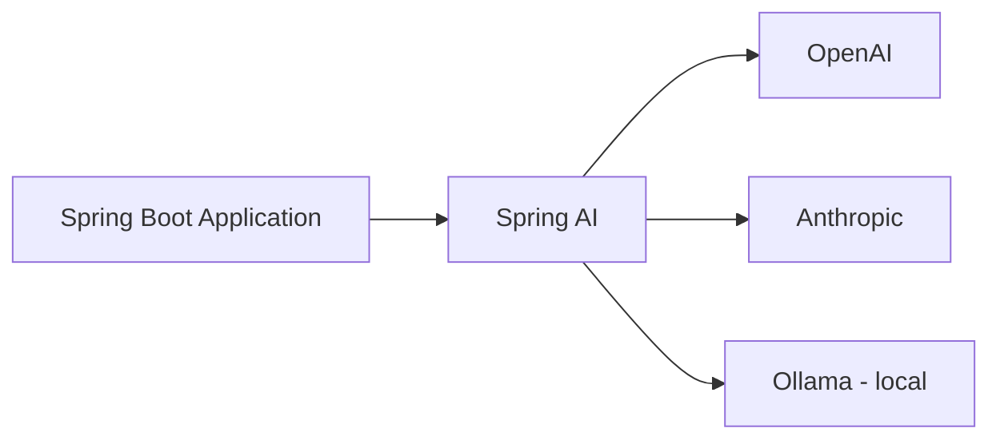

# 01 – Spring AI Fundamentals

---

## 1. Why Spring AI?

Spring Boot helps us build enterprise applications: Spring Web for APIs, Spring Data JPA for databases, Spring Security for security.
Today, many applications also need **AI features**. For example, in an e-commerce app you may want:

- A **chatbot** that answers customer questions
- An **AI-generated product description**
- An **AI-generated product image**

### The problem

Most AI work is done in Python. If your enterprise app is in Java, you have two choices:

| Choice | Problem |
|--------|---------|
| Build a separate Python AI service and call it from Java | Two languages, many API calls, two teams |
| Talk to the AI models **directly from Java** | Better, but needs a clean layer |

**Spring AI** is that clean layer. It is an **application framework for AI engineering**. It sits between your Spring Boot app and the AI models (LLMs).

---

## 2. Important Terms

| Term | Meaning |
|------|---------|
| **LLM** | Large Language Model (the "brain" that understands and writes text) |
| **Providers** | Companies that offer models as a service: OpenAI, Anthropic (Claude), Google, Microsoft, Amazon |
| **Models as a Service** | You create an account, add credit, get an **API key**, and send requests to their models |
| **Ollama** | A tool to run open-source models (Llama, Mistral, DeepSeek, Gemma...) on **your own machine** |
| **Token** | A small piece of text. Providers charge based on tokens sent and received |

These models are **not free**. You pay for what you use (tokens).

### What Spring AI supports

- Chat completion
- Embeddings
- Text to image
- Audio transcription (speech to text)
- Text to speech
- Moderation

---

## 3. Why not use the provider SDK directly?

OpenAI and Anthropic both give a Java SDK. You can use it, but:

- Each provider has **different code** and different classes.
- If you use only one model forever, the SDK is fine.
- If you want to **use many models** or **change the model later**, you must change a lot of code.

We need **abstraction**: one common way to talk to any model.
Spring AI gives this. You write code once, and you can switch between OpenAI, Anthropic, Ollama, Azure OpenAI, Google, Mistral, and more, mostly by changing dependency and properties.

> **Note:** Spring AI is inspired by **LangChain** (a Python library). It is not an exact copy, but it gives many similar features, including **RAG** (you will learn it later).

---

## 4. Spring AI Documentation

- Go to the Spring website → **Projects → Spring AI → Learn → Reference Documentation**.
- The docs explain chat models, embeddings, vector stores, RAG, and the list of supported providers (Anthropic, Azure OpenAI, DeepSeek, Vertex AI, Groq, HuggingFace, Mistral, NVIDIA, OpenAI, Ollama, and more). The list keeps growing.
- For each provider there is a different **chat model** class (for example `OpenAiChatModel`, `AnthropicChatModel`, `OllamaChatModel`).

---

## 5. Versions

Spring AI first had snapshot/milestone versions. Now there is a stable version **1.0.0** (with Spring Boot 3.3+/3.4+).

- Some class names and artifact names changed in 1.0.0 (for example the starter is now `spring-ai-starter-model-openai`).
- The **concepts stay the same**. This tutorial uses the **1.0.0** style of code, and mentions the old style where it matters.

---

## 6. Quick Summary

| Point | Detail |
|-------|--------|
| Spring AI | Layer between your Spring app and AI models |
| Benefit | Abstraction: same code for many providers |
| Provider examples | OpenAI, Anthropic, Ollama, Azure OpenAI, Google |
| Cost | Cloud models charge per token; Ollama models run free on your machine |

## 7. Practice Questions

**Q1. What is Spring AI?**
**A:** An application framework that connects Spring applications to AI (LLM) models with a common API.

**Q2. Why use Spring AI instead of a provider SDK?**
**A:** SDKs are different for each provider. Spring AI gives one abstraction, so switching models needs very few code changes.

**Q3. How are cloud AI models charged?**
**A:** Based on the number of tokens sent and received.
