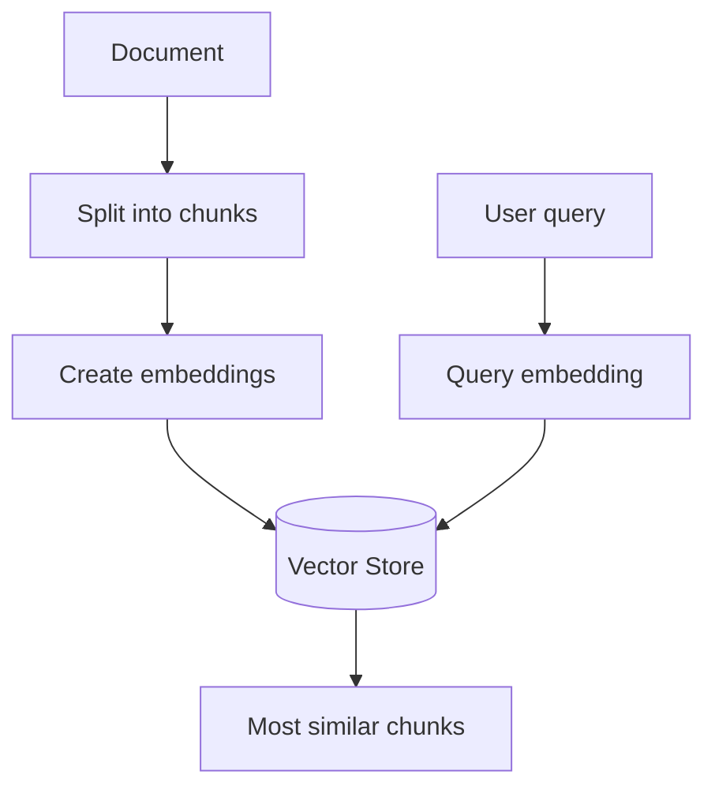
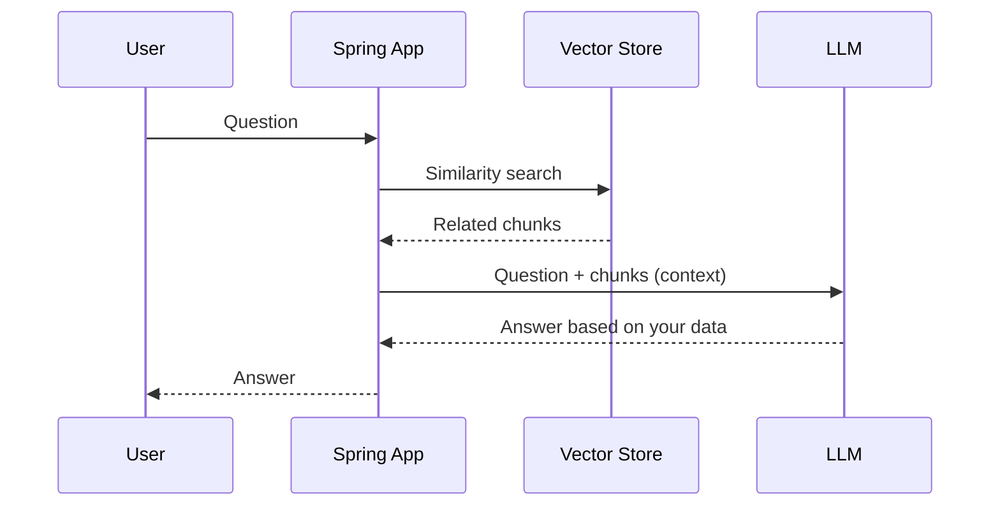

# 04 – Vector Databases, Vector Stores and RAG

---

## 1. Why a Vector Database?

Suppose you have a product file (title, description, price, category, features) and a user searches for **"wearable"**. No product has that word, so a normal word search (like SQL `LIKE`) finds nothing. But a smartwatch is wearable! We want a **semantic search**.

### Steps

1. Take the big document and break it into small **chunks**.
2. Convert each chunk into an **embedding**.
3. Store the embeddings in a **vector database**.
4. For a user query: convert the query to an embedding and find the **closest** stored chunks.



### `VectorStore` in Spring AI

`VectorStore` is an **interface**. Main methods:

| Method | Use |
|--------|-----|
| `add(List<Document>)` | Store documents (embeddings are created for you) |
| `delete(...)` | Remove documents |
| `similaritySearch(...)` | Find similar documents |

Implementations available: Simple, Azure, Cassandra, Chroma, Elasticsearch, MariaDB, Neo4j, Oracle, **PgVector**, **Redis**, SAP and more.

| Implementation | Notes |
|----------------|-------|
| **SimpleVectorStore** | Built in, keeps data in memory. Good for **learning only**. |
| **PgVector** | PostgreSQL with a vector extension. Needs Docker (or install). |
| **Redis** | Fast in-memory store. Run with Docker. |

To change the store you only change the dependency, properties and the one bean that creates the store. Your other code does not change.

---

## 2. Simple Vector Store

### Step 1: Create the `VectorStore` bean

```java
@Configuration
public class AppConfig {

    @Bean
    public VectorStore vectorStore(EmbeddingModel embeddingModel) {
        return SimpleVectorStore.builder(embeddingModel).build();
    }
}
```

We create it once as a bean, so the whole app can inject it. The embedding model is used to create embeddings.

> If you have two embedding models (Ollama + OpenAI), add `@Qualifier("openAiEmbeddingModel")` on the parameter.

### Step 2: Load the file into the store

Put `product_details.txt` in `src/main/resources`.

```java
@Component
public class DataInitializer {

    @Autowired
    private VectorStore vectorStore;

    @PostConstruct
    public void init() {
        TextReader textReader = new TextReader(new ClassPathResource("product_details.txt"));

        TokenTextSplitter splitter = new TokenTextSplitter(500, 30, 20, Integer.MAX_VALUE, false);

        List<Document> documents = splitter.split(textReader.get());

        vectorStore.add(documents);
    }
}
```

### Explanation

| Part | Meaning |
|------|---------|
| `@PostConstruct` | Runs the method once, when the app starts. |
| `TextReader` | Reads a text file into `Document` objects. |
| `ClassPathResource` | Finds the file inside `resources`. |
| `TokenTextSplitter` | Breaks a big document into smaller chunks (also called documents). |
| `vectorStore.add(documents)` | Creates embeddings and stores them. |

### `TokenTextSplitter` settings

| Parameter | Meaning | Example |
|-----------|---------|---------|
| `chunkSize` | Max **tokens** in one chunk. Keep it smaller than the model context size, leave room for the query. | 500 |
| `minChunkSizeChars` | Minimum characters in a chunk | 30 |
| `minChunkLengthToEmbed` | Chunks shorter than this are thrown away | 20 |
| `maxNumChunks` | Hard limit on chunks | `Integer.MAX_VALUE` (no limit) |
| `keepSeparator` | Keep line breaks/separators | `false` |

`new TokenTextSplitter()` uses default values. Setting your own values gives better chunks (the default gave fewer, bigger chunks and worse results in the example).

### Step 3: Search

```java
@RestController
public class ProductController {

    @Autowired
    private VectorStore vectorStore;

    @PostMapping("/api/product")
    public List<Document> getProducts(@RequestParam String text) {
        return vectorStore.similaritySearch(text);
    }
}
```

Searching "wearable" now returns related items such as earbuds and a laptop sleeve, even though the word is not in the file.

### Limit the number of results

```java
return vectorStore.similaritySearch(
        SearchRequest.builder()
                .query(text)
                .topK(2)
                .build());
```

| Option | Meaning |
|--------|---------|
| `query` | Text to search |
| `topK` | Maximum number of results |
| `similarityThreshold` | Minimum score (0 to 1) |

Searching "tea" with `topK(2)` returns a green tea and a coffee cup.

---

## 3. PgVector (PostgreSQL) with Docker

PgVector is an **open-source extension for PostgreSQL**. Normal Postgres does not include it, so we run it with **Docker**.

### Step 1: `docker-compose.yml` (project root)

```yaml
services:
  pgvector:
    image: pgvector/pgvector:pg16
    environment:
      - POSTGRES_DB=telusko
      - POSTGRES_USER=postgres
      - POSTGRES_PASSWORD=your_password
    ports:
      - "5432:5432"
```

`docker compose up -d` starts the container. With the Spring Boot Docker Compose dependency, Spring Boot can start it for you when the app runs.

### Step 2: Dependencies

```xml
<dependency>
    <groupId>org.springframework.ai</groupId>
    <artifactId>spring-ai-starter-vector-store-pgvector</artifactId>
</dependency>
<dependency>
    <groupId>org.springframework.boot</groupId>
    <artifactId>spring-boot-docker-compose</artifactId>
    <scope>runtime</scope>
</dependency>
```

(Check the exact artifact names on Spring Initializr for your version.)

### Step 3: `application.properties`

```properties
spring.datasource.url=jdbc:postgresql://localhost:5432/telusko
spring.datasource.username=postgres
spring.datasource.password=your_password

spring.ai.vectorstore.pgvector.index-type=HNSW
spring.ai.vectorstore.pgvector.distance-type=COSINE_DISTANCE
spring.ai.vectorstore.pgvector.dimensions=1536
spring.ai.vectorstore.pgvector.max-document-batch-size=10000

spring.main.allow-bean-definition-overriding=true
```

| Property | Meaning |
|----------|---------|
| `index-type` | How vectors are indexed (HNSW is the default) |
| `distance-type` | How closeness is measured (cosine by default) |
| `dimensions` | **Must match** the embedding model's dimensions |
| `max-document-batch-size` | Documents inserted per batch |
| `allow-bean-definition-overriding` | Needed because we define our own `VectorStore` bean |

### Step 4: Schema

The store needs a table with a `vector` column. Put a SQL file in `resources` (for example `init-schema.sql`):

```sql
CREATE EXTENSION IF NOT EXISTS vector;
CREATE EXTENSION IF NOT EXISTS hstore;
CREATE EXTENSION IF NOT EXISTS "uuid-ossp";

CREATE TABLE IF NOT EXISTS vector_store (
    id uuid DEFAULT uuid_generate_v4() PRIMARY KEY,
    content text,
    metadata json,
    embedding vector(1536)
);

CREATE INDEX ON vector_store USING HNSW (embedding vector_cosine_ops);
```

Load it at start-up:

```properties
spring.sql.init.mode=always
spring.sql.init.schema-locations=classpath:init-schema.sql
```

(If you prefer, `spring.ai.vectorstore.pgvector.initialize-schema=true` can create the table for you.)

### Step 5: Change the bean

```java
@Bean
public VectorStore vectorStore(JdbcTemplate jdbcTemplate, EmbeddingModel embeddingModel) {
    return PgVectorStore.builder(jdbcTemplate, embeddingModel).build();
}
```

PgVector uses a relational database, so it needs `JdbcTemplate`.

### Common error: dimension mismatch

*"Expected 1536 dimensions, not 3072"* → the table is `vector(1536)` but the model `text-embedding-3-large` gives 3072. Fix: use a **1536-dimension model** (`text-embedding-3-small` or `text-embedding-ada-002`), or change the dimension everywhere (table and property).

The controller and data initializer **do not change**, because they only use the `VectorStore` interface.

---

## 4. Redis Vector Store

### Step 1: Run Redis Stack with Docker

```bash
docker run -d --name redis-stack -p 6379:6379 redis/redis-stack:latest
```

(Remove the Postgres/Docker Compose pieces if you no longer use them.)

### Step 2: Dependencies

```xml
<dependency>
    <groupId>org.springframework.ai</groupId>
    <artifactId>spring-ai-starter-vector-store-redis</artifactId>
</dependency>
<dependency>
    <groupId>redis.clients</groupId>
    <artifactId>jedis</artifactId>
</dependency>
```

### Step 3: Properties

```properties
spring.data.redis.host=localhost
spring.data.redis.port=6379
spring.ai.vectorstore.redis.index-name=product-index
spring.ai.vectorstore.redis.prefix=product
spring.ai.vectorstore.redis.initialize-schema=true
```

### Step 4: Beans

PgVector used `JdbcTemplate`. Redis uses the **Jedis** client, so we create a `JedisPooled` bean:

```java
@Bean
public JedisPooled jedisPooled() {
    return new JedisPooled("localhost", 6379);
}

@Bean
public VectorStore vectorStore(JedisPooled jedisPooled, EmbeddingModel embeddingModel) {
    return RedisVectorStore.builder(jedisPooled, embeddingModel)
            .indexName("product-index")
            .initializeSchema(true)
            .build();
}
```

### Errors you may see

| Error | Fix |
|-------|-----|
| "No such index" (it searches for the index `spring-ai-index`) | Set `.indexName("product-index")` to match your property |
| "No such index" even after that | Set `initializeSchema(true)` (default is `false`), so the index is created |

---

## 5. What is RAG?

**RAG** = **R**etrieval **A**ugmented **G**eneration.

### Problems with plain LLMs

| Problem | Meaning |
|---------|---------|
| **Old knowledge** | The model was trained up to a certain date. |
| **Hallucination** | If it does not know, it may make up an answer. |
| **No access to your data** | It does not know your products, documents or orders. |

Example: user asks *"Need details about the art kit for kids."* A plain model gives a general answer, not your product. Ask *"tell me a joke"* and it tells one, even though it is a shopping assistant.

### The RAG idea

1. Store your data as embeddings in a vector store (done before).
2. When a user asks a question, **search** the vector store for related chunks.
3. Send the question **plus those chunks (context)** to the LLM.
4. The LLM answers using your data.



---

## 6. RAG Implementation with `QuestionAnswerAdvisor`

Spring AI does all the steps with one advisor.

```java
@PostMapping("/api/ask")
public String getAnswerUsingRag(@RequestParam String query) {
    return chatClient
            .prompt(query)
            .advisors(QuestionAnswerAdvisor.builder(vectorStore).build())
            .call()
            .content();
}
```

| Part | Meaning |
|------|---------|
| `QuestionAnswerAdvisor` | Searches the vector store for the query and adds the results to the prompt. |
| `builder(vectorStore)` | Tells it which store to search. |
| `.advisors(...)` | Applies the advisor to this call only. |

(Older versions used `new QuestionAnswerAdvisor(vectorStore)`.)

**Result:** asking about "art kit for kids" or a product name now returns details from your own file, written in the model's own words. The advisor needs the dependency `spring-ai-advisors-vector-store` in 1.0.0.

> RAG is not limited to text files. You can also read **PDF** files with PDF readers and store them the same way. Many AI products use RAG behind the scenes to get fresh or private data.

---

## Quick Reference

| Item | Use |
|------|-----|
| `Document` | A chunk of text + metadata |
| `TextReader` | Read a text file |
| `TokenTextSplitter` | Split a document into chunks |
| `VectorStore.add / delete / similaritySearch` | Main methods |
| `SearchRequest` | `query`, `topK`, `similarityThreshold` |
| `QuestionAnswerAdvisor` | Easy RAG |

### Anti-patterns

| Anti-pattern | Why it is bad |
|--------------|---------------|
| Using `SimpleVectorStore` in production | Data is lost on restart (memory only) |
| Embedding dimension different from the table dimension | Insert fails |
| Using the default chunking without checking results | Chunks may be too big for good search |
| Sending the whole document to the LLM | Costs many tokens; use RAG chunks |

## Practice Questions

**Q1. What are the steps to store a document in a vector store?**
**A:** Read it, split into chunks, create embeddings (done by the store), and save.

**Q2. What does `topK(2)` mean?**
**A:** Return at most the 2 most similar results.

**Q3. What is RAG and which problem does it solve?**
**A:** It adds your own retrieved data to the prompt, which reduces hallucination and gives the model fresh/private information.

**Q4. Which class do you change when moving from Simple store to PgVector?**
**A:** Only the `VectorStore` bean (plus dependencies and properties).
