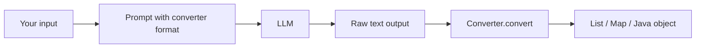

# 07 – Structured Output Converters

---

## 1. Why Structured Output?

In a chat app, a text answer is fine. But when **your application** talks to an AI, it needs data in a fixed shape: a **list**, a **map**, or a **Java object**, not a free-form sentence.

Spring AI gives **output converters** for this.

| Converter | Gives you |
|-----------|-----------|
| `ListOutputConverter` | `List<String>` |
| `MapOutputConverter` | `Map<String, Object>` |
| `BeanOutputConverter<T>` | A Java object (or a list of objects) |

### How it works



**Important:** The converter does not magically change any answer. You must **tell the LLM the format** you want. The converter's `getFormat()` gives that instruction text, and you put it into the prompt.

---

## 2. List Output Converter

**Goal:** `GET /movies?name=Tom Hanks` → a `List<String>` of movie names.

```java
@RestController
public class MovieController {

    private final ChatClient chatClient;

    public MovieController(ChatClient.Builder builder) {
        this.chatClient = builder.build();
    }

    @GetMapping("/movies")
    public List<String> getMovies(@RequestParam String name) {

        String message = "List top 5 movies of the actor {name}. {format}";

        ListOutputConverter outputConverter =
                new ListOutputConverter(new DefaultConversionService());

        PromptTemplate template = new PromptTemplate(message,
                Map.of("name", name, "format", outputConverter.getFormat()));

        Prompt prompt = template.create();

        String content = chatClient.prompt(prompt).call().content();

        return outputConverter.convert(content);
    }
}
```

### Explanation

| Step | Meaning |
|------|---------|
| `{name}` and `{format}` | Placeholders in the prompt. |
| `new ListOutputConverter(new DefaultConversionService())` | Creates the converter (default conversion service is fine). |
| `outputConverter.getFormat()` | Text that tells the LLM: "answer as a comma-separated list". It replaces `{format}`. |
| `PromptTemplate(message, map)` | Creates the template with the values. |
| `.call().content()` | Gets the raw `String`. |
| `outputConverter.convert(content)` | Converts the string into `List<String>`. |

**Test:** `name=SRK` or `name=Tom Hanks` → a clean list of movie names, which any existing Java code that expects a `List<String>` can use.

---

## 3. Bean Output Converter (One Object)

**Goal:** return one movie as a Java object with fields.

### The class

```java
public class Movie {
    private String movieName;
    private String leadActor;
    private String director;
    private int year;

    // getters and setters (or use Lombok @Data)
}
```

### The method

```java
@GetMapping("/movie")
public Movie getMovieData(@RequestParam String name) {

    String message = "Get me the best movie of the actor {name}. {format}";

    BeanOutputConverter<Movie> outputConverter = new BeanOutputConverter<>(Movie.class);

    PromptTemplate template = new PromptTemplate(message,
            Map.of("name", name, "format", outputConverter.getFormat()));

    String content = chatClient.prompt(template.create()).call().content();

    return outputConverter.convert(content);
}
```

### Explanation

- `new BeanOutputConverter<>(Movie.class)` – the converter reads the **fields of `Movie`** and builds a **JSON schema**.
- `getFormat()` tells the LLM: "answer in JSON that follows this schema".
- `convert(content)` reads the JSON and creates a `Movie` object.

**Result (JSON returned to the client):**

```json
{
  "movieName": "Forrest Gump",
  "leadActor": "Tom Hanks",
  "director": "Robert Zemeckis",
  "year": 1994
}
```

---

## 4. Bean Output Converter with a List

**Goal:** `List<Movie>`.

A `List<Movie>` has no single class we can pass (`List<Movie>.class` is not allowed in Java), so we use **`ParameterizedTypeReference`**:

```java
@GetMapping("/movies-list")
public List<Movie> getMovieList(@RequestParam String name) {

    String message = "Top 5 movies of the actor {name}. {format}";

    BeanOutputConverter<List<Movie>> outputConverter =
            new BeanOutputConverter<>(new ParameterizedTypeReference<List<Movie>>() {});

    PromptTemplate template = new PromptTemplate(message,
            Map.of("name", name, "format", outputConverter.getFormat()));

    String content = chatClient.prompt(template.create()).call().content();

    return outputConverter.convert(content);
}
```

- `new ParameterizedTypeReference<List<Movie>>() {}` – an anonymous class that keeps the generic type information.
- Everything else is the same. The result is a JSON array of movies.

> Spring AI also has a shortcut: `chatClient.prompt(...).call().entity(Movie.class)` or `.entity(new ParameterizedTypeReference<List<Movie>>() {})`, which does the converter work for you.

---

## Quick Reference

| Need | Use |
|------|-----|
| List of strings | `ListOutputConverter` |
| Map | `MapOutputConverter` |
| One object | `BeanOutputConverter<Movie>(Movie.class)` |
| List of objects | `BeanOutputConverter<>(new ParameterizedTypeReference<List<Movie>>(){})` |
| Tell the model the format | `converter.getFormat()` inside the prompt |
| Parse the output | `converter.convert(text)` |

## Practice Questions

**Q1. What does `getFormat()` do?**
**A:** It returns instructions for the LLM about the output format. You add it to the prompt.

**Q2. Why do we use `ParameterizedTypeReference` for a list of beans?**
**A:** Java cannot use `List<Movie>.class`, so we use this class to keep the generic type.

**Q3. Which converter turns an answer into a Java object?**
**A:** `BeanOutputConverter`.
