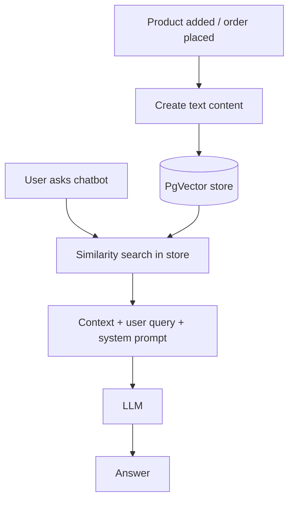

# 08 – Adding AI Features to an E-commerce Spring Boot Project

> **We add three AI features** to an existing Spring Boot e-commerce back end:
> 1. AI-generated **product description**
> 2. AI-generated **product image**
> 3. An **AI chatbot (Ask AI)** that answers questions about products and orders using **RAG**

---

## 1. The Existing Project

It is a simple back end (the React front end only calls our APIs; it is not covered here).

| Part | Details |
|------|---------|
| Database | PostgreSQL, tables created by Spring Data JPA |
| `Product` entity | id, name, brand, category, description, price, releaseDate, productAvailable, stockQuantity, imageName, imageType, image (`@Lob`) |
| `ProductController` | get all products, get by id, get image, add, update, delete, search |
| `ProductService` / `ProductRepo` | Business logic and JPA queries |

When AI is added to an existing project, you add **new files** (config, services, controller methods). The old code stays the same.

### What the new front end expects

| Button / feature | Back-end API |
|------------------|--------------|
| Generate description | `POST /api/product/generate-description?name=..&category=..` |
| Generate image | `POST /api/product/generate-image?name=..&category=..&description=..` |
| Ask AI chat | `GET /api/chat/ask?message=..` |

> Until we build these, the UI shows errors like *"Request method POST is not supported"*, because no controller method exists.

---

## 2. Prepare the Project for Spring AI

### 2.1 `pom.xml`

Set the version:

```xml
<properties>
    <spring-ai.version>1.0.0</spring-ai.version>
</properties>
```

Add the OpenAI starter:

```xml
<dependency>
    <groupId>org.springframework.ai</groupId>
    <artifactId>spring-ai-starter-model-openai</artifactId>
</dependency>
```

Add the Spring AI BOM so all Spring AI versions match:

```xml
<dependencyManagement>
    <dependencies>
        <dependency>
            <groupId>org.springframework.ai</groupId>
            <artifactId>spring-ai-bom</artifactId>
            <version>${spring-ai.version}</version>
            <type>pom</type>
            <scope>import</scope>
        </dependency>
    </dependencies>
</dependencyManagement>
```

> When you create a **new** project from Spring Initializr and select OpenAI, you get these pieces automatically (click **Explore** to see them). For an existing project, copy them. Always copy-paste to avoid typos (for example `spring-ai.version` uses a hyphen in the property name).

Reload Maven.

### 2.2 `application.properties`

```properties
spring.ai.openai.api-key=${OPENAI_API_KEY}
spring.ai.openai.chat.options.model=gpt-4o
```

### 2.3 Create a `ChatClient` bean

Create a `config` package:

```java
@Configuration
public class AppConfig {

    @Bean
    public ChatClient chatClient(ChatClient.Builder builder) {
        return builder.build();
    }
}
```

Now any class can `@Autowired` the `ChatClient`. (You can also build it in each class constructor; a config class keeps it in one place.)

---

## 3. Feature 1: Generate Product Description

The front end sends `name` and `category`. We build a prompt from them.

### Controller

```java
@PostMapping("/product/generate-description")
public ResponseEntity<String> generateDescription(@RequestParam String name,
                                                  @RequestParam String category) {
    try {
        String aiDescription = productService.generateDescription(name, category);
        return new ResponseEntity<>(aiDescription, HttpStatus.OK);
    } catch (Exception e) {
        return new ResponseEntity<>(e.getMessage(), HttpStatus.INTERNAL_SERVER_ERROR);
    }
}
```

- The controller does not know that AI is used. It just asks the service.
- A good step: first return a fixed text like `"demo description"` from the service, and check that the mapping works. Then add AI.

### Service

```java
@Autowired
private ChatClient chatClient;

public String generateDescription(String name, String category) {

    String descPrompt = String.format("""
            Write a concise and professional product description for an e-commerce listing.

            Product Name: %s
            Category: %s

            Keep it simple, engaging, and highlight the key features.
            Avoid jargon. Keep it under 250 characters.
            """, name, category);

    return chatClient.prompt(descPrompt).call().content();
}
```

| Part | Meaning |
|------|---------|
| `String.format(... %s ...)` | Puts name and category into the prompt. |
| "under 250 characters" | The database column allows only 255 characters, so we ask the model to stay short. |
| `chatClient.prompt(...).call().content()` | Sends the prompt and gets the text. |

> Handle `null` results in real projects.

---

## 4. Feature 2: Generate Product Image

### Controller

```java
@PostMapping("/product/generate-image")
public ResponseEntity<?> generateImage(@RequestParam String name,
                                       @RequestParam String category,
                                       @RequestParam String description) {
    try {
        byte[] aiImage = productService.generateImage(name, category, description);
        return new ResponseEntity<>(aiImage, HttpStatus.OK);
    } catch (Exception e) {
        return new ResponseEntity<>(e.getMessage(), HttpStatus.INTERNAL_SERVER_ERROR);
    }
}
```

We return the **image bytes**, not a link, so the front end can show it and save it with the product.

### Service method (in `ProductService`)

```java
@Autowired
private AiImageGeneratorService aiImageGeneratorService;

public byte[] generateImage(String name, String category, String description) {

    String imagePrompt = String.format("""
            Create a clean, professional product photo for an e-commerce website.
            Category: %s
            Product: %s
            Details: %s
            Use a plain background, good lighting, minimal elements,
            like a professional photo taken before selling the product online.
            """, category, name, description);

    return aiImageGeneratorService.generateImage(imagePrompt);
}
```

### New class `AiImageGeneratorService`

```java
@Service
public class AiImageGeneratorService {

    @Autowired
    private OpenAiImageModel imageModel;

    public byte[] generateImage(String imagePrompt) {

        OpenAiImageOptions options = OpenAiImageOptions.builder()
                .N(1)
                .width(1024)
                .height(1024)
                .quality("standard")
                .responseFormat("url")
                .model("dall-e-3")
                .build();

        ImageResponse response = imageModel.call(new ImagePrompt(imagePrompt, options));

        String imageUrl = response.getResult().getOutput().getUrl();

        try (InputStream in = URI.create(imageUrl).toURL().openStream()) {
            return in.readAllBytes();
        } catch (IOException e) {
            throw new RuntimeException("Could not download the image", e);
        }
    }
}
```

### Explanation

| Part | Meaning |
|------|---------|
| `OpenAiImageModel` | Image model (chat client is only for text). |
| Options | One image, 1024 x 1024, `standard` quality (cheaper; a small box on the site does not need HD), response as URL, model DALL·E 3. |
| `getUrl()` | Link of the generated image. |
| `openStream().readAllBytes()` | Downloads the image and returns the bytes. |

Image generation takes **10–20 seconds**. The user can edit the result or save the product with it.

---

## 5. Feature 3: The "Ask AI" Chatbot – Plan

A customer-care chatbot should know:
- Our **products** (to suggest items, e.g. "I want to stay hydrated" → smart bottle).
- Our **orders** (to answer "what is my order status?" using order number or email).

The LLM does **not** know our database. So we use **RAG**:



Steps we will do:

1. Add the **Order** feature files (if your project does not have them).
2. Set up **PgVector** with Docker.
3. Create the **chatbot** controller and service.
4. **Store product data** in the vector store when a product is saved.
5. **Keep stock updated** in the vector store when orders are placed.
6. **Store order data** in the vector store when an order is placed.

---

## 6. Order Feature (Files Added)

Add these classes to the project:

| Layer | Class | Purpose |
|-------|-------|---------|
| Controller | `OrderController` | `POST /api/orders/place` (place order), `GET /api/orders` (all orders) |
| Service | `OrderService` | Place order and list orders |
| Repository | `OrderRepo` | JPA repository for `Order` |
| Model | `Order` | orderId, customerName, email, status, orderDate, list of items |
| Model | `OrderItem` | product, quantity, totalPrice, linked to an order |
| DTO | `OrderRequest`, `OrderResponse`, item DTOs | Data between client and server only |

### What `placeOrder` does

- For the request:
  - Create an `Order` (generate an order id, set customer name, email, status, date)
  - For each requested item:
    - Load the `Product`
    - **Subtract the quantity** from the product stock and save the product
    - Create an `OrderItem` (product, quantity, total price)
  - Save the order (JPA also creates the `order_item` rows)
  - *(Later we also add the order to the vector store here.)*

An order has many items, and one item can have many quantities (2 keyboards = one item, quantity 2).

---

## 7. Set Up PgVector in the Project

Our old project used Postgres installed on the machine. For vectors we use the Docker PgVector image.

### 7.1 `compose.yaml` (project root)

```yaml
services:
  pgvector:
    image: pgvector/pgvector:pg16
    environment:
      - POSTGRES_DB=telusko
      - POSTGRES_USER=postgres
      - POSTGRES_PASSWORD=your_password
    ports:
      - "5432:5432"
```

With the Docker Compose support dependency, Spring Boot starts the container and **auto-configures the datasource**, so you can remove the manual `spring.datasource.*` lines.

### 7.2 Dependencies (add / remove)

Add:

```xml
<dependency>
    <groupId>org.springframework.ai</groupId>
    <artifactId>spring-ai-starter-vector-store-pgvector</artifactId>
</dependency>
<dependency>
    <groupId>org.springframework.boot</groupId>
    <artifactId>spring-boot-docker-compose</artifactId>
    <scope>runtime</scope>
</dependency>
```

Remove the separate Postgres driver if the starter already brings it (keep one driver).

### 7.3 `application.properties`

```properties
spring.sql.init.mode=always
spring.sql.init.schema-locations=classpath:init-schema.sql

spring.ai.openai.embedding.options.model=text-embedding-ada-002
```

- `init-schema.sql` creates the `vector_store` table (`vector(1536)` column), as shown in the vector store chapter.
- Use an embedding model with **1536 dimensions** (`text-embedding-ada-002`). In the video, `text-embedding-3-small` also looked fine on paper but gave problems here; `ada-002` worked well. If you change the model, check the dimension.

Start the app: Docker pulls the image the first time (takes time), the `vector_store` table is created, then Tomcat starts.

---

## 8. Chatbot Controller

Our front end calls `/api/chat/ask?message=hi`. If the endpoint does not exist you see *"Failed to fetch"* in the browser.

```java
@RestController
@RequestMapping("/api/chat")
@CrossOrigin
public class ChatBotController {

    @Autowired
    private ChatBotService chatBotService;

    @GetMapping("/ask")
    public ResponseEntity<String> askBot(@RequestParam String message) {
        return ResponseEntity.ok(chatBotService.getBotResponse(message));
    }
}
```

- `@CrossOrigin` allows the React app (another port) to call this API (same as in `ProductController`).
- The controller only passes the message to the service.

---

## 9. Chatbot Service with RAG

### 9.1 The system prompt file

Create `src/main/resources/prompt/chatbot-rag-prompt.txt`. Keeping the prompt in a file lets you change it without touching Java code.

```text
You are a helpful and professional customer service assistant for our e-commerce store.

Use ONLY the context below to answer. If the answer is not in the context,
say that you do not have that information and ask for more details.

If the user asks about an order, ask for the order number or email address.
Be polite and short. Do not make up products or orders.

CONTEXT:
{context}

USER QUESTION:
{userQuery}
```

`{context}` and `{userQuery}` are placeholders.

### 9.2 `ChatBotService`

```java
@Service
public class ChatBotService {

    @Autowired
    private ChatClient chatClient;

    @Autowired
    private VectorStore vectorStore;

    @Value("classpath:prompt/chatbot-rag-prompt.txt")
    private Resource promptResource;

    public String getBotResponse(String userQuery) {
        try {
            String promptText = promptResource.getContentAsString(StandardCharsets.UTF_8);

            String context = semanticContext(userQuery);

            Prompt prompt = PromptTemplate.builder()
                    .template(promptText)
                    .variables(Map.of("userQuery", userQuery, "context", context))
                    .build()
                    .create();

            return chatClient.prompt(prompt).call().content();

        } catch (Exception e) {
            return "Bot failed: " + e.getMessage();
        }
    }

    private String semanticContext(String userQuery) {

        List<Document> documents = vectorStore.similaritySearch(
                SearchRequest.builder()
                        .query(userQuery)
                        .topK(5)
                        .similarityThreshold(0.7)
                        .build());

        StringBuilder context = new StringBuilder();
        for (Document document : documents) {
            context.append(document.getFormattedContent()).append("\n");
        }
        return context.toString();
    }
}
```

### Explanation

| Step | Meaning |
|------|---------|
| Read the prompt file | `Resource.getContentAsString(...)` works inside a jar too (`getFile()` would not). |
| `semanticContext` | Searches the vector store for the 5 most similar documents with score at least 0.7, and joins their text. |
| `PromptTemplate.builder()...variables(...)` | Fills `{context}` and `{userQuery}`. |
| `chatClient.prompt(prompt).call().content()` | Sends the final prompt to the model. |
| `catch` | Returns a safe message instead of crashing. |

Right now the vector store is empty, so the bot gives general answers (it cannot find the laptop product). Next we fill the store.

---

## 10. Store Product Data in the Vector Store

When a product is saved, also add its text to the vector store.

```java
@Autowired
private VectorStore vectorStore;

public Product addProduct(Product product, MultipartFile imageFile) throws IOException {

    product.setImageName(imageFile.getOriginalFilename());
    product.setImageType(imageFile.getContentType());
    product.setImage(imageFile.getBytes());

    Product savedProduct = repo.save(product);

    String content = String.format("""
            Product Name: %s
            Description: %s
            Brand: %s
            Category: %s
            Price: %.2f
            Release Date: %s
            Available: %s
            Stock Quantity: %d
            """,
            savedProduct.getName(),
            savedProduct.getDescription(),
            savedProduct.getBrand(),
            savedProduct.getCategory(),
            savedProduct.getPrice(),
            savedProduct.getReleaseDate(),
            savedProduct.isProductAvailable(),
            savedProduct.getStockQuantity());

    Document document = new Document(
            UUID.randomUUID().toString(),
            content,
            Map.of("productId", String.valueOf(savedProduct.getId())));

    vectorStore.add(List.of(document));

    return savedProduct;
}
```

### Explanation

- We keep the **saved product** (it now has its database id).
- The **content** is a readable text with a **label for each value** ("Price: 600", not just "600"), so the model understands each value.
- `new Document(id, content, metadata)`:
  - id = a random unique string
  - content = the text that is embedded
  - metadata = `productId`, so we can find or delete this document later
- `vectorStore.add(...)` creates the embedding and stores it.

**Test:** add a product like "Asus laptop", then ask the chatbot *"I want to buy a laptop"* → it suggests the laptop. Add a "smart bottle" and ask *"I want to stay hydrated"* → it suggests the bottle. Only products added **after** this code exists are in the vector store.

> Do the same in your **update** method: delete the old document (see next section) and add a new one, otherwise the store keeps old data.

---

## 11. Keep Stock Updated in the Vector Store

When an order is placed, the stock goes down in the database. The vector store must show the **new stock**, or the bot will say "4 available" when only 1 is left.

You **cannot edit** a document. So: **delete** the old one, then **add** a new one.

In `OrderService`, after saving the updated product:

```java
@Autowired
private VectorStore vectorStore;

// product = the product after the stock was reduced and saved

String filter = String.format("productId == '%s'", String.valueOf(product.getId()));
vectorStore.delete(filter);

String updatedContent = String.format("""
        Product Name: %s
        Description: %s
        Brand: %s
        Category: %s
        Price: %.2f
        Release Date: %s
        Available: %s
        Stock Quantity: %d
        """,
        product.getName(), product.getDescription(), product.getBrand(),
        product.getCategory(), product.getPrice(), product.getReleaseDate(),
        product.isProductAvailable(), product.getStockQuantity());

Document updatedDoc = new Document(
        UUID.randomUUID().toString(),
        updatedContent,
        Map.of("productId", String.valueOf(product.getId())));

vectorStore.add(List.of(updatedDoc));
```

| Part | Meaning |
|------|---------|
| `filter` | A filter expression that matches the metadata key `productId`. |
| `vectorStore.delete(filter)` | Deletes the old product document. |
| `updatedDoc` | A new document with the updated stock. |

(You can move this code into a small helper method and reuse it in both services.)

---

## 12. Store Order Data in the Vector Store

After saving the order, add its details so the chatbot can answer order questions.

```java
Order savedOrder = orderRepo.save(order);

StringBuilder content = new StringBuilder();
content.append("Order Summary\n");
content.append("Order ID: ").append(savedOrder.getOrderId()).append("\n");
content.append("Customer: ").append(savedOrder.getCustomerName()).append("\n");
content.append("Email: ").append(savedOrder.getEmail()).append("\n");
content.append("Date: ").append(savedOrder.getOrderDate()).append("\n");
content.append("Status: ").append(savedOrder.getStatus()).append("\n");
content.append("Products:\n");

for (OrderItem item : savedOrder.getOrderItems()) {
    content.append("- ")
           .append(item.getProduct().getName())
           .append(" x ")
           .append(item.getQuantity())
           .append(" = ")
           .append(item.getTotalPrice())
           .append("\n");
}

Document document = new Document(
        UUID.randomUUID().toString(),
        content.toString(),
        Map.of("orderId", savedOrder.getOrderId()));

vectorStore.add(List.of(document));
```

### Explanation

- We use a `StringBuilder` because an order has **many items**, and we add them in a loop.
- The format for each item is `name x quantity = price`, so the model can read it easily.
- Metadata `orderId` helps to find the document later.
- Use your own getter names from your `Order` and `OrderItem` classes.

### Test the chatbot

1. Place orders (for example 2 laptops, 5 bottles) with different names and emails.
2. Ask: *"What's my order status?"* → the bot asks for an order number or email.
3. Give the email → the bot finds the order details.
4. Say *"I don't remember the order id, but I bought two laptops"* → the bot can use items and date to find it.
5. A **new** order after this code is added is searchable. Old orders (placed before) are **not** in the vector store.

> The chatbot in this project does **not** have chat memory. To make it remember the conversation, combine this with a memory advisor (see the chat memory section earlier).

---

## 13. Final Flow Summary

- **Add product** → save in DB → create text → add `Document` (with `productId`) to vector store.
- **Place order** → reduce stock in DB → delete old product document → add updated product document → save order → add order `Document` to vector store.
- **User asks chatbot** → `ChatBotController` → `ChatBotService` → similarity search (top 5, score ≥ 0.7) → build prompt from the file with context and question → LLM → answer.

---

## Quick Reference

| Task | Where |
|------|-------|
| Spring AI dependency, BOM, version | `pom.xml` |
| API key and model | `application.properties` |
| `ChatClient` bean | `AppConfig` |
| Description / image generation | `ProductController` + `ProductService` + `AiImageGeneratorService` |
| Vector store (PgVector, Docker) | `compose.yaml`, `init-schema.sql`, properties |
| Chatbot | `ChatBotController` + `ChatBotService` + prompt file |
| Embed data | `ProductService` (products), `OrderService` (orders) |

### Anti-patterns

| Anti-pattern | Why it is bad |
|--------------|---------------|
| Putting AI logic inside the controller | Keep it in services; controller should stay thin |
| Embedding raw values without labels | The model cannot tell what each value means |
| Not updating the vector store after stock or product changes | Chatbot gives old, wrong answers |
| Letting the model answer without context rules | It may make up products (hallucination) |
| API key in the properties file in Git | Key can be stolen |

## Practice Questions

**Q1. Why do we ask for "under 250 characters" in the description prompt?**
**A:** The database column allows only 255 characters.

**Q2. Why does the image service return bytes and not a URL?**
**A:** The front end can show the image and save it with the product; the link is temporary.

**Q3. Why do we delete and re-add a product document when stock changes?**
**A:** Documents cannot be edited. The new document has the updated stock.

**Q4. What do `topK(5)` and `similarityThreshold(0.7)` do in the chatbot search?**
**A:** Return at most 5 documents, and only those with a similarity score of 0.7 or more.

**Q5. How does the chatbot get access to our database data?**
**A:** We store product and order text as embeddings in the vector store, then retrieve related text and send it to the LLM with the question (RAG).
