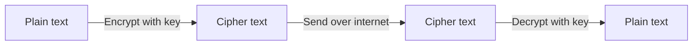
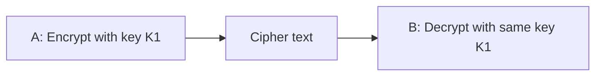
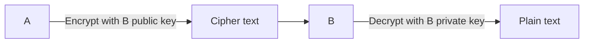
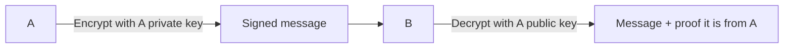
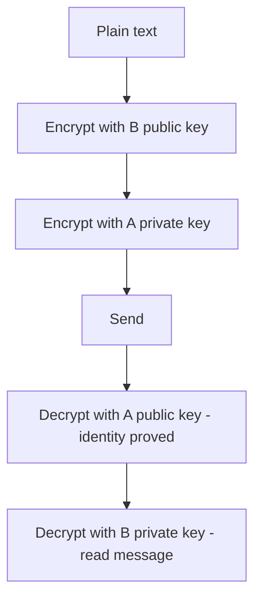
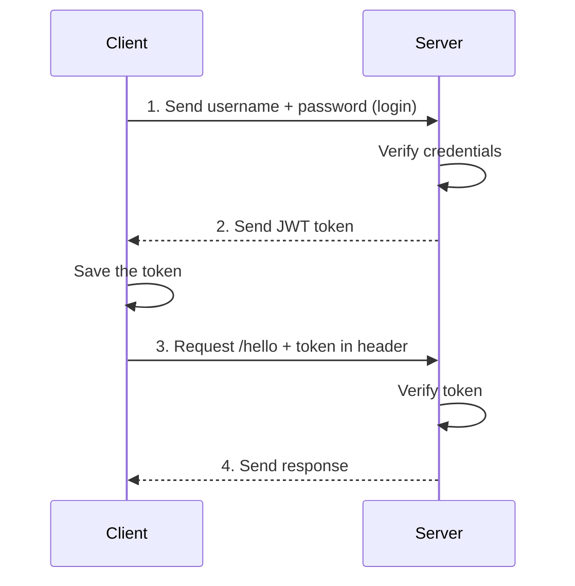
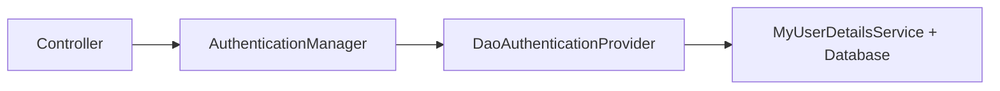
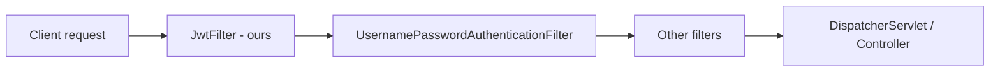
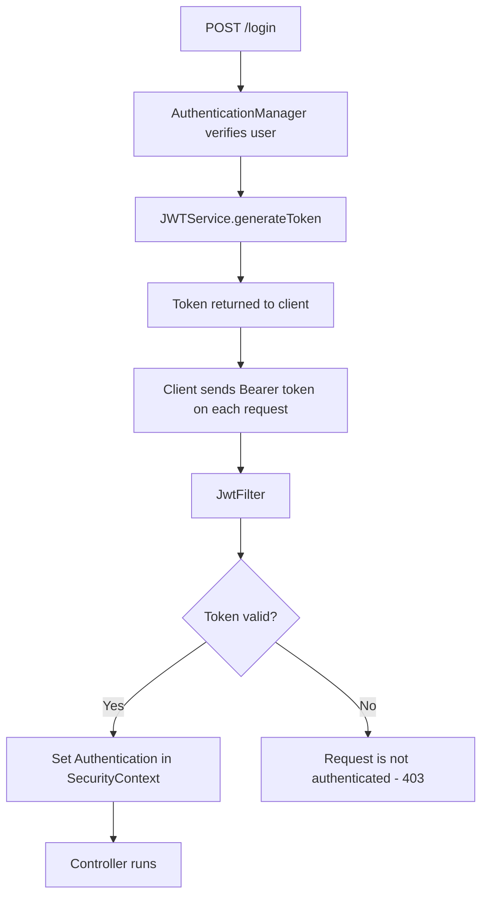
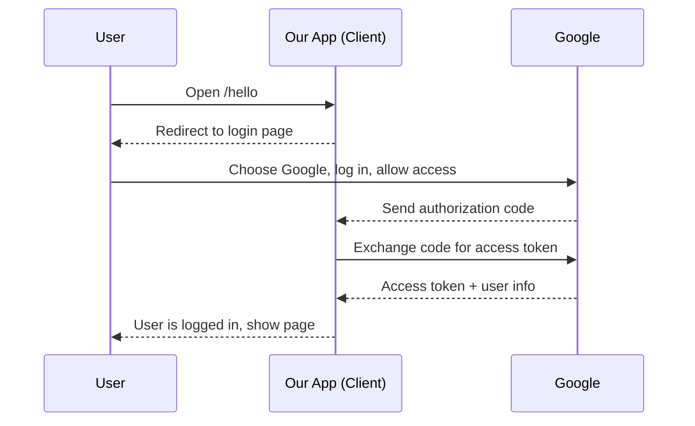

# Cryptography, JWT and OAuth2 with Spring Security – Complete Tutorial

> **Tech used:** Spring Boot 3.2.x, Java 21, Spring Security 6, Spring Data JPA, PostgreSQL, JJWT library, Postman

---

## Table of Contents

1. [Cryptography Basics](#1-cryptography-basics)
2. [Encryption and Decryption](#2-encryption-and-decryption)
3. [Symmetric Key Cryptography](#3-symmetric-key-cryptography)
4. [Asymmetric Key Cryptography](#4-asymmetric-key-cryptography)
5. [Digital Signature](#5-digital-signature)
6. [Why JWT? Sessions vs Tokens](#6-why-jwt-sessions-vs-tokens)
7. [What is JWT?](#7-what-is-jwt)
8. [JWT Implementation Plan](#8-jwt-implementation-plan)
9. [Project Setup for JWT](#9-project-setup-for-jwt)
10. [Login Endpoint with AuthenticationManager](#10-login-endpoint-with-authenticationmanager)
11. [Generating the JWT Token](#11-generating-the-jwt-token)
12. [Creating the JWT Filter](#12-creating-the-jwt-filter)
13. [Validating the Token](#13-validating-the-token)
14. [Testing the Full JWT Flow](#14-testing-the-full-jwt-flow)
15. [JWT Summary](#15-jwt-summary)
16. [What is OAuth2?](#16-what-is-oauth2)
17. [OAuth2 Project Setup](#17-oauth2-project-setup)
18. [Security Configuration for OAuth2](#18-security-configuration-for-oauth2)
19. [Google Login](#19-google-login)
20. [GitHub Login](#20-github-login)
21. [Quick Reference Summary](#21-quick-reference-summary)
22. [Practice Questions](#22-practice-questions)

---

## 1. Cryptography Basics

On the internet, data moves between a client and a server (or between two servers). Anyone sitting **in between** can look at this data. This is called a **Man-in-the-Middle (MITM) attack**.

There are two kinds of attacks:

| Attack | What the attacker does |
|--------|------------------------|
| **Passive attack** | Only **reads** the data. |
| **Active attack** | **Changes** the data before it reaches the receiver. |

**Example:**
- Person A sends: *"Let's meet at the cafe at 5:00 PM."*
- Person C (attacker) catches the message, changes it to *"6:00 PM"*, and sends it to B.

### What we need

1. Even if someone sees the data, they **should not be able to read it**.
2. Even if someone changes the data, the receiver **should know** that it was changed.

We solve this with **cryptography**.

---

## 2. Encryption and Decryption

| Term | Meaning |
|------|---------|
| **Plain text** | The normal, readable message. |
| **Encryption** | Converting plain text into **cipher text** using a **key**. |
| **Cipher text** | The unreadable, scrambled message. |
| **Decryption** | Converting cipher text back to plain text using a key. |



- If attacker C catches the cipher text, C cannot read it, because C does not have the key.
- B can read it, because B has the key.

The **key** is the most important part. There are two types of keys: **symmetric** and **asymmetric**.

---

## 3. Symmetric Key Cryptography

In **symmetric** cryptography, the **same key** is used to encrypt and to decrypt.



**Good points:**
- It is **fast**.
- You can use a big key size. Bigger key = more secure.

**Problems:**
- **Key sharing:** A and B must share the key **before** they talk. They cannot send the key over the internet, because the attacker can see the key too.
- **Too many keys:** If A talks to B, D and E, A needs a different key for each person (K1, K2, K3...). Managing many keys is hard.

**Common algorithms:** AES, DES

---

## 4. Asymmetric Key Cryptography

In **asymmetric** cryptography, each person has **two keys**:

| Key | Who knows it |
|-----|--------------|
| **Public key** | **Everyone** (it can be shared openly) |
| **Private key** | **Only the owner** |

### Rule

- Data encrypted with a **public key** can only be decrypted with the matching **private key**.
- Data encrypted with a **private key** can only be decrypted with the matching **public key**.
- You always need the **opposite** key. You cannot use the same key for both.

### Example: A sends a secret message to B

1. A takes **B's public key** (anyone can get it) and encrypts the message.
2. The message travels on the internet.
3. B decrypts it with **B's private key**.



If attacker C catches the message, C cannot decrypt it. C only has C's own keys and B's public key. Only B's **private key** can open it.

**Why it solves the problem:** No need to share a secret key beforehand. Everyone only keeps one private key safe, and shares the public key.

**Common algorithms:** RSA, ECC

### Symmetric vs Asymmetric

| | Symmetric | Asymmetric |
|---|-----------|------------|
| Keys | One shared key | Public key + private key |
| Speed | Faster | Slower |
| Key sharing | Hard (must share secretly) | Easy (public key is open) |
| Algorithms | AES, DES | RSA, ECC |

### A problem that is still left

Encryption with B's public key **hides** the message. But anyone can use B's public key. So attacker C can also encrypt a fake message ("Meet at 6:00 PM") with B's public key and send it. B decrypts it fine and **cannot know** it came from C, not A.

We need a way to **prove who sent the message**. That is a **digital signature**.

---

## 5. Digital Signature

A digital signature proves the **identity of the sender**.

### How it works

1. A encrypts the message with **A's private key** (not B's public key).
2. B decrypts it with **A's public key**.
3. If decryption works, it **must** have come from A, because only A has A's private key.



**If attacker C sends a fake message:** C can only use C's private key. B tries A's public key and decryption fails. So B knows the message is not from A.

Also, A cannot say later *"I did not send it"*. This is called **non-repudiation**.

### Problem: no secrecy

Anyone can get A's public key, so anyone can decrypt and **read** the signed message. We have **identity** but **no secrecy**.

### Solution: use both (double encryption)

1. A encrypts with **B's public key** → *(secrecy)*
2. A encrypts again with **A's private key** → *(signature)*

At the receiver:

1. B decrypts with **A's public key** → proves it is from A.
2. B decrypts with **B's private key** → reads the message.

An attacker can remove the outer layer using A's public key, but still cannot remove the inner layer without B's private key.



> This idea of **signing** is used inside JWT.

---

## 6. Why JWT? Sessions vs Tokens

### The coffee shop idea (simple story)

Imagine you buy a **monthly coffee pass** from a cafe.

| Method | How it works | Problem |
|--------|--------------|---------|
| **Face recognition** | The staff knows your face. | The staff can change. |
| **Entry in a book (ID)** | Cafe writes your entry and gives you ID `102`. You say your ID each time and they check the book. | If the cafe has **many branches**, other branches do not have the book. |
| **Pass with all details (token)** | You get a pass that says: name, date issued, expiry, and what you can get (only coffee). Any branch can read it. | Someone can **copy or fake** a pass. |
| **Signed pass** | The cafe **signs** the pass (stamp/digital signature). | Fake passes can be detected. |

The last method is the same idea as **JWT**.

### In the IT world

After you log in, the server must remember who you are, because HTTP is **stateless**.

**Option 1: Session ID (server remembers)**
- Server stores a session and gives you a `JSESSIONID` cookie.
- Works well with **one server**.
- With **many servers** (horizontal scaling), the session is only in one server. You must:
  - share sessions using a common database/cache, or
  - use the load balancer to always send you to the same server ("sticky sessions").

**Option 2: Token (client carries the proof)**
- After login, the server gives you a **signed token**. It contains your data.
- You send the token with every request.
- Any server can **verify the signature** and trust the token. No shared session storage is needed.

| | Session | Token (JWT) |
|---|---------|-------------|
| Data stored | On the server | Inside the token (client keeps it) |
| Scaling | Harder | Easier |
| Server state | Stateful | Stateless |

---

## 7. What is JWT?

**JWT** = **J**SON **W**eb **T**oken.

- It is an open industry standard (**RFC 7519**).
- It is a safe and **compact** way to send data between two parties.
- Plain JSON or XML would be long. JWT uses a short **encoded** format.

### How a JWT looks

It is a long string with **three parts** separated by dots:

```
xxxxxxxxxx.yyyyyyyyyy.zzzzzzzzzz
 HEADER     PAYLOAD    SIGNATURE
```

You can paste a token on **jwt.io** to decode and see the parts.

### The three parts

| Part | What it has | Example |
|------|-------------|---------|
| **Header** | Algorithm and token type | `{"alg": "HS256", "typ": "JWT"}` |
| **Payload** | The data, called **claims** | `{"sub": "harsh", "iat": 1738..., "exp": 1738...}` |
| **Signature** | Proof that the token was not changed | Created using header + payload + secret key |

### Common claims

| Claim | Meaning |
|-------|---------|
| `sub` (subject) | Who the token is for (usually the username) |
| `iat` (issued at) | Time when the token was created |
| `exp` (expiration) | Time when the token stops working |

> Keep the payload **small**. The token travels in a request header, and some servers do not accept very large headers.

### Algorithms

| Algorithm | Type | Notes |
|-----------|------|-------|
| `HS256` | Symmetric (HMAC SHA-256) | One **secret key**, shared by client and server side |
| `RS256` | Asymmetric (RSA) | Private key signs, public key verifies |
| `ES256`, `PS256` | Other options | |

A higher number (256, 384, 512) means a bigger key and more security.

### ⚠️ Very important: signed is NOT hidden

- By default a JWT is **signed**, not **encrypted**.
- The signature only makes sure **nobody can change** the token.
- **Anyone can read** the payload (just decode it).
- So **never put secrets** in the payload: no password, no phone number, no Social Security number, no bank details.
- JWT can also be encrypted if needed, but that is not the default.

---

## 8. JWT Implementation Plan

Example: a client wants a simple API (like `GET /hello`) that is secured with JWT.



So we need two main jobs:

1. **Create** the token (after a successful login).
2. **Verify** the token (on every other request).

We will use a library for both. The next sections build everything step by step.

---

## 9. Project Setup for JWT

We continue with the secured student/user project built earlier (users in the database, BCrypt passwords, `UserPrincipal`, `MyUserDetailsService`, `UserService`, `UserController`).

### Starting point: files in the project

- `controller` → `HelloController`, `StudentController`, `UserController`
- `model` → `User`, `UserPrincipal`, `Student`
- `dao` → `UserRepo`
- `service` → `MyUserDetailsService`, `UserService`
- `config` → `SecurityConfig`

### 9.1 A simple secured endpoint

```java
@RestController
public class HelloController {

    @GetMapping("hello")
    public String greet() {
        return "Hello World";
    }
}
```

### 9.2 `application.properties` changes

```properties
spring.jpa.hibernate.ddl-auto=update
spring.jpa.show-sql=true
```

| Property | Meaning |
|----------|---------|
| `ddl-auto=update` | Hibernate creates the table automatically if it is missing. |
| `show-sql=true` | Prints SQL queries in the console (helpful to see the database calls). |

### 9.3 Auto-generate the user ID

We should not send the `id` manually when registering. Let the database generate it:

```java
@Entity
@Data
@Table(name = "users")
public class User {

    @Id
    @GeneratedValue(strategy = GenerationType.IDENTITY)
    private int id;
    private String username;
    private String password;
}
```

`GenerationType.IDENTITY` means the database creates the id (auto-increment).

### 9.4 Allow `/register` without login

All URLs are secured. But a new user cannot log in before registering. So we allow `/register` for everyone using `requestMatchers(...).permitAll()`:

```java
@Bean
public SecurityFilterChain securityFilterChain(HttpSecurity http) throws Exception {
    return http
            .csrf(customizer -> customizer.disable())
            .authorizeHttpRequests(request -> request
                    .requestMatchers("register").permitAll()
                    .anyRequest().authenticated())
            .httpBasic(Customizer.withDefaults())
            .sessionManagement(session ->
                    session.sessionCreationPolicy(SessionCreationPolicy.STATELESS))
            .build();
}
```

- `requestMatchers("register").permitAll()` → anyone can call `/register`.
- `anyRequest().authenticated()` → every other URL needs authentication.
- JWT also needs **stateless** sessions.

### 9.5 Test registration in Postman

- Method: **POST** (not GET), URL: `/register`
- Authorization: **No Auth**
- Body (JSON):

```json
{
  "username": "navin",
  "password": "n@123"
}
```

The response shows the saved user. The database row has the **BCrypt** password.

---

## 10. Login Endpoint with AuthenticationManager

Now we create a `/login` endpoint. After a correct username and password, it returns a JWT.

### 10.1 Allow `/login` without a token

```java
.requestMatchers("register", "login").permitAll()
```

Nobody has a token before login, so `/login` must be open.

### 10.2 Create an `AuthenticationManager` bean

How a login request is checked:



The controller needs the `AuthenticationManager` object. We create it as a bean in `SecurityConfig`:

```java
@Bean
public AuthenticationManager authenticationManager(AuthenticationConfiguration config) throws Exception {
    return config.getAuthenticationManager();
}
```

- `AuthenticationConfiguration` already knows the manager. We just get it and expose it as a bean.

### 10.3 Login method in `UserController`

```java
@RestController
public class UserController {

    @Autowired
    private UserService service;

    @Autowired
    private AuthenticationManager authManager;

    @PostMapping("register")
    public User register(@RequestBody User user) {
        return service.saveUser(user);
    }

    @PostMapping("login")
    public String login(@RequestBody User user) {
        Authentication authentication = authManager.authenticate(
                new UsernamePasswordAuthenticationToken(user.getUsername(), user.getPassword()));

        if (authentication.isAuthenticated()) {
            return "Success";
        }
        return "Login Failed";
    }
}
```

**Explanation:**

| Part | Meaning |
|------|---------|
| `UsernamePasswordAuthenticationToken(username, password)` | An `Authentication` object that holds the username and password (the credentials). |
| `authManager.authenticate(...)` | Checks the credentials using our `DaoAuthenticationProvider` and database. |
| `authentication.isAuthenticated()` | `true` if the user is valid. |

- Wrong password → `authenticate()` throws an exception, so the client gets **403 Forbidden**.
- Correct password → we return `"Success"` for now. Next, we return a token instead.

---

## 11. Generating the JWT Token

### 11.1 Add the JJWT dependencies

We use the **JJWT** library. It needs three dependencies (API, implementation, and JSON support):

```xml
<dependency>
    <groupId>io.jsonwebtoken</groupId>
    <artifactId>jjwt-api</artifactId>
    <version>0.11.5</version>
</dependency>
<dependency>
    <groupId>io.jsonwebtoken</groupId>
    <artifactId>jjwt-impl</artifactId>
    <version>0.11.5</version>
    <scope>runtime</scope>
</dependency>
<dependency>
    <groupId>io.jsonwebtoken</groupId>
    <artifactId>jjwt-jackson</artifactId>
    <version>0.11.5</version>
    <scope>runtime</scope>
</dependency>
```

| Dependency | Purpose |
|------------|---------|
| `jjwt-api` | The interfaces and classes we write code against |
| `jjwt-impl` | The real implementation |
| `jjwt-jackson` | Converts claims to/from JSON |

> Reload Maven after adding them. The code in this tutorial uses the JJWT **0.11.5** style (`setClaims`, `signWith(key, algorithm)`). Newer versions use slightly different method names.

### 11.2 Call a service from the login method

The token creation logic should not be in the controller. We create a `JWTService` class.

Update the login method:

```java
@Autowired
private JWTService jwtService;

@PostMapping("login")
public String login(@RequestBody User user) {
    Authentication authentication = authManager.authenticate(
            new UsernamePasswordAuthenticationToken(user.getUsername(), user.getPassword()));

    if (authentication.isAuthenticated()) {
        return jwtService.generateToken(user.getUsername());
    }
    return "Login Failed";
}
```

### 11.3 `JWTService` – generate the token

```java
@Service
public class JWTService {

    private String secretKey = "";

    public JWTService() {
        try {
            KeyGenerator keyGen = KeyGenerator.getInstance("HmacSHA256");
            SecretKey sk = keyGen.generateKey();
            secretKey = Base64.getEncoder().encodeToString(sk.getEncoded());
        } catch (NoSuchAlgorithmException e) {
            throw new RuntimeException(e);
        }
    }

    public String generateToken(String username) {

        Map<String, Object> claims = new HashMap<>();

        return Jwts.builder()
                .setClaims(claims)
                .setSubject(username)
                .setIssuedAt(new Date(System.currentTimeMillis()))
                .setExpiration(new Date(System.currentTimeMillis() + 60 * 1000 * 3))
                .signWith(getKey(), SignatureAlgorithm.HS256)
                .compact();
    }

    private Key getKey() {
        byte[] keyBytes = Decoders.BASE64.decode(secretKey);
        return Keys.hmacShaKeyFor(keyBytes);
    }
}
```

### Explanation: `generateToken`

| Line | Meaning |
|------|---------|
| `Map<String, Object> claims` | Extra data for the payload (empty here, you can add your own). |
| `Jwts.builder()` | Starts building a token. |
| `.setClaims(claims)` | Sets the claims map. |
| `.setSubject(username)` | The `sub` claim: who the token belongs to. |
| `.setIssuedAt(...)` | The `iat` claim: the current time. |
| `.setExpiration(...)` | The `exp` claim: current time + `60 * 1000 * 3` milliseconds = **3 minutes**. |
| `.signWith(getKey(), SignatureAlgorithm.HS256)` | Signs the token with our secret key using HS256. |
| `.compact()` | Builds the final token string. |

### Explanation: the secret key

- The signature needs a **secret key**. Only the server knows it.
- `Keys.hmacShaKeyFor(bytes)` creates a proper HMAC key from bytes.
- We **generate a random key** in the constructor using `KeyGenerator` (HmacSHA256) and store it as a Base64 string. `getKey()` decodes it back to bytes.
- **Other option:** you can hard-code a Base64 secret string. That works, but then the key is visible in your code.

> ⚠️ **Note:** A random key made in the constructor changes **every time the app restarts**. Then old tokens stop working (you will see "JWT signature does not match" in the console). For production, keep one fixed secret key outside the code (for example in an environment variable).

### 11.4 Test token generation

1. Register a user (`POST /register`).
2. Send `POST /login` with the same username and password.
3. The response is now a long token string, not "Success".
4. Paste the token on **jwt.io**: you can see the algorithm (`HS256`), the `sub` (username), `iat` and `exp` (about 3 minutes later).

If you now call `GET /hello` with this token (`Authorization` → **Bearer Token**), you still get **403**. The server creates tokens, but it does not **verify** them yet. That is next.

---

## 12. Creating the JWT Filter

### Why a filter?

By default, Spring Security checks username and password using `UsernamePasswordAuthenticationFilter`. We want to check a **token** instead. So we add **our own filter** before it.

Remember the idea of a **filter chain**:



### 12.1 Add the filter to `SecurityConfig`

```java
@Autowired
private JwtFilter jwtFilter;

@Bean
public SecurityFilterChain securityFilterChain(HttpSecurity http) throws Exception {
    return http
            .csrf(customizer -> customizer.disable())
            .authorizeHttpRequests(request -> request
                    .requestMatchers("register", "login").permitAll()
                    .anyRequest().authenticated())
            .httpBasic(Customizer.withDefaults())
            .sessionManagement(session ->
                    session.sessionCreationPolicy(SessionCreationPolicy.STATELESS))
            .addFilterBefore(jwtFilter, UsernamePasswordAuthenticationFilter.class)
            .build();
}
```

`addFilterBefore(ourFilter, existingFilterClass)` places **our** filter before the given one.

### 12.2 Create `JwtFilter`

```java
@Component
public class JwtFilter extends OncePerRequestFilter {

    @Override
    protected void doFilterInternal(HttpServletRequest request,
                                    HttpServletResponse response,
                                    FilterChain filterChain) throws ServletException, IOException {
        // token checking goes here (next sections)
    }
}
```

| Part | Meaning |
|------|---------|
| `@Component` | Makes it a Spring bean so it can be auto-wired. |
| `OncePerRequestFilter` | An abstract class. Our filter runs **once for every request**. |
| `doFilterInternal` | The only method we must write. It gets `request`, `response` and `filterChain`. |
| `FilterChain` | Used to pass the request to the **next filter**. |

---

## 13. Validating the Token

### 13.1 Read the token from the request

The client sends the token in the `Authorization` header like this:

```
Authorization: Bearer <token>
```

### 13.2 Complete `JwtFilter`

```java
@Component
public class JwtFilter extends OncePerRequestFilter {

    @Autowired
    private JWTService jwtService;

    @Autowired
    ApplicationContext context;

    @Override
    protected void doFilterInternal(HttpServletRequest request,
                                    HttpServletResponse response,
                                    FilterChain filterChain) throws ServletException, IOException {

        String authHeader = request.getHeader("Authorization");
        String token = null;
        String username = null;

        if (authHeader != null && authHeader.startsWith("Bearer ")) {
            token = authHeader.substring(7);
            username = jwtService.extractUserName(token);
        }

        if (username != null && SecurityContextHolder.getContext().getAuthentication() == null) {

            UserDetails userDetails = context.getBean(MyUserDetailsService.class)
                    .loadUserByUsername(username);

            if (jwtService.validateToken(token, userDetails)) {
                UsernamePasswordAuthenticationToken authToken =
                        new UsernamePasswordAuthenticationToken(userDetails, null, userDetails.getAuthorities());

                authToken.setDetails(new WebAuthenticationDetailsSource().buildDetails(request));

                SecurityContextHolder.getContext().setAuthentication(authToken);
            }
        }

        filterChain.doFilter(request, response);
    }
}
```

### Step-by-step explanation

1. **Get the header**
   `request.getHeader("Authorization")` returns something like `Bearer eyJhbGci...`.

2. **Check the format**
   The header must not be `null` and must start with `Bearer `.

3. **Get the token**
   `"Bearer "` has 7 characters (6 letters + 1 space). So `substring(7)` gives only the token.

4. **Get the username**
   `jwtService.extractUserName(token)` reads the `sub` claim from the token.

5. **Check if the user is already authenticated**
   `SecurityContextHolder.getContext().getAuthentication() == null` means no one is authenticated yet for this request. Only then do we validate.

6. **Load the user from the database**
   We use `ApplicationContext.getBean(MyUserDetailsService.class)` to get the service. (Auto-wiring it directly can cause a **circular dependency**, so we ask the context when we need it.)

7. **Validate the token**
   `jwtService.validateToken(token, userDetails)` checks the token (see below).

8. **Create an `Authentication` object**
   Spring Security only understands an `Authentication` object. It does not care about JWT. So after the token is valid, we create a `UsernamePasswordAuthenticationToken` with:
   - principal = `userDetails`
   - credentials = `null` (no password needed now)
   - authorities = `userDetails.getAuthorities()`

9. **Add request details**
   `setDetails(new WebAuthenticationDetailsSource().buildDetails(request))` attaches details like the remote IP address and session info.

10. **Save it in the security context**
    `SecurityContextHolder.getContext().setAuthentication(authToken)` tells Spring Security: *"This user is authenticated."*

11. **Continue the chain**
    `filterChain.doFilter(request, response)` passes the request to the next filter. **Do not forget this line**, or the request will stop here.

### 13.3 Complete `JWTService` – extract and validate

Add these methods to `JWTService`:

```java
public String extractUserName(String token) {
    return extractClaim(token, Claims::getSubject);
}

private <T> T extractClaim(String token, Function<Claims, T> claimResolver) {
    final Claims claims = extractAllClaims(token);
    return claimResolver.apply(claims);
}

private Claims extractAllClaims(String token) {
    return Jwts.parserBuilder()
            .setSigningKey(getKey())
            .build()
            .parseClaimsJws(token)
            .getBody();
}

public boolean validateToken(String token, UserDetails userDetails) {
    final String userName = extractUserName(token);
    return userName.equals(userDetails.getUsername()) && !isTokenExpired(token);
}

private boolean isTokenExpired(String token) {
    return extractExpiration(token).before(new Date());
}

private Date extractExpiration(String token) {
    return extractClaim(token, Claims::getExpiration);
}
```

### Explanation

| Method | What it does |
|--------|--------------|
| `extractAllClaims` | Verifies the signature using our key and returns **all claims** (the payload). If the signature is wrong or the token is broken, it throws an exception. |
| `extractClaim` | A generic helper. You tell it **which claim** you want using a function (like `Claims::getSubject`). |
| `extractUserName` | Gets the `sub` claim (the username). |
| `extractExpiration` | Gets the `exp` claim (a `Date`). |
| `isTokenExpired` | `true` if the expiry time is **before** the current time. |
| `validateToken` | Token is valid only if the **username matches** the database user **and** the token is **not expired**. |

---

## 14. Testing the Full JWT Flow

1. Restart the app.
2. `POST /login` with `{"username": "harsh", "password": "h@123"}` → you get a token.
3. Create `GET /hello` in Postman. In **Authorization**, choose **Bearer Token**, and paste the new token.
4. Send → **Hello World** ✔️

In the console, you can see the database query for the user, because the filter loads the user to validate the token.

### Common problems

| Problem | Reason |
|---------|--------|
| `403 Forbidden` with a token | Token expired (3 minutes), or filter is not added. |
| "JWT signature does not match" in console | Token was created by an earlier run (random key changed after restart). Login again to get a new token. |
| `GET` instead of `POST` for `/register` or `/login` | Use the correct HTTP method. |

---

## 15. JWT Summary

### Flow in simple steps

1. Client calls `POST /login` with username and password.
2. `UserController.login()` uses `AuthenticationManager` to verify the credentials.
   - `AuthenticationManager` → `DaoAuthenticationProvider` → `MyUserDetailsService` → database.
3. If valid, `JWTService.generateToken()` creates the token (subject, issued time, expiry, signature) and the controller returns it.
4. For every next request, the client sends `Authorization: Bearer <token>`.
5. `JwtFilter` (placed before `UsernamePasswordAuthenticationFilter`):
   - reads the header and extracts the token and username
   - validates the token (username matches + not expired)
   - puts an `Authentication` object into the `SecurityContext`
   - calls `filterChain.doFilter(...)`
6. Spring Security sees an authenticated user, and the controller runs.



### Files in the JWT setup

| File | Role |
|------|------|
| `SecurityConfig` | Stateless config, `permitAll` for register/login, `AuthenticationManager` bean, adds `JwtFilter` |
| `UserController` | `/register` and `/login` endpoints |
| `JWTService` | Generates the token, extracts claims, validates the token |
| `JwtFilter` | Checks the token on every request |
| `MyUserDetailsService` | Loads the user from the database |

> You set up this code **once** per project. After that, you only write your normal controllers.

---

## 16. What is OAuth2?

**OAuth** = **O**pen **Auth**orization. The current version is **OAuth2**.

You often see buttons like **Login with Google**, **Login with GitHub**, **Login with Facebook**. They work with OAuth2.

### The idea

- You want to log in to a third-party application.
- Instead of making a new username/password there, you say: *"Check my identity with Google."*
- You **do not give your Google password** to the third-party application. Google checks it and tells the application the allowed details.
- You choose what the application may get (for example your email or profile). Google does not share everything.

### Roles

| Role | Example |
|------|---------|
| **Resource owner** | You (the user) |
| **Client** | The third-party application you want to log in to (our Spring Boot app) |
| **Authorization server / resource server** | Google or GitHub |



**Benefits:** it is faster for users, and your app does not need to store passwords or manage a user database.

---

## 17. OAuth2 Project Setup

### Step 1: Create a project from Spring Initializr

| Setting | Value |
|---------|-------|
| Project | Maven |
| Spring Boot | 3.2.x |
| Group | `com.telusko` |
| Artifact | `SpringOAuthDemo` |
| Java | 21 |
| Dependencies | **Spring Web**, **OAuth2 Client** |

### Step 2: A simple controller

```java
@RestController
public class HelloController {

    @GetMapping("hello")
    public String greet() {
        return "Welcome to Telusko";
    }
}
```

### Step 3: Change the port (optional)

If port `8080` is busy:

```properties
server.port=8000
```

The examples below use port `8000`.

> To see the app without security first, you can comment out the `spring-boot-starter-oauth2-client` dependency. With the dependency back in, Spring Security is active again, and you get a **default login page** for every URL.

---

## 18. Security Configuration for OAuth2

By default, the OAuth2 client dependency also brings Spring Security with a username/password form. We want **only OAuth2 login**.

```java
@Configuration
@EnableWebSecurity
public class SecurityConfig {

    @Bean
    public SecurityFilterChain defaultSecurityFilterChain(HttpSecurity http) throws Exception {

        http.authorizeHttpRequests(auth -> auth.anyRequest().authenticated());
        http.oauth2Login(Customizer.withDefaults());

        return http.build();
    }
}
```

### Explanation

| Line | Meaning |
|------|---------|
| `authorizeHttpRequests(... anyRequest().authenticated())` | Every request needs a logged-in user. |
| `oauth2Login(Customizer.withDefaults())` | Enables login through OAuth2 providers with default settings. |
| No `formLogin(...)` | The normal username/password form is **not** used. |

If you run now, the app fails to start, because the **client id and client secret** are missing. We add them in the next sections.

---

## 19. Google Login

### Step 1: Create credentials in Google Cloud Console

1. Open **Google Cloud Console** (`console.cloud.google.com`) and go to the console.
2. Go to **APIs & Services → Credentials**.
3. If this is your first time, complete the **OAuth consent screen** (application name and basic details; keep the rest default).
4. Click **Create credentials → OAuth client ID**.
5. Application type: **Web application**. Give any name (for example `sample app`).
6. Under **Authorized redirect URIs**, add:

   ```
   http://localhost:8000/login/oauth2/code/google
   ```

   (Use your own port. For a deployed app, use your public URL.)
7. Click **Create**. You get a **Client ID** and a **Client Secret**. Copy both.

### Step 2: Add them to `application.properties`

```properties
spring.security.oauth2.client.registration.google.client-id=YOUR_GOOGLE_CLIENT_ID
spring.security.oauth2.client.registration.google.client-secret=YOUR_GOOGLE_CLIENT_SECRET
```

| Part of the property | Meaning |
|----------------------|---------|
| `registration` | We register a provider for login. |
| `google` | The **provider name**. Spring Boot already knows Google's URLs, so only the id and secret are needed. |
| `client-id` / `client-secret` | The credentials you got from Google. |

> ⚠️ **Never share or commit your client secret.** In real projects, keep them in environment variables or a secret manager.

### Step 3: Test

1. Restart the app and open `http://localhost:8000/hello`.
2. You are redirected to a login page with the option **Google**.
3. Click Google and choose your Google account.
4. You see **Welcome to Telusko**.
5. You stay logged in for other URLs of the app too.

---

## 20. GitHub Login

Adding GitHub is the same as Google. Add one more registration and use `github` as the provider name.

### Step 1: Register an OAuth app in GitHub

1. Log in to GitHub → **Settings → Developer settings → OAuth Apps → New OAuth App**.
2. Fill in:

   | Field | Value |
   |-------|-------|
   | Application name | `sample app` |
   | Homepage URL | `http://localhost:8000` |
   | Authorization callback URL | `http://localhost:8000/login/oauth2/code/github` |

3. Click **Register application**. You get the **Client ID**.
4. Click **Generate a new client secret** and copy it.

### Step 2: Add to `application.properties`

```properties
spring.security.oauth2.client.registration.github.client-id=YOUR_GITHUB_CLIENT_ID
spring.security.oauth2.client.registration.github.client-secret=YOUR_GITHUB_CLIENT_SECRET
```

> ⚠️ **Common mistake:** If you copy the Google lines and only change the word `google` to `github`, but keep the **Google** id and secret, GitHub login will fail (you get a 404 page). Use the **GitHub** client id and secret.

### Step 3: Test

Restart and open `/hello`. Now the login page shows **two** options: **Google** and **GitHub**. Both work.

---

## 21. Quick Reference Summary

### Cryptography

| Term | Meaning |
|------|---------|
| Encryption | Plain text → cipher text using a key |
| Decryption | Cipher text → plain text using a key |
| Symmetric | Same key to encrypt and decrypt (AES, DES) |
| Asymmetric | Public + private key pair (RSA, ECC) |
| Digital signature | Encrypt with **your private key** to prove identity |
| Secrecy + identity | Encrypt with receiver's public key **and** sign with sender's private key |

### JWT

| Item | Detail |
|------|--------|
| Parts | Header . Payload . Signature |
| Header | Algorithm + type |
| Payload (claims) | `sub`, `iat`, `exp`, and custom data |
| Signature | Makes sure the token is not changed |
| Default | Signed, **not encrypted** |
| Sent as | `Authorization: Bearer <token>` |

### JWT Classes and Methods

| Name | Purpose |
|------|---------|
| `AuthenticationManager` | Verifies username and password at login |
| `UsernamePasswordAuthenticationToken` | `Authentication` object for credentials (also used to set the authenticated user in the filter) |
| `Jwts.builder()` | Builds a token |
| `SignatureAlgorithm.HS256` | Signing algorithm |
| `Keys.hmacShaKeyFor(bytes)` | Creates the HMAC key |
| `Jwts.parserBuilder()` | Parses and verifies a token |
| `OncePerRequestFilter` | Base class for a filter that runs once per request |
| `addFilterBefore(...)` | Adds our filter before an existing one |
| `SecurityContextHolder` | Holds the current authentication |

### OAuth2

| Item | Detail |
|------|--------|
| Dependency | `spring-boot-starter-oauth2-client` |
| Config | `http.oauth2Login(Customizer.withDefaults())` |
| Properties | `spring.security.oauth2.client.registration.<provider>.client-id` and `.client-secret` |
| Redirect URI | `http://<host>:<port>/login/oauth2/code/<provider>` |

### Anti-patterns (do not do these)

| Anti-pattern | Why it is bad |
|--------------|---------------|
| Putting passwords or personal data in the JWT payload | Anyone can decode and read it |
| Hard-coding the secret key in code | Anyone with the code can create fake tokens |
| Very long expiry times for tokens | A stolen token works for a long time |
| Forgetting `filterChain.doFilter(...)` in a filter | The request stops and never reaches the controller |
| Committing OAuth client secrets to Git | Others can misuse your credentials |
| Sending a token over plain HTTP | Attackers can read and steal it. Use HTTPS |

---

## 22. Practice Questions

**Q1. What is a man-in-the-middle attack?**
**A:** An attacker sits between the sender and receiver. They can read (passive) or change (active) the data.

**Q2. What is the difference between symmetric and asymmetric encryption?**
**A:** Symmetric uses one shared key. Asymmetric uses a public and private key pair.

**Q3. In asymmetric encryption, which key does A use to send a secret message to B?**
**A:** B's public key. B then decrypts with B's private key.

**Q4. How does a digital signature prove identity?**
**A:** The sender encrypts with the sender's private key. If the receiver can decrypt it with the sender's public key, only that sender could have created it.

**Q5. Why is JWT easier to scale than sessions?**
**A:** The token carries the user data and is signed, so any server can verify it. No session needs to be stored or shared between servers.

**Q6. What are the three parts of a JWT?**
**A:** Header, payload, and signature.

**Q7. Is a JWT encrypted by default?**
**A:** No. It is only signed, so anyone can read the payload. Never put secret data inside.

**Q8. Which algorithm is HS256?**
**A:** HMAC with SHA-256. It is symmetric (one secret key).

**Q9. Why do we permit `/login` and `/register` without authentication?**
**A:** A user has no token before login, and a new user is not registered yet.

**Q10. Why do we create an `AuthenticationManager` bean?**
**A:** To use it in the login method and verify the username and password through the `DaoAuthenticationProvider`.

**Q11. What does `OncePerRequestFilter` do?**
**A:** It makes sure our filter is called one time for every request.

**Q12. Why do we skip the first 7 characters of the `Authorization` header?**
**A:** `"Bearer "` is 7 characters (6 letters and a space). The token starts after that.

**Q13. A token is valid when which two conditions are true?**
**A:** The username in the token matches the user in the database, and the token has not expired.

**Q14. Why do we set an `Authentication` object in `SecurityContextHolder`?**
**A:** Spring Security only understands `Authentication` objects. Setting it tells Spring that the user is authenticated.

**Q15. What is the redirect URI for Google login on port 8000?**
**A:** `http://localhost:8000/login/oauth2/code/google`

**Q16. Why must you never share the OAuth client secret?**
**A:** Anyone who has it can pretend to be your application.